.. _tutorial-vm:

===========
Tutorial VM
===========

Introduction
============

This appendix provides information on how to launch the Pegasus Tutorial
VM. The VM is a quick way to get started using Pegasus. It comes
pre-configured with Pegasus, DAGMan and Condor so that you can begin
running workflows immediately.

In the following sections we will cover how to start, log into, and stop
the tutorial VM locally, using the VirtualBox virtualization software,
and remotely on Amazon EC2.

.. _vm-virtualbox:

VirtualBox
==========

VirtualBox is a free desktop virtual machine manager. You can use it to
run the Pegasus Tutorial VM on your desktop or laptop.

Install VirtualBox
------------------

First, download and install the VirtualBox platform package from the
VirtualBox website: https://www.virtualbox.org

Download VM Image
-----------------

Next, download the Pegasus Tutorial VM from the Pegasus download page:
http://pegasus.isi.edu/downloads

Move the downloaded file somewhere that you can find later.

Create Virtual Machine
----------------------

Start VirtualBox. You should get a screen that looks like this:

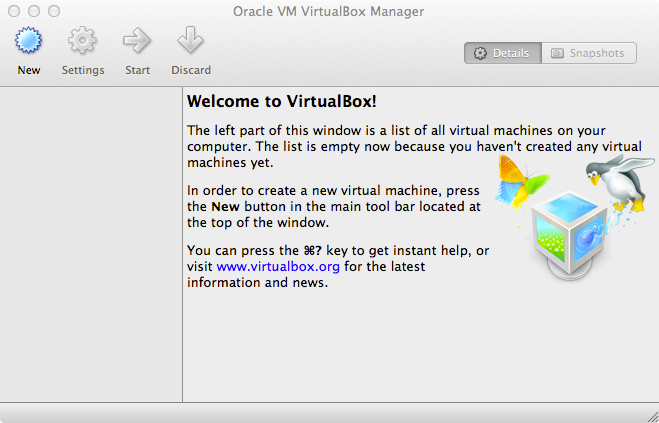

   VirtualBox Welcome Screen

Click on File > Import Appliance, and Appliance Import Wizard will
appear:

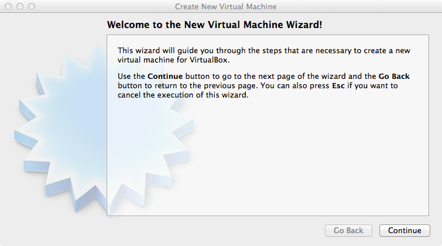

   Create New Virtual Machine Wizard

Click the folder icon and locate the .ova file that you downloaded
earlier.

Click "Continue" to get to the "Appliance Settings" Page:

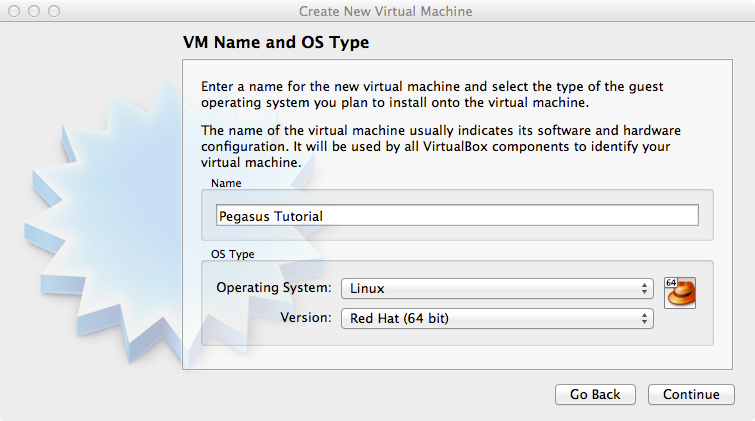

   VM Name and OS Type

Click "Import". You will get back to the welcome screen showing the new
virtual machine:

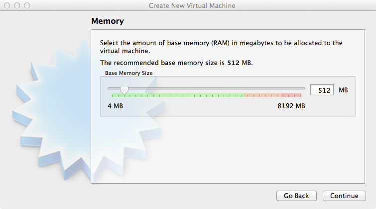

   Memory

Click on the name of the virual machine and then click "Start". After a
few seconds you should get to the login screen:

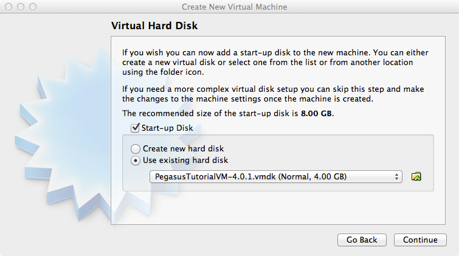

   Login Screen

Log in as user "**tutorial**" with password "**pegasus**".

After you log in, Click the Terminal Icon, to open a Terminal. You can
return to the `tutorial chapter <#tutorial>`__ to complete the tutorial.

Terminating the VM
------------------

When you are done with the tutorial you can shut down the VM by typing:

::

   $ sudo /sbin/poweroff

at the prompt and then enter the tutorial user's password.

Alternatively, you can just close the window and choose "Power off the
machine".

.. _vm-amazon:

Amazon EC2
==========

In order to launch the tutorial VM you need to sign up for an Amazon Web
Services account here: http://aws.amazon.com

Launching the VM
----------------

Once you have an account, sign into the AWS Management Console at this
URL: http://console.aws.amazon.com. You will get a page that looks like
this:

.. figure:: images/vm_ec2_01.png
   :alt: AWS Management Console
   :width: 100.0%

   AWS Management Console

Choose the "EC2" icon under "Amazon Web Services". You will get this
page:

.. figure:: images/vm_ec2_02.png
   :alt: EC2 Management Console
   :width: 100.0%

   EC2 Management Console

First, make sure the “Region:” drop-down in the upper left-hand corner
is set to “US West (Oregon)”.

Click on the “AMIs” link on the left side and set “Viewing:” to “All
Images”, “All Platforms”, and type “Pegasus Tutorial VM” in the search
box:

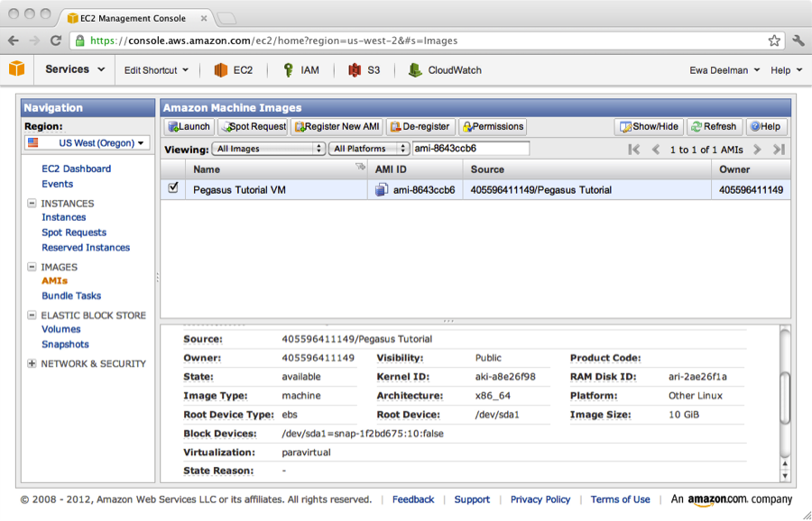

   Locating the Tutorial VM

You will see several versions of the VM. If you don’t see any AMIs named
“Pegasus Tutorial VM” you may need to click the Refresh button. We
update the VM regularly, so your search results will not match the
picture above.

Check the check box next to the latest Pegasus Tutorial VM and click the
“Launch” button. The "Request Instances Wizard" will pop up:

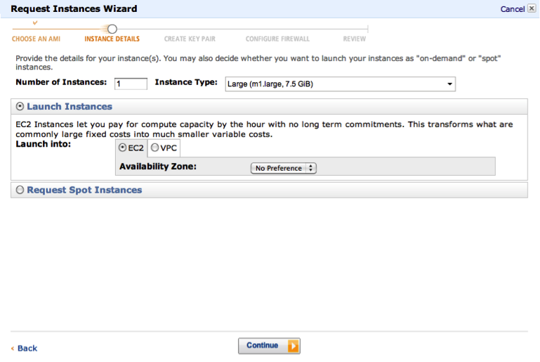

   Request Instances Wizard: Step 1

In the first step of the Request Instances Wizard choose the “Large”
instance type and click “Continue”:

.. figure:: images/vm_ec2_05.png
   :alt: Request Instances Wizard: Step 2
   :width: 100.0%

   Request Instances Wizard: Step 2

Don’t change anything on the “Advanced Instance Options” step and click
“Continue”:

.. figure:: images/vm_ec2_06.png
   :alt: Request Instances Wizard: Step 3
   :width: 100.0%

   Request Instances Wizard: Step 3

On the “Storage Device Configuration” step make sure “Delete on
Termination” is set to "true", then click “Continue”:

.. figure:: images/vm_ec2_07.png
   :alt: Request Instances Wizard: Step 4
   :width: 100.0%

   Request Instances Wizard: Step 4

On the next step type “Pegasus Tutorial” into the “Value” field and
click “Continue”:

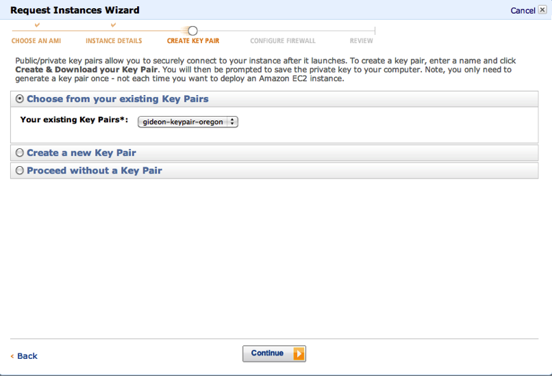

   Request Instances Wizard: Step 5

On the next page choose one of your existing key pairs and click
“Continue”. If you don’t have an existing key pair you can also choose
“Proceed without a Key Pair” (you will log in with a username/password).

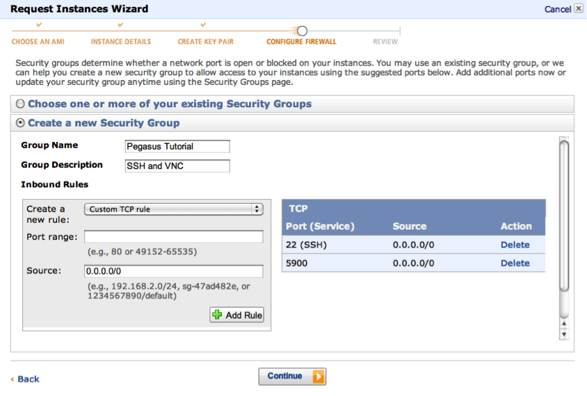

   Request Instances Wizard: Step 6

On the next page choose “Create a new Security Group”. Name the security
group “Pegasus Tutorial” and give it a description. Create an inbound
TCP rule to allow connections on port 22 (SSH) from source 0.0.0.0/0 and
click "Add Rule". This rule allows you to SSH into your EC2 instance.
Create another TCP rule to allow connections on port 5000 from source
0.0.0.0/0 and click "Add Rule" again. This rule is for the Pegasus
Dashboard web interface. Then click “Continue”.

Note that you will only need to create this security group once. If you
launch the Pegasus Tutorial VM again the security group should appear in
the list of existing security groups.

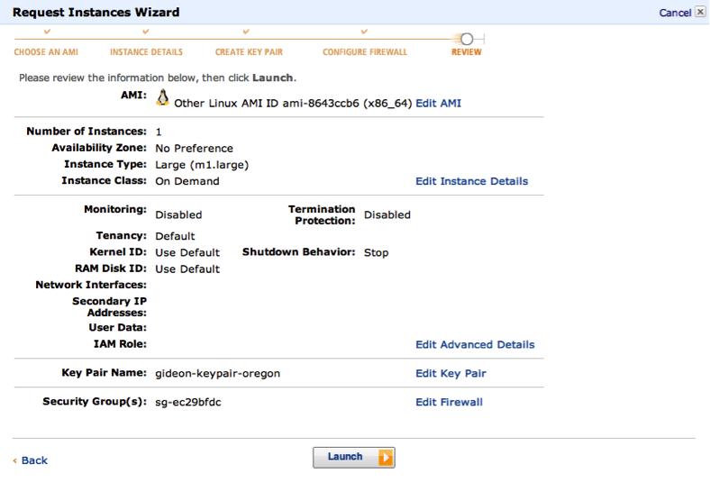

   Request Instances Wizard: Step 7

On the last step of the wizard validate your selections and click
“Launch”.

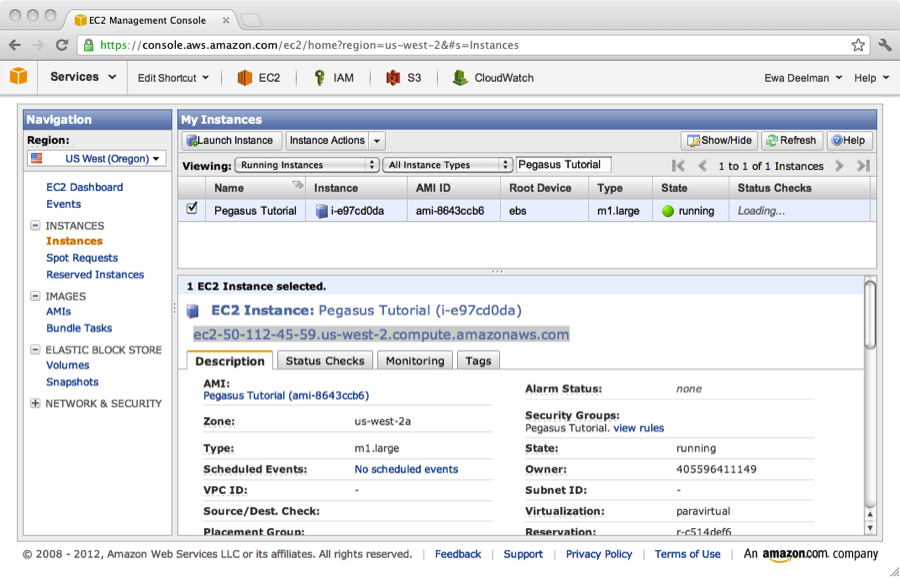

   Running Instances

Finally, navigate to the “Instances” section and check the checkbox next
to the “Pegasus Tutorial” instance. Copy the DNS name to the clipboard.
In this example the name is:
**ec2-50-112-45-59.us-west-2.compute.amazonaws.com**. Yours will almost
surely be different.

At this point your VM will take a few minutes to boot. Wait until the
“Status Checks” column reads: “2/2 checks passed” before continuing. You
may need to click the Refresh button.

Logging into the VM
-------------------

Log into the VM using SSH. The username is ‘\ **tutorial**\ ’ and the
password is ‘\ **pegasus**\ ’.

On UNIX machines such as Linux or Mac OS X you can log in via SSH by
opening a terminal and typing:

::

   $ ssh tutorial@ec2-50-112-45-59.us-west-2.compute.amazonaws.com
   The authenticity of host 'ec2-50-112-45-59.us-west-2.compute.amazonaws.com (50.112.45.59)' can't be established.
   RSA key fingerprint is 56:b0:11:ba:8f:98:ba:dd:75:f6:3c:09:ef:b9:2a:ac.
   Are you sure you want to continue connecting (yes/no)? yes
   [tutorial@localhost ~]$

where “ec2-50-112-45-59.us-west-2.compute.amazonaws.com” is the DNS name
of your VM that you copied from the AWS Management Console.

If you are on Windows you will need to install an SSH client. You can
download the PuTTY SSH client and find documentation for how to
configure it here: http://www.chiark.greenend.org.uk/~sgtatham/putty

Shutting down the VM
--------------------

When you are finished with the tutorial, make sure you terminate the VM.
If you forget to do this you will be charged for all of the hours that
the VM runs.

To terminate the VM click on “Instances” link on the left side of the
AWS Management Console, check the box next to the “Pegasus Tutorial” VM,
and click “Instance Actions”-->“Terminate”:

.. figure:: images/vm_ec2_12.png
   :alt: Terminate Instance
   :width: 100.0%

   Terminate Instance

Then click "Yes, terminate":

.. figure:: images/vm_ec2_13.png
   :alt: Yes, Terminate Instance
   :width: 100.0%

   Yes, Terminate Instance
