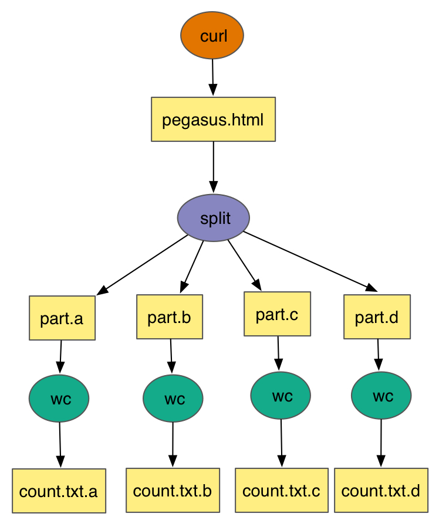
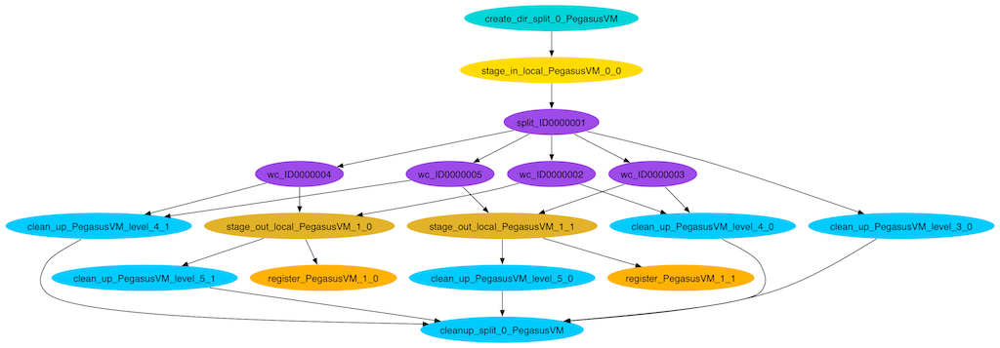
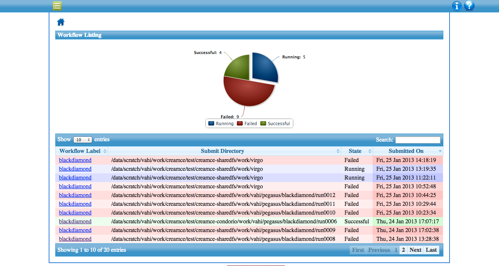
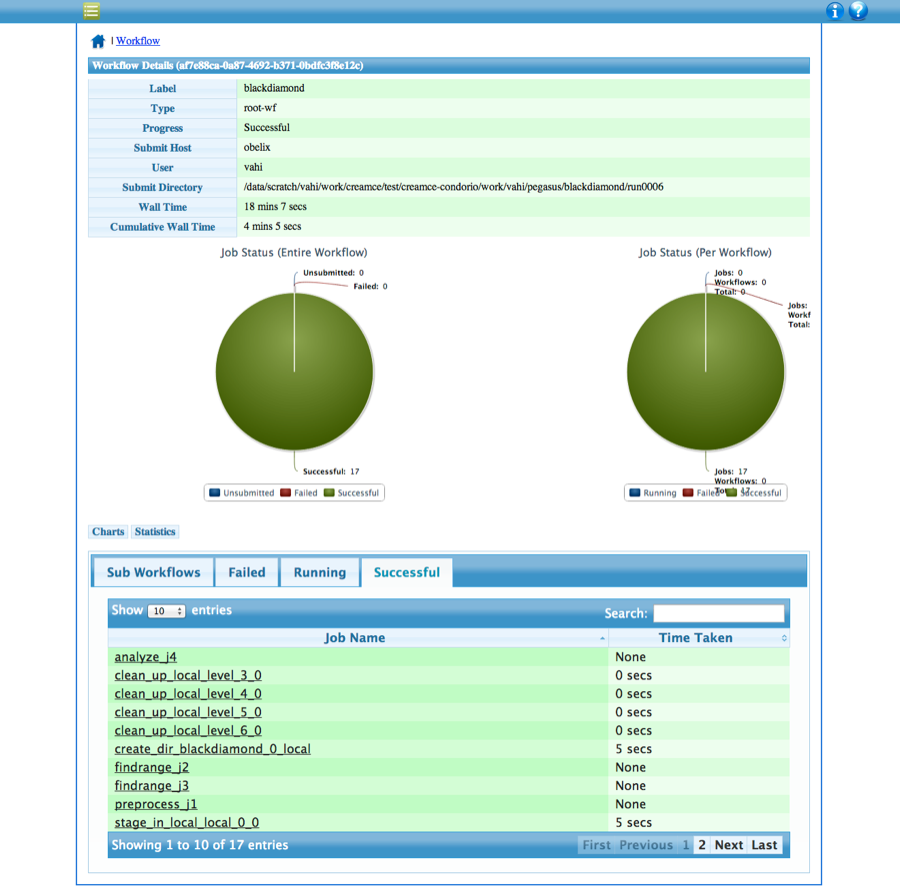
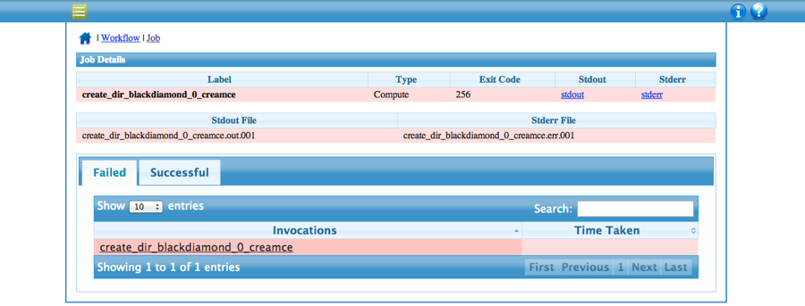
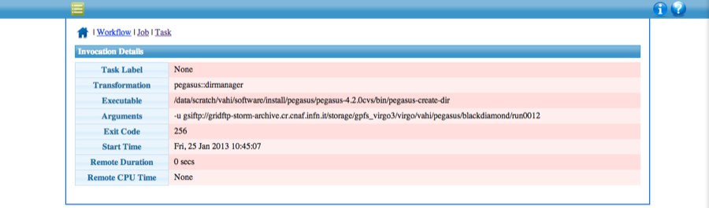
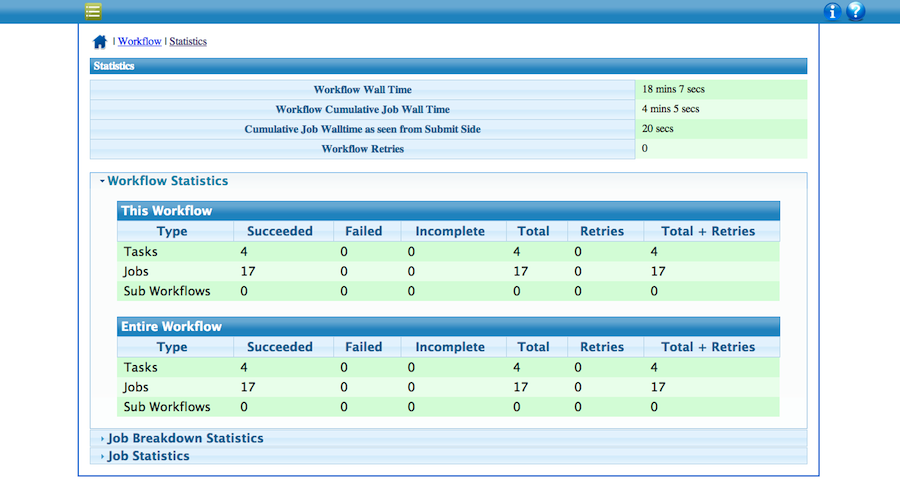
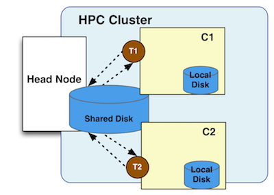

.. _tutorial:

========
Tutorial
========

.. _tutorial-introduction:

Introduction
============

This tutorial will take you through the steps of running simple
workflows using Pegasus Workflow Management System. Pegasus allows
scientists to

1. **Automate** their scientific computational work, as portable
   workflows. Pegasus enables scientists to construct workflows in
   abstract terms without worrying about the details of the underlying
   execution environment or the particulars of the low-level
   specifications required by the middleware (Condor, Globus, or Amazon
   EC2). It automatically locates the necessary input data and
   computational resources necessary for workflow execution. It cleans
   up storage as the workflow is executed so that data-intensive
   workflows have enough space to execute on storage-constrained
   resources.

2. **Recover** from failures at runtime. When errors occur, Pegasus
   tries to recover when possible by retrying tasks, and when all else
   fails, provides a rescue workflow containing a description of only
   the work that remains to be done. It also enables users to move
   computations from one resource to another. Pegasus keeps track of
   what has been done (provenance) including the locations of data used
   and produced, and which software was used with which parameters.

3. **Debug** failures in their computations using a set of system
   provided debugging tools and an online workflow monitoring dashboard.

This tutorial is intended for new users who want to get a quick overview
of Pegasus concepts and usage. The accompanying tutorial VM comes
pre-configured to run the example workflows. The instructions listed
here refer mainly to the simple split workflow example. The tutorial
covers

-  submission of an already generated example workflow with Pegasus.

-  how to use the Pegasus Workflow Dashboard for monitoring workflows.

-  the command line tools for monitoring, debugging and generating
   statistics.

-  recovery from failures

-  creation of workflow using system provided API

-  information catalogs configuration.

More information about the topics covered in this tutorial can be found
in later chapters of this user's guide.

All of the steps in this tutorial are performed on the command-line. The
convention we will use for command-line input and output is to put
things that you should type in bold, monospace font, and to put the
output you should get in a normal weight, monospace font, like this:

::

   [user@host dir]$ you type this
   you get this

Where ``[user@host dir]$`` is the terminal prompt, the text you should
type is “\ ``you type this``\ ”, and the output you should get is
"``you get this``". The terminal prompt will be abbreviated as ``$``.
Because some of the outputs are long, we don’t always include
everything. Where the output is truncated we will add an ellipsis '...'
to indicate the omitted output.

**If you are having trouble with this tutorial, or anything else related
to Pegasus, you can contact the Pegasus Users mailing list
at**\ pegasus-users@isi.edu\ **to get help. You can also contact us on
our**\ `support chatroom <https://pegasus.isi.edu/support>`__\ **on
HipChat.**

.. _tutorial-started:

Getting Started
===============

Easiest way to start the tutorial is to connect to a hosted service
using SSH as shown below.

::

   $ ssh tutorial@pegasus-tutorial.isi.edu
   tutorial@pegasus-tutorial.isi.edu's password: pegasus123

..

   **Note**

   The workflow dashboard is not run in the hosted service. To try out
   the workflow dashboard use the virtual machines provided below.

**OR**

We have provided several virtual machines that contain all of the
software required for this tutorial. Virtual machine images are provided
for :ref:`vm-virtualbox` and :ref:`vm-amazon`.
Information about deploying the tutorial VM on these platforms is in
`the appendix <#tutorial_vm>`__. If you want to use the tutorial VM,
please go to the appendix for the platform you are using and follow the
instructions for starting the VM found there before continuing with this
tutorial.

If you have already installed Pegasus and Condor on your own machine,
then you don't need to use the VM for the tutorial. You can use the
``pegasus-init`` command to generate the example workflow in any
directory on your machine. Just be aware that you will have to modify
the paths referenced in this tutorial to match the directory where you
generated the example workflow.

The remainder of this tutorial will assume that you have a terminal open
with Pegasus on your PATH.

.. _tutorial-scientific-workflows:

What are Scientific Workflows
=============================

Scientific workflows allow users to easily express multi-step
computational tasks, for example retrieve data from an instrument or a
database, reformat the data, and run an analysis. A scientific workflow
describes the dependencies between the tasks and in most cases the
workflow is described as a directed acyclic graph (DAG), where the nodes
are tasks and the edges denote the task dependencies. A defining
property for a scientific workflow is that it manages data flow. The
tasks in a scientific workflow can be everything from short serial tasks
to very large parallel tasks (MPI for example) surrounded by a large
number of small, serial tasks used for pre- and post-processing.

Workflows can vary from simple to complex. Below are some examples. In
the figures below, the task are designated by circles/ellipses while the
files created by the tasks are indicated by rectangles. Arrows indicate
task dependencies.

**Process Workflow**

It consists of a single task that runs the ``ls`` command and generates
a listing of the files in the \`/\` directory.

.. figure:: images/tutorial-single-job-wf.jpg
   :alt: Process Workflow

   Process Workflow

**Pipeline of Tasks**

The pipeline workflow consists of two tasks linked together in a
pipeline. The first job runs the \`curl\` command to fetch the Pegasus
home page and store it as an HTML file. The result is passed to the
\`wc\` command, which counts the number of lines in the HTML file.

**Split Workflow**

The split workflow downloads the Pegasus home page using the \`curl\`
command, then uses the \`split\` command to divide it into 4 pieces. The
result is passed to the \`wc\` command to count the number of lines in
each piece.

**Merge Workflow**

The merge workflow runs the \`ls\` command on several \*/bin directories
and passes the results to the \`cat\` command, which merges the files
into a single listing. The merge workflow is an example of a parameter
sweep over arguments.

**Diamond Workflow**

The diamond workflow runs combines the split and merge workflow patterns
to create a more complex workflow.

.. figure:: images/tutorial-diamond-wf.jpg
   :alt: Diamond Workflow

   Diamond Workflow

**Complex Workflows**

The above examples can be used as building blocks for much complex
workflows. Some of these are showcased on the `Pegasus Applications
page <https://pegasus.isi.edu/applications>`__.

.. _tutorial-submitting-wf:

Submitting an Example Workflow
==============================

All of the example workflows described in the previous section can be
generated with the ``pegasus-init`` command. For this tutorial we will
be using the split workflow, which can be created like this:

::

   $ cd /home/tutorial
   $ pegasus-init split
   Do you want to generate a tutorial workflow? (y/n) [n]: y
   1: Local Machine Condor Pool
   2: USC HPCC Cluster
   3: OSG from ISI submit node
   4: XSEDE, with Bosco
   5: Bluewaters, with Glite
   6: TACC Wrangler with Glite
   7: OLCF TITAN with Glite
   What environment is tutorial to be setup for? (1-7) [1]: 1
   1: Process
   2: Pipeline
   3: Split
   4: Merge
   5: EPA (requires R)
   6: Population Modeling using Containers
   7: Diamond
   What tutorial workflow do you want? (1-7) [1]: 3
   Pegasus Tutorial setup for example workflow - split for execution on submit-host in directory /home/tutorial/split
   $ cd split
   $ ls
   README.md        sites.xml  tc.txt  bin                 daxgen.py
   generate_dax.sh  input      output  pegasus.properties  plan_cluster_dax.sh
   plan_dax.sh      rc.txt

..

   **Tip**

   The ``pegasus-init`` tool can be used to generate workflow skeletons
   from templates by asking the user questions. It is easier to use
   pegasus-init than to start a new workflow from scratch.

The split workflow looks like this:

   Split Workflow

The input workflow description for Pegasus is called the DAX. It can be
generated by running the ``generate_dax.sh`` script from the split
directory, like this:

::

   $ ./generate_dax.sh split.dax
   Generated dax split.dax

This script will run a small Python program (``daxgen.py``) that
generates a file with a .dax extension using the Pegasus Python API. We
will cover the details of creating a DAX programmatically `later in the
tutorial <#tutorial-wf-generation>`__. Pegasus reads the DAX and
generates an executable HTCondor workflow that is run on an execution
site.

The ``pegasus-plan`` command is used to submit the workflow through
Pegasus. The pegasus-plan command reads the input workflow (DAX file
specified by --dax option), maps the abstract DAX to one or more
execution sites, and submits the generated executable workflow to
HTCondor. Among other things, the options to pegasus-plan tell Pegasus

-  the workflow to run

-  where (what site) to run the workflow

-  the input directory where the inputs are placed

-  the output directory where the outputs are placed

By default, the workflow is setup to run on the compute sites (i.e sites
with handle other than "local") defined in the sites.xml file. In our
example, the workflow will run on a site named "condorpool" in the
sites.xml file.

   **Note**

   If there are multiple compute sites specified in your sites.xml, and
   you want to choose a specific site, use the --sites option to
   pegasus-plan

To plan the split workflow invoke the pegasus-plan command using the
``plan_dax.sh`` wrapper script as follows:

::

   $ ./plan_dax.sh split.dax
   2019.08.22 18:51:29.289 UTC:
   2019.08.22 18:51:29.295 UTC:   -----------------------------------------------------------------------
   2019.08.22 18:51:29.300 UTC:   File for submitting this DAG to HTCondor           : split-0.dag.condor.sub
   2019.08.22 18:51:29.305 UTC:   Log of DAGMan debugging messages                 : split-0.dag.dagman.out
   2019.08.22 18:51:29.310 UTC:   Log of HTCondor library output                     : split-0.dag.lib.out
   2019.08.22 18:51:29.315 UTC:   Log of HTCondor library error messages             : split-0.dag.lib.err
   2019.08.22 18:51:29.321 UTC:   Log of the life of condor_dagman itself          : split-0.dag.dagman.log
   2019.08.22 18:51:29.326 UTC:
   2019.08.22 18:51:29.331 UTC:   -no_submit given, not submitting DAG to HTCondor.  You can do this with:
   2019.08.22 18:51:29.341 UTC:   -----------------------------------------------------------------------
   2019.08.22 18:51:29.932 UTC:   Created Pegasus database in: sqlite:////home/tutorial/.pegasus/workflow.db
   2019.08.22 18:51:29.937 UTC:   Your database is compatible with Pegasus version: 4.9.2
   2019.08.22 18:51:29.997 UTC:   Submitting to condor split-0.dag.condor.sub
   2019.08.22 18:51:30.021 UTC:   Submitting job(s).
   2019.08.22 18:51:30.026 UTC:   1 job(s) submitted to cluster 1.
   2019.08.22 18:51:30.032 UTC:
   2019.08.22 18:51:30.037 UTC:   Your workflow has been started and is running in the base directory:
   2019.08.22 18:51:30.042 UTC:
   2019.08.22 18:51:30.047 UTC:     /home/tutorial/split/submit/tutorial/pegasus/split/run0001
   2019.08.22 18:51:30.052 UTC:
   2019.08.22 18:51:30.058 UTC:   *** To monitor the workflow you can run ***
   2019.08.22 18:51:30.063 UTC:
   2019.08.22 18:51:30.068 UTC:     pegasus-status -l /home/tutorial/split/submit/tutorial/pegasus/split/run0001
   2019.08.22 18:51:30.074 UTC:
   2019.08.22 18:51:30.079 UTC:   *** To remove your workflow run ***
   2019.08.22 18:51:30.084 UTC:
   2019.08.22 18:51:30.089 UTC:     pegasus-remove /home/tutorial/split/submit/tutorial/pegasus/split/run0001
   2019.08.22 18:51:30.095 UTC:
   2019.08.22 18:51:30.658 UTC:   Time taken to execute is 1.495 seconds

..

   **Note**

   The line in the output that starts with ``pegasus-status``, contains
   the command you can use to monitor the status of the workflow. The
   path it contains is the path to the submit directory where all of the
   files required to submit and monitor the workflow are stored.

This is what the split workflow looks like after Pegasus has finished
planning the DAX:

   Split DAG

For this workflow the only jobs Pegasus needs to add are a directory
creation job, a stage-in job (for pegasus.html), and stage-out jobs (for
wc count outputs). The cleanup jobs remove data that is no longer
required as workflow executes.

.. _tutorial-wf-dashboard:

Workflow Dashboard for Monitoring and Debugging
===============================================

The Pegasus Dashboard is a web interface for monitoring and debugging
workflows. We will use the web dashboard to monitor the status of the
split workflow.

If you are doing the tutorial using the tutorial VM, then the dashboard
will start when the VM boots. If you are using your own machine, then
you will need to start the dashboard by running:

::

   $ pegasus-service

By default, the dashboard server can only monitor workflows run by the
current user i.e. the user who is running the pegasus-service.

Access the dashboard by navigating your browser to
**https://localhost:5000**. If you are using the EC2 VM you will need to
replace 'localhost' with the IP address of your EC2 instance.

When the webpage loads up, it will ask you for a username and a
password. If you are using the tutorial VM, then log in as user
"**tutorial**" with password "**pegasus**". If you are running the
dashboard on your own machine, then use your UNIX username and password
to log in.

The Dashboard's home page lists all workflows, which have been run by
the current-user. The home page shows the status of each workflow i.e.
Running/Successful/Failed/Failing. The home page lists only the top
level workflows (Pegasus supports hierarchical workflows i.e. workflows
within a workflow). The rows in the table are color coded

-  **Green**: indicates workflow finished successfully.

-  **Red**: indicates workflow finished with a failure.

-  **Blue**: indicates a workflow is currently running.

-  **Gray**: indicates a workflow that was archived.

   Dashboard Home Page

To view details specific to a workflow, the user can click on
corresponding workflow label. The workflow details page lists workflow
specific information like workflow label, workflow status, location of
the submit directory, etc. The details page also displays pie charts
showing the distribution of jobs based on status.

In addition, the details page displays a tab listing all sub-workflows
and their statuses. Additional tabs exist which list information for all
running, failed, successful, and failing jobs.

The information displayed for a job depends on it's status. For example,
the failed jobs tab displays the job name, exit code, links to available
standard output, and standard error contents.

   Dashboard Workflow Page

To view details specific to a job the user can click on the
corresponding job's job label. The job details page lists information
relevant to a specific job. For example, the page lists information like
job name, exit code, run time, etc.

The job instance section of the job details page lists all attempts made
to run the job i.e. if a job failed in its first attempt due to
transient errors, but ran successfully when retried, the job instance
section shows two entries; one for each attempt to run the job.

The job details page also shows tab's for failed, and successful task
invocations (Pegasus allows users to group multiple smaller task's into
a single job i.e. a job may consist of one or more tasks)

   Dashboard Job Description Page

The task invocation details page provides task specific information like
task name, exit code, duration etc. Task details differ from job
details, as they are more granular in nature.

   Dashboard Invocation Page

The dashboard also has web pages for workflow statistics and workflow
charts, which graphically renders information provided by the
pegasus-statistics and pegasus-plots command respectively.

The Statistics page shows the following statistics.

1. Workflow level statistics

2. Job breakdown statistics

3. Job specific statistics

   Dashboard Statistics Page

.. _tutorial-monitoring-cmd-tools:

Command line tools for Monitoring and Debugging
===============================================

Pegasus also comes with a series of command line tools that users can
use to monitor and debug their workflows.

-  pegasus-status : monitor the status of the workflow

-  pegasus-analyzer : debug a failed workflow

-  pegasus-statistics : generate statistics from a workflow run.

pegasus-status - monitoring the workflow
----------------------------------------

After the workflow has been submitted you can monitor it using the
``pegasus-status`` command:

::

   $ pegasus-status -l submit/tutorial/pegasus/split/run0001
   STAT  IN_STATE  JOB
   Run      00:39  split-0 ( /home/tutorial/split/submit/tutorial/pegasus/split/run0001 )
   Idle     00:03   ┗━split_ID0000001
   Summary: 2 Condor jobs total (I:1 R:1)

   UNRDY READY   PRE  IN_Q  POST  DONE  FAIL %DONE STATE   DAGNAME
      14     0     0     1     0     2     0  11.8 Running *split-0.dag

This command shows the workflow (split-0) and the running jobs (in the
above output it shows the two findrange jobs). It also gives statistics
on the number of jobs in each state and the percentage of the jobs in
the workflow that have finished successfully.

Use the ``watch`` option to continuously monitor the workflow:

::

   $ pegasus-status -w submit/tutorial/pegasus/split/run0001
   ...

You should see all of the jobs in the workflow run one after the other.
After a few minutes you will see:

::

   (no matching jobs found in Condor Q)
   UNRDY READY   PRE  IN_Q  POST  DONE  FAIL %DONE STATE   DAGNAME
       0     0     0     0     0    15     0 100.0 Success *split-0.dag

That means the workflow is finished successfully.

If the workflow finished successfully you should see the output count
files in the ``output`` directory.

::

   $ ls output/
   count.txt.a  count.txt.b  count.txt.c  count.txt.d

pegasus-analyzer - debug a failed workflow
------------------------------------------

In the case that one or more jobs fails, then the output of the
``pegasus-status`` command above will have a non-zero value in the
``FAILURE`` column.

You can debug the failure using the ``pegasus-analyzer`` command. This
command will identify the jobs that failed and show their output.
Because the workflow succeeded, ``pegasus-analyzer`` will only show some
basic statistics about the number of successful jobs:

::

   $ pegasus-analyzer submit/tutorial/pegasus/split/run0001/
   ************************************Summary*************************************

   Submit Directory   : submit/tutorial/pegasus/split/run0001/
   Total jobs         :     10 (100.00%)
   # jobs succeeded   :     10 (100.00%)
   # jobs failed      :      0 (0.00%)
   # jobs held        :      0 (0.00%)
   # jobs unsubmitted :      0 (0.00%)

If the workflow had failed you would see something like this:

::

   $ pegasus-analyzer submit/tutorial/pegasus/split/run0002

   ************************************Summary*************************************

    Submit Directory   : submit/tutorial/pegasus/split/run0002
    Total jobs         :     15 (100.00%)
    # jobs succeeded   :      1 (5.88%)
    # jobs failed      :      1 (5.88%)
    # jobs unsubmitted :     15 (88.24%)

   ******************************Failed jobs' details******************************

   ==========================stage_in_local_PegasusVM_0_0==========================

    last state: POST_SCRIPT_FAILED
          site: local
   submit file: stage_in_local_PegasusVM_0_0.sub
   output file: stage_in_local_PegasusVM_0_0.out.001
    error file: stage_in_local_PegasusVM_0_0.err.001

   -------------------------------Task #1 - Summary--------------------------------

   site        : local
   hostname    : unknown
   executable  : /usr/bin/pegasus-transfer
   arguments   :   --threads   2
   exitcode    : 1
   working dir : /home/tutorial/split/submit/tutorial/pegasus/split/run0002

   ------------------Task #1 - pegasus::transfer - None - stdout-------------------

   2015-10-22 21:13:50,970    INFO:  Reading URL pairs from stdin
   2015-10-22 21:13:50,970    INFO:  PATH=/usr/bin:/bin
   2015-10-22 21:13:50,970    INFO:  LD_LIBRARY_PATH=
   2015-10-22 21:13:50,972    INFO:  1 transfers loaded
   2015-10-22 21:13:50,972    INFO:  Sorting the tranfers based on transfer type and source/destination
   2015-10-22 21:13:50,972    INFO:  --------------------------------------------------------------------------------
   2015-10-22 21:13:50,972    INFO:  Starting transfers - attempt 1
   2015-10-22 21:13:50,972    INFO:  Using 1 threads for this round of transfers
   2015-10-22 21:13:53,845   ERROR:  Command exited with non-zero exit code (1): /usr/bin/scp -r -B -o UserKnownHostsFile=/dev/null -o StrictHostKeyChecking=no -i /home/tutorial/.ssh/id_rsa -P 22 '/home/tutorial/examples/split/input/pegasus.html' 'tutorial@127.0.0.1:/home/tutorial/work/tutorial/pegasus/split/run0002/pegasus.html'
   2015-10-22 21:15:55,911    INFO:  --------------------------------------------------------------------------------
   2015-10-22 21:15:55,912    INFO:  Starting transfers - attempt 2
   2015-10-22 21:15:55,912    INFO:  Using 1 threads for this round of transfers
   2015-10-22 21:15:58,446   ERROR:  Command exited with non-zero exit code (1): /usr/bin/scp -r -B -o UserKnownHostsFile=/dev/null -o StrictHostKeyChecking=no -i /home/tutorial/.ssh/id_rsa -P 22 '/home/tutorial/examples/split/input/pegasus.html' 'tutorial@127.0.0.1:/home/tutorial/work/tutorial/pegasus/split/run0002/pegasus.html'
   2015-10-22 21:16:40,468    INFO:  --------------------------------------------------------------------------------
   2015-10-22 21:16:40,469    INFO:  Starting transfers - attempt 3
   2015-10-22 21:16:40,469    INFO:  Using 1 threads for this round of transfers
   2015-10-22 21:16:43,168   ERROR:  Command exited with non-zero exit code (1): /usr/bin/scp -r -B -o UserKnownHostsFile=/dev/null -o StrictHostKeyChecking=no -i /home/tutorial/.ssh/id_rsa -P 22 '/home/tutorial/examples/split/input/pegasus.html' 'tutorial@127.0.0.1:/home/tutorial/work/tutorial/pegasus/split/run0002/pegasus.html'
   2015-10-22 21:16:43,173    INFO:  --------------------------------------------------------------------------------
   2015-10-22 21:16:43,173    INFO:  Stats: no local files in the transfer set
   2015-10-22 21:16:43,173 CRITICAL:  Some transfers failed! See above, and possibly stderr.

   -------------Task #1 - pegasus::transfer - None - Kickstart stderr--------------

   Warning: Permanently added '127.0.0.1' (RSA) to the list of known hosts.
   /home/tutorial/split/input/pegasus.html: No such file or directory
   ..
   /home/tutorial/split/input/pegasus.html: No such file or directory

In this example, we removed one of the input files. We will cover this
in more detail in the recovery section. The output of
``pegasus-analyzer`` indicates that pegasus.html file could not be
found.

pegasus-statistics - collect statistics about a workflow run
------------------------------------------------------------

The ``pegasus-statistics`` command can be used to gather statistics
about the runtime of the workflow and its jobs. The ``-s all`` argument
tells the program to generate all statistics it knows how to calculate:

::

   $ pegasus-statistics –s all submit/tutorial/pegasus/split/run0001
   #
   # Pegasus Workflow Management System - http://pegasus.isi.edu
   #
   # Workflow summary:
   #   Summary of the workflow execution. It shows total
   #   tasks/jobs/sub workflows run, how many succeeded/failed etc.
   #   In case of hierarchical workflow the calculation shows the
   #   statistics across all the sub workflows.It shows the following
   #   statistics about tasks, jobs and sub workflows.
   #     * Succeeded - total count of succeeded tasks/jobs/sub workflows.
   #     * Failed - total count of failed tasks/jobs/sub workflows.
   #     * Incomplete - total count of tasks/jobs/sub workflows that are
   #       not in succeeded or failed state. This includes all the jobs
   #       that are not submitted, submitted but not completed etc. This
   #       is calculated as  difference between 'total' count and sum of
   #       'succeeded' and 'failed' count.
   #     * Total - total count of tasks/jobs/sub workflows.
   #     * Retries - total retry count of tasks/jobs/sub workflows.
   #     * Total+Retries - total count of tasks/jobs/sub workflows executed
   #       during workflow run. This is the cumulative of retries,
   #       succeeded and failed count.
   # Workflow wall time:
   #   The wall time from the start of the workflow execution to the end as
   #   reported by the DAGMAN.In case of rescue dag the value is the
   #   cumulative of all retries.
   # Cumulative job wall time:
   #   The sum of the wall time of all jobs as reported by kickstart.
   #   In case of job retries the value is the cumulative of all retries.
   #   For workflows having sub workflow jobs (i.e SUBDAG and SUBDAX jobs),
   #   the wall time value includes jobs from the sub workflows as well.
   # Cumulative job wall time as seen from submit side:
   #   The sum of the wall time of all jobs as reported by DAGMan.
   #   This is similar to the regular cumulative job wall time, but includes
   #   job management overhead and delays. In case of job retries the value
   #   is the cumulative of all retries. For workflows having sub workflow
   #   jobs (i.e SUBDAG and SUBDAX jobs), the wall time value includes jobs
   #   from the sub workflows as well.
   # Cumulative job badput wall time:
   #   The sum of the wall time of all failed jobs as reported by kickstart.
   #   In case of job retries the value is the cumulative of all retries.
   #   For workflows having sub workflow jobs (i.e SUBDAG and SUBDAX jobs),
   #   the wall time value includes jobs from the sub workflows as well.
   # Cumulative job badput wall time as seen from submit side:
   #   The sum of the wall time of all failed jobs as reported by DAGMan.
   #   This is similar to the regular cumulative job badput wall time, but includes
   #   job management overhead and delays. In case of job retries the value
   #   is the cumulative of all retries. For workflows having sub workflow
   #   jobs (i.e SUBDAG and SUBDAX jobs), the wall time value includes jobs
   #   from the sub workflows as well.
   ------------------------------------------------------------------------------
   Type           Succeeded Failed  Incomplete  Total     Retries   Total+Retries
   Tasks          5         0       0           5         0         5
   Jobs           10        0       0           10        0         10
   Sub-Workflows  0         0       0           0         0         0
   ------------------------------------------------------------------------------

   Workflow wall time                                       : 1 min, 39 secs
   Cumulative job wall time                                 : 10.522 secs
   Cumulative job wall time as seen from submit side        : 14.0 secs
   Cumulative job badput wall time                          : 0.0 secs
   Cumulative job badput wall time as seen from submit side : 0.0 secs

   # Integrity Metrics
   # Number of files for which checksums were compared/computed along with total time spent doing it.
   9 files checksums compared with total duration of 0.358 secs
   9 files checksums generated with total duration of 0.192 secs

   # Integrity Errors
   # Total:
   #       Total number of integrity errors encountered across all job executions(including retries) of a workflow.
   # Failures:
   #       Number of failed jobs where the last job instance had integrity errors.
   Failures: 0 job failures had integrity errors

   Summary                       : submit/tutorial/pegasus/split/run0001/statistics/summary.txt
   Workflow execution statistics : submit/tutorial/pegasus/split/run0001/statistics/workflow.txt
   Job instance statistics       : submit/tutorial/pegasus/split/run0001/statistics/jobs.txt
   Transformation statistics     : submit/tutorial/pegasus/split/run0001/statistics/breakdown.txt
   Integrity statistics          : submit/tutorial/pegasus/split/run0001/statistics/integrity.txt
   Time statistics               : submit/tutorial/pegasus/split/run0001/statistics/time.txt

The output of ``pegasus-statistics`` contains many definitions to help
users understand what all of the values reported mean. Among these are
the total wall time of the workflow, which is the time from when the
workflow was submitted until it finished, and the total cumulative job
wall time, which is the sum of the runtimes of all the jobs.

The ``pegasus-statistics`` command also writes out several reports in
the ``statistics`` subdirectory of the workflow submit directory:

::

   $ ls submit/tutorial/pegasus/split/run0001/statistics/
   jobs.txt          summary.txt         time.txt          breakdown.txt          workflow.txt

The file ``breakdown.txt``, for example, has min, max, and mean runtimes
for each transformation:

::

   $ more submit/tutorial/pegasus/split/run0001/statistics/breakdown.txt
   # legends
   # Transformation - name of the transformation.
   # Count          - the number of times the invocations corresponding to
   #                  the transformation was executed.
   # Succeeded      - the count of the succeeded invocations corresponding
   #                  to the transformation.
   # Failed         - the count of the failed invocations corresponding to
   #                  the transformation.
   # Min(sec)       - the minimum invocation runtime value corresponding to
   #                  the transformation.
   # Max(sec)       - the maximum invocation runtime value corresponding to
   #                  the transformation.
   # Mean(sec)      - the mean of the invocation runtime corresponding to
   #                  the transformation.
   # Total(sec)     - the cumulative of invocation runtime corresponding to
   #                  the transformation.

   # 773d8fa3-8bff-4f75-8e2b-38e2c904f803 (split)
   Transformation           Count     Succeeded Failed  Min       Max       Mean      Total
   dagman::post             15        15        0       5.0       6.0       5.412     92.0
   pegasus::cleanup         6         6         0       1.474     3.178     2.001     12.008
   pegasus::dirmanager      1         1         0       2.405     2.405     2.405     2.405
   pegasus::rc-client       2         2         0       2.382     7.406     4.894     9.788
   pegasus::transfer        3         3         0       3.951     5.21      4.786     14.358
   split                    1         1         0       0.009     0.009     0.009     0.009
   wc                       4         4         0       0.005     0.029     0.012     0.047

   # All (All)
   Transformation           Count     Succeeded  Failed  Min       Max       Mean      Total
   dagman::post             15        15         0       5.0       6.0       5.412     92.0
   pegasus::cleanup         6         6          0       1.474     3.178     2.001     12.008
   pegasus::dirmanager      1         1          0       2.405     2.405     2.405     2.405
   pegasus::rc-client       2         2          0       2.382     7.406     4.894     9.788
   pegasus::transfer        3         3          0       3.951     5.21      4.786     14.358
   split                    1         1          0       0.009     0.009     0.009     0.009
   wc                       4         4          0       0.005     0.029     0.012     0.047

In this case, because the example transformation sleeps for 30 seconds,
the min, mean, and max runtimes for each of the analyze, findrange, and
preprocess transformations are all close to 30.

.. _tutorial-failure-recovery:

Recovery from Failures
======================

Executing workflows in a distributed environment can lead to failures.
Often, they are a result of the underlying infrastructure being
temporarily unavailable, or errors in workflow setup such as incorrect
executables specified, or input files being unavailable.

In case of transient infrastructure failures such as a node being
temporarily down in a cluster, Pegasus will automatically retry jobs in
case of failure. After a set number of retries (usually once), a hard
failure occurs, because of which workflow will eventually fail.

In most of the cases, these errors are correctable (either the resource
comes back online or application errors are fixed). Once the errors are
fixed, you may not want to start a new workflow but instead start from
the point of failure. In order to do this, you can submit the rescue
workflows automatically created in case of failures. A rescue workflow
contains only a description of only the work that remains to be done.

Submitting Rescue Workflows
---------------------------

In this example, we will take our previously run workflow and introduce
errors such that workflow we just executed fails at runtime.

First we will "hide" the input file to cause a failure by renaming it:

::

   $ mv input/pegasus.html input/pegasus.html.bak

Now submit the workflow again:

::

   $ ./plan_dax.sh split.dax
   2015.10.22 20:20:08.299 PDT:
   2015.10.22 20:20:08.307 PDT:   -----------------------------------------------------------------------
   2015.10.22 20:20:08.312 PDT:   File for submitting this DAG to Condor           : split-0.dag.condor.sub
   2015.10.22 20:20:08.323 PDT:   Log of DAGMan debugging messages                 : split-0.dag.dagman.out
   2015.10.22 20:20:08.330 PDT:   Log of Condor library output                     : split-0.dag.lib.out
   2015.10.22 20:20:08.339 PDT:   Log of Condor library error messages             : split-0.dag.lib.err
   2015.10.22 20:20:08.346 PDT:   Log of the life of condor_dagman itself          : split-0.dag.dagman.log
   2015.10.22 20:20:08.352 PDT:
   2015.10.22 20:20:08.368 PDT:   -----------------------------------------------------------------------
   2015.10.22 20:20:12.331 PDT:   Your database is compatible with Pegasus version: 4.5.3
   2015.10.22 20:20:13.326 PDT:   Submitting to condor split-0.dag.condor.sub
   2015.10.22 20:20:14.224 PDT:   Submitting job(s).
   2015.10.22 20:20:14.254 PDT:   1 job(s) submitted to cluster 168.
   2015.10.22 20:20:14.288 PDT:
   2015.10.22 20:20:14.297 PDT:   Your workflow has been started and is running in the base directory:
   2015.10.22 20:20:14.303 PDT:
   2015.10.22 20:20:14.309 PDT:     /home/tutorial/split/submit/tutorial/pegasus/split/run0002
   2015.10.22 20:20:14.315 PDT:
   2015.10.22 20:20:14.321 PDT:   *** To monitor the workflow you can run ***
   2015.10.22 20:20:14.326 PDT:
   2015.10.22 20:20:14.332 PDT:     pegasus-status -l /home/tutorial/split/submit/tutorial/pegasus/split/run0002
   2015.10.22 20:20:14.351 PDT:
   2015.10.22 20:20:14.369 PDT:   *** To remove your workflow run ***
   2015.10.22 20:20:14.376 PDT:
   2015.10.22 20:20:14.388 PDT:     pegasus-remove /home/tutorial/split/submit/tutorial/pegasus/split/run0002
   2015.10.22 20:20:14.397 PDT:
   2015.10.22 20:20:16.146 PDT:   Time taken to execute is 10.292 seconds

We will now monitor the workflow using the pegasus-status command till
it fails. We will add -w option to pegasus-status to watch automatically
till the workflow finishes:

::

   $ pegasus-status -w submit/tutorial/pegasus/split/run0002
   (no matching jobs found in Condor Q)
   UNREADY   READY     PRE  QUEUED    POST SUCCESS FAILURE %DONE
         8       0       0       0       0       2       1  18.2
   Summary: 1 DAG total (Failure:1)

Now we can use the pegasus-analyzer command to determine what went
wrong:

::

   $ pegasus-analyzer submit/tutorial/pegasus/split/run0002

   ************************************Summary*************************************

    Submit Directory   : submit/tutorial/pegasus/split/run0002
    Total jobs         :     11 (100.00%)
    # jobs succeeded   :      2 (18.18%)
    # jobs failed      :      1 (9.09%)
    # jobs unsubmitted :      8 (72.73%)

   ******************************Failed jobs' details******************************

   ===========================stage_in_remote_local_0_0============================

    last state: POST_SCRIPT_FAILED
          site: local
   submit file: stage_in_remote_local_0_0.sub
   output file: stage_in_remote_local_0_0.out.001
    error file: stage_in_remote_local_0_0.err.001

   -------------------------------Task #1 - Summary--------------------------------

   site        : local
   hostname    : unknown
   executable  : /usr/local/bin/pegasus-transfer
   arguments   :   --threads   2
   exitcode    : 1
   working dir : /home/tutorial/split/submit/tutorial/pegasus/split/run0002

   ------------------Task #1 - pegasus::transfer - None - stdout-------------------

   2016-02-18 11:52:58,189    INFO:  Reading URL pairs from stdin
   2016-02-18 11:52:58,189    INFO:  PATH=/usr/local/bin:/usr/bin:/bin
   2016-02-18 11:52:58,189    INFO:  LD_LIBRARY_PATH=
   2016-02-18 11:52:58,189    INFO:  1 transfers loaded
   2016-02-18 11:52:58,189    INFO:  Sorting the tranfers based on transfer type and source/destination
   2016-02-18 11:52:58,190    INFO:  --------------------------------------------------------------------------------
   2016-02-18 11:52:58,190    INFO:  Starting transfers - attempt 1
   2016-02-18 11:52:58,190    INFO:  Using 1 threads for this round of transfers
   2016-02-18 11:53:00,205   ERROR:  Command exited with non-zero exit code (1): /bin/cp -f -R -L '/home/tutorial/split/input/pegasus.html' '/home/tutorial/split/scratch/tutorial/pegasus/split/run0002/pegasus.html'
   2016-02-18 11:54:46,205    INFO:  --------------------------------------------------------------------------------
   2016-02-18 11:54:46,205    INFO:  Starting transfers - attempt 2
   2016-02-18 11:54:46,205    INFO:  Using 1 threads for this round of transfers
   2016-02-18 11:54:48,220   ERROR:  Command exited with non-zero exit code (1): /bin/cp -f -R -L '/home/tutorial/split/input/pegasus.html' '/home/tutorial/split/scratch/tutorial/pegasus/split/run0002/pegasus.html'
   2016-02-18 11:55:24,224    INFO:  --------------------------------------------------------------------------------
   2016-02-18 11:55:24,224    INFO:  Starting transfers - attempt 3
   2016-02-18 11:55:24,224    INFO:  Using 1 threads for this round of transfers
   2016-02-18 11:55:26,240   ERROR:  Command exited with non-zero exit code (1): /bin/cp -f -R -L '/home/tutorial/split/input/pegasus.html' '/home/tutorial/split/scratch/tutorial/pegasus/split/run0002/pegasus.html'
   2016-02-18 11:55:26,240    INFO:  --------------------------------------------------------------------------------
   2016-02-18 11:55:26,240    INFO:  Stats: no local files in the transfer set
   2016-02-18 11:55:26,240 CRITICAL:  Some transfers failed! See above, and possibly stderr.

   -------------Task #1 - pegasus::transfer - None - Kickstart stderr--------------

   cp: /home/tutorial/split/input/pegasus.html: No such file or directory
   cp: /home/tutorial/split/input/pegasus.html: No such file or directory
   cp: /home/tutorial/split/input/pegasus.html: No such file or directory

The above listing indicates that it could not transfer pegasus.html.
Let's correct that error by restoring the pegasus.html file:

::

   $ mv input/pegasus.html.bak input/pegasus.html

Now in order to start the workflow from where we left off, instead of
executing pegasus-plan we will use the command pegasus-run on the
directory from our previous failed workflow run:

::

   $ pegasus-run submit/tutorial/pegasus/split/run0002/
   Rescued /home/tutorial/split/submit/tutorial/pegasus/split/run0002/split-0.log as /home/tutorial/split/submit/tutorial/pegasus/split/run0002/split-0.log.000
   Submitting to condor split-0.dag.condor.sub
   Submitting job(s).
   1 job(s) submitted to cluster 181.

   Your workflow has been started and is running in the base directory:

     submit/tutorial/pegasus/split/run0002/

   *** To monitor the workflow you can run ***

     pegasus-status -l submit/tutorial/pegasus/split/run0002/

   *** To remove your workflow run ***

     pegasus-remove submit/tutorial/pegasus/split/run0002/

The workflow will now run to completion and succeed.

::

   $ pegasus-status -l submit/tutorial/pegasus/split/run0002/
   (no matching jobs found in Condor Q)
   UNRDY READY   PRE  IN_Q  POST  DONE  FAIL %DONE STATE   DAGNAME
       0     0     0     0     0    11     0 100.0 Success *split-0.dag
   Summary: 1 DAG total (Success:1)

.. _tutorial-wf-generation:

Generating the Workflow
=======================

The example that you ran earlier already had the workflow description
(split.dax) generated. Pegasus reads workflow descriptions from DAX
files. The term "DAX" is short for "Directed Acyclic Graph in XML". DAX
is an XML file format that has syntax for expressing jobs, arguments,
files, and dependencies. We now will be creating the split workflow that
we just ran using the Pegasus provided DAX API:

   Split Workflow

In this diagram, the ovals represent computational jobs, the dog-eared
squares are files, and the arrows are dependencies.

In order to create a DAX it is necessary to write code for a DAX
generator. Pegasus comes with Perl, Java, and Python libraries for
writing DAX generators. In this tutorial we will show how to use the
Python library.

The DAX generator for the split workflow is in the file ``daxgen.py``.
Look at the file by typing:

::

   $ more daxgen.py
   ...

..

   **Tip**

   We will be using the ``more`` command to inspect several files in
   this tutorial. ``more`` is a pager application, meaning that it
   splits text files into pages and displays the pages one at a time.
   You can view the next page of a file by pressing the spacebar. Type
   'h' to get help on using ``more``. When you are done, you can type
   'q' to close the file.

The code has 3 main sections:

1. A new ADAG object is created. This is the main object to which jobs
   and dependencies are added.

   ::

      # Create a abstract dag
      dax = ADAG("split")
      ...

2. Jobs and files are added. The 5 jobs in the diagram above are added
   and 9 files are referenced. Arguments are defined using strings and
   File objects. The input and output files are defined for each job.
   This is an important step, as it allows Pegasus to track the files,
   and stage the data if necessary. Workflow outputs are tagged with
   "transfer=true".

   ::

      # the split job that splits the webpage into smaller chunks
      webpage = File("pegasus.html")

      split = Job("split")
      split.addArguments("-l","100","-a","1",webpage,"part.")
      split.uses(webpage, link=Link.INPUT)
      dax.addJob(split)

      ...

3. Dependencies are added. These are shown as arrows in the diagram
   above. They define the parent/child relationships between the jobs.
   When the workflow is executing, the order in which the jobs will be
   run is determined by the dependencies between them.

   ::

      # Add control-flow dependencies
      dax.depends(wc, split)

Generate a DAX file named ``split.dax`` by typing:

::

   $ ./generate_dax.sh split.dax
   Generated dax split.dax

The ``split.dax`` file should contain an XML representation of the split
workflow. You can inspect it by typing:

::

   $ more split.dax
   ...

.. _tutorial-catalogs:

Information Catalogs
====================

The workflow description (DAX) that you specify to Pegasus is portable,
and usually does not contain any locations to physical input files,
executables or cluster end points where jobs are executed. Pegasus uses
three information catalogs during the planning process.

.. figure:: images/tutorial-pegasus-catalogs.png
   :alt: Information Catalogs used by Pegasus

   Information Catalogs used by Pegasus

.. _tutorial-site-catalog:

The Site Catalog
----------------

The site catalog describes the sites where the workflow jobs are to be
executed. In this tutorial we assume that you have a Personal Condor
pool running on localhost. If you are using one of the tutorial VMs this
has already been setup for you. The site catalog for the tutorial
examples is in ``sites.xml``:

::

   $ more sites.xml
   ...
      <!-- The local site contains information about the submit host -->
       <!-- The arch and os keywords are used to match binaries in the transformation catalog -->
       <site handle="local" arch="x86_64" os="LINUX">

           <!-- These are the paths on the submit host were Pegasus stores data -->
           <!-- Scratch is where temporary files go -->
           <directory type="shared-scratch" path="/home/tutorial/scratch">
               <file-server operation="all" url="file:///home/tutorial/scratch"/>
           </directory>

           <!-- Storage is where pegasus stores output files -->
           <directory type="local-storage" path="/home/tutorial/output">
               <file-server operation="all" url="file:///home/tutorial/output"/>
           </directory>
       </site>

   ...

..

   **Note**

   By default (unless specified in properties), Pegasus picks ups the
   site catalog from a XML file named sites.xml in the current working
   directory from where pegasus-plan is invoked.

There are two sites defined in the site catalog: "local" and
"condorpool". The "local" site is used by Pegasus to learn about the
submit host where the workflow management system runs. The "condorpool"
site is the Condor pool configured on your submit machine. In the case
of the tutorial VM, the local site and the condorpool site refer to the
same machine, but they are logically separate as far as Pegasus is
concerned.

1. The **local** site is configured with a "storage" file system that is
   mounted on the submit host (indicated by the file:// URL). This file
   system is where the output data from the workflow will be stored.
   When the workflow is planned we will tell Pegasus that the output
   site is "local".

2. The **condorpool** site is also configured with a "scratch" file
   system. This file system is where the working directory will be
   created. When we plan the workflow we will tell Pegasus that the
   execution site is "condorpool".

Pegasus supports many different file transfer protocols. In this case
the Pegasus configuration is set up so that input and output files are
transferred to/from the condorpool site by Condor. This is done by
setting ``pegasus.data.configuration = condorio`` in the properties
file. In a normal Condor pool, this will cause job input/output files to
be transferred from/to the submit host to/from the worker node. In the
case of the tutorial VM, this configuration is just a fancy way to copy
files from the workflow scratch directory to the job scratch directory.

Finally, the condorpool site is configured with two profiles that tell
Pegasus that it is a plain Condor pool. Pegasus supports many ways of
submitting tasks to a remote cluster. In this configuration it will
submit vanilla Condor jobs.

HPC Clusters
~~~~~~~~~~~~

Typically the sites in the site catalog describe remote clusters, such
as PBS clusters or Condor pools.

Usually, a typical deployment of an HPC cluster is illustrated below.
The site catalog, captures for each cluster (site)

-  directories that can be used for executing jobs

-  whether a shared file system is available

-  file servers to use for staging input data and staging out output
   data

-  headnode of the cluster to which jobs can be submitted.

   Sample HPC Cluster Setup

Below is a sample site catalog entry for HPC cluster at SDSC that is
part of XSEDE

::

   <site  handle="sdsc-gordon" arch="x86_64" os="LINUX">
           <grid  type="gt5" contact="gordon-ln4.sdsc.xsede.org:2119/jobmanager-fork" scheduler="Fork" jobtype="auxillary"/>
           <grid  type="gt5" contact="gordon-ln4.sdsc.xsede.org:2119/jobmanager-pbs" scheduler="unknown" jobtype="compute"/>

           <!-- the base directory where workflow jobs will execute for the site -->
           <directory type="shared-scratch" path="/oasis/scratch/ux454281/temp_project">
               <file-server operation="all" url="gsiftp://oasis-dm.sdsc.xsede.org:2811/oasis/scratch/ux454281/temp_project"/>
           </directory>

           <profile namespace="globus" key="project">TG-STA110014S</profile>
           <profile namespace="env" key="PEGASUS_HOME">/home/ux454281/software/pegasus/pegasus-4.5.0</profile>
       </site>

The Transformation Catalog
--------------------------

The transformation catalog describes all of the executables (called
"transformations") used by the workflow. This description includes the
site(s) where they are located, the architecture and operating system
they are compiled for, and any other information required to properly
transfer them to the execution site and run them.

For this tutorial, the transformation catalog is in the file ``tc.txt``:

::

   $ more tc.txt
   tr wc {
       site condorpool {
           pfn "/usr/bin/wc"
           arch "x86_64"
           os "linux"
           type "INSTALLED"
       }
   }
   ...

..

   **Note**

   By default (unless specified in properties), Pegasus picks up the
   transformation catalog from a text file named tc.txt in the current
   working directory from where pegasus-plan is invoked.

The ``tc.txt`` file contains information about two transformations: wc,
and split. These two transformations are referenced in the split DAX.
The transformation catalog indicates that both transformations are
installed on the condorpool site, and are compiled for x86_64 Linux.

The Replica Catalog
-------------------

**Note:** Replica Catalog configuration is not required for the tutorial
setup. It is only required if you want to refer to input files on
external servers.

The example that you ran, was configured with the inputs already present
on the submit host (where Pegasus is installed) in a directory. If you
have inputs at external servers, then you can specify the URLs to the
input files in the Replica Catalog. This catalog tells Pegasus where to
find each of the input files for the workflow.

All files in a Pegasus workflow are referred to in the DAX using their
Logical File Name (LFN). These LFNs are mapped to Physical File Names
(PFNs) when Pegasus plans the workflow. This level of indirection
enables Pegasus to map abstract DAXes to different execution sites and
plan out the required file transfers automatically.

The Replica Catalog for the diamond workflow is in the ``rc.txt`` file:

::

   $ more rc.txt
   # This is the replica catalog. It lists information about each of the
   # input files used by the workflow. You can use this to specify locations to input files present on external servers.

   # The format is:
   # LFN     PFN    pool="SITE"
   #
   # For example:
   #data.txt  file:///tmp/data.txt         site="local"
   #data.txt  http://example.org/data.txt  site="example"
   pegasus.html file:///home/tutorial/split/input/pegasus.html   site="local"

..

   **Note**

   By default (unless specified in properties), Pegasus picks ups the
   transformation catalog from a text file named tc.txt in the current
   working directory from where pegasus-plan is invoked. In our
   tutorial, input files are on the submit host and we used the --input
   dir option to pegasus-plan to specify where they are located.

This replica catalog contains only one entry for the split workflow’s
only input file. This entry has an LFN of "pegasus.html" with a PFN of
"file:///home/tutorial/split/input/pegasus.html" and the file is stored
on the local site, which implies that it will need to be transferred to
the condorpool site when the workflow runs.

.. _tutorial-configuration:

Configuring Pegasus
===================

In addition to the information catalogs, Pegasus takes a configuration
file that specifies settings that control how it plans the workflow.

For the diamond workflow, the Pegasus configuration file is relatively
simple. It only contains settings to help Pegasus find the information
catalogs. These settings are in the ``pegasus.properties`` file:

::

   $ more pegasus.properties
   # This tells Pegasus where to find the Site Catalog
   pegasus.catalog.site.file=sites.xml

   # This tells Pegasus where to find the Replica Catalog
   pegasus.catalog.replica=File
   pegasus.catalog.replica.file=rc.txt

   # This tells Pegasus where to find the Transformation Catalog
   pegasus.catalog.transformation=Text
   pegasus.catalog.transformation.file=tc.txt

   # Use condor to transfer workflow data
   pegasus.data.configuration=condorio

   # This is the name of the application for analytics
   pegasus.metrics.app=pegasus-tutorial

.. _tutorial-conclusion:

Conclusion
==========

Congratulations! You have completed the tutorial.

If you used Amazon EC2 for this tutorial make sure to terminate your VM.
Refer to the `appendix <#tutorial_vm>`__ for more information about how
to do this.

Refer to the other chapters in this guide for more information about
creating, planning, and executing workflows with Pegasus.

Please contact the Pegasus Users Mailing list at pegasus-users@isi.edu
if you need help.
