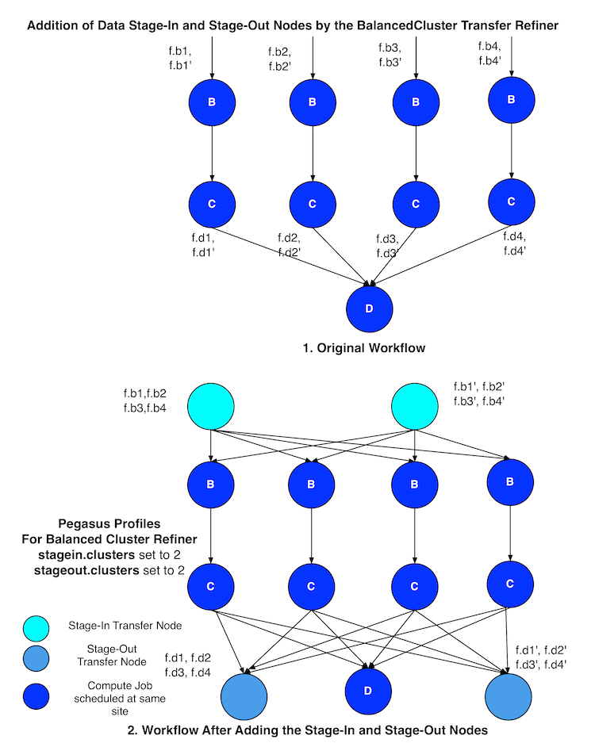
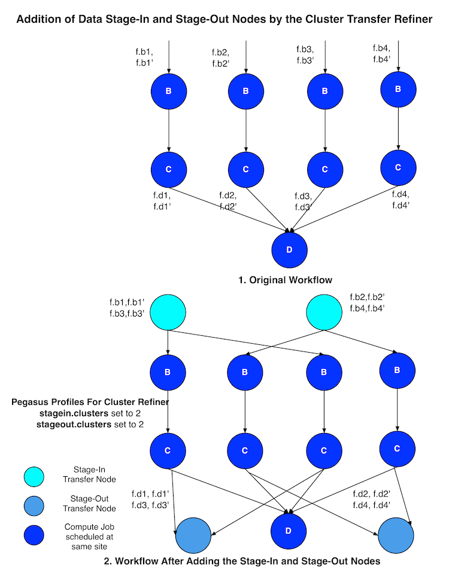
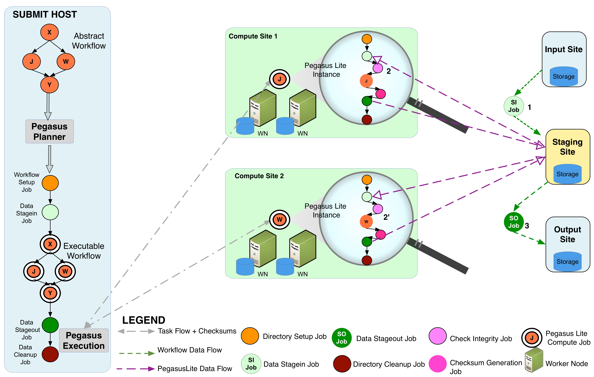

.. _data-management:

===============
Data Management
===============

One of the key features of Pegasus is it's end to end data management
of datasets tracked in your workflow. Pegasus is responsible for selecting
the best replica for your inputs, transferring them to a location where
jobs in your workflow can access them, cleaning up datasets no longer
required as the workflow runs, to staging out and registering the
generated outputs to locations of your choosing. Majority of the
data management optimizations occur during the
`mapping phase <#mapping-refinement-steps>`__ , where the input Abstract
Workflow in converted to an Executable Workflow that can be executed
on your target infrastructure.

This chapter provides details of all data management capabilities
in Pegasus.

.. _replica-selection:

Replica Selection
=================

Each job in the Abstract Workflow maybe associated with input LFN's denoting
the files that are required for the job to run. To determine the physical
replica (PFN) for a LFN, Pegasus queries the Replica catalog to get all the
PFN's (replicas) associated with a LFN. The Replica Catalog may return
multiple PFN's for each of the LFN's queried. Hence, Pegasus needs to
select a single PFN amongst the various PFN's returned for each LFN.
This process is known as replica selection in Pegasus. Users can specify
the replica selector to use in the properties file.

This document describes the various Replica Selection Strategies in
Pegasus.

Configuration
-------------

The user properties determine what replica selector Pegasus Workflow
Mapper uses. The property **pegasus.selector.replica** is used to
specify the replica selection strategy. Currently supported Replica
Selection strategies are

1. Default

2. Regex

3. Restricted

4. Local

The values are case sensitive. For example the following property
setting will throw a Factory Exception .

::

   pegasus.selector.replica  default

The correct way to specify is

::

   pegasus.selector.replica  Default

Supported Replica Selectors
---------------------------

The various Replica Selectors supported in Pegasus Workflow Mapper are
explained below.

.. note::

   Starting 4.6.0 release the Default and Regex Replica Selectors return
   an ordered list with priorities set. *pegasus-transfer* at runtime will
   failover to alternate url's specified, if a higher priority source
   URL is inaccessible.

.. _replica-selection-default:

Default
~~~~~~~

This is the default replica selector used in the Pegasus Workflow
Mapper. If the property pegasus.selector.replica is not defined in
properties, then Pegasus uses this selector.

The selector orders the various candidate replica's according to the
following rules

1. valid file URL's . That is URL's that have the site attribute
   matching the site where the executable *pegasus-transfer* is
   executed.

2. all URL's from preferred site (usually the compute site)

3. all other remotely accessible ( non file) URL's

To use this replica selector set the following property

::

   pegasus.selector.replica                  Default

Regex
~~~~~

This replica selector allows the user to specific regular expressions
that can be used to rank various PFN's returned from the Replica Catalog
for a particular LFN. This replica selector orders the replicas based on
the rank. Lower the rank higher the preference.

The regular expressions are assigned different rank, that determine the
order in which the expressions are employed. The rank values for the
regex can expressed in user properties using the property.

::

   pegasus.selector.replica.regex.rank.[value]                  regex-expression

The **[value]** in the above property is an integer value that denotes
the rank of an expression with a rank value of 1 being the highest rank.

For example, a user can specify the following regex expressions that
will ask Pegasus to prefer file URL's over gsiftp url's from
example.isi.edu

::

   pegasus.selector.replica.regex.rank.1                       file://.*
   pegasus.selector.replica.regex.rank.2                       gsiftp://example\.isi\.edu.*

User can specify as many regex expressions as they want.

Since Pegasus is in Java , the regex expression support is what Java
supports. It is pretty close to what is supported by Perl. More details
can be found at
http://java.sun.com/j2se/1.5.0/docs/api/java/util/regex/Pattern.html

Before applying any regular expressions on the PFN's for a particular
LFN that has to be staged to a site X, the file URL's that don't match
the site X are explicitly filtered out.

To use this replica selector set the following property

::

   pegasus.selector.replica                  Regex

Restricted
~~~~~~~~~~

This replica selector, allows the user to specify good sites and bad
sites for staging in data to a particular compute site. A good site for
a compute site X, is a preferred site from which replicas should be
staged to site X. If there are more than one good sites having a
particular replica, then a random site is selected amongst these
preferred sites.

A bad site for a compute site X, is a site from which replicas should
not be staged. The reason of not accessing replica from a bad site can
vary from the link being down, to the user not having permissions on
that site's data.

The good \| bad sites are specified by the following properties

::

   pegasus.replica.*.prefer.stagein.sites
   pegasus.replica.*.ignore.stagein.sites

where the \* in the property name denotes the name of the compute site.
A \* in the property key is taken to mean all sites. The value to these
properties is a comma separated list of sites.

For example the following settings

::

   pegasus.selector.replica.*.prefer.stagein.sites            usc
   pegasus.replica.uwm.prefer.stagein.sites                   isi,cit

means that prefer all replicas from site usc for staging in to any
compute site. However, for uwm use a tighter constraint and prefer only
replicas from site isi or cit. The pool attribute associated with the
PFN's tells the replica selector to what site a replica/PFN is
associated with.

The pegasus.replica.*.prefer.stagein.sites property takes precedence
over pegasus.replica.*.ignore.stagein.sites property i.e. if for a site
X, a site Y is specified both in the ignored and the preferred set, then
site Y is taken to mean as only a preferred site for a site X.

To use this replica selector set the following property

::

   pegasus.selector.replica                  Restricted

.. _replica-selection-local:

Local
~~~~~

This replica selector always prefers replicas from the local host ( pool
attribute set to local ) and that start with a file: URL scheme. It is
useful, when users want to stagein files to a remote site from the
submit host using the Condor file transfer mechanism.

To use this replica selector set the following property

::

   pegasus.selector.replica                  Local

.. _transfer:

Data Transfers
==============

As part of the Workflow Mapping Process, Pegasus does data management
for the executable workflow . It queries a Replica Catalog to discover
the locations of the input datasets and adds data movement and
registration nodes in the workflow to

1. stage-in input data to the staging sites ( a site associated with the
   compute job to be used for staging. In the shared filesystem setup,
   staging site is the same as the execution sites where the jobs in the
   workflow are executed )

2. stage-out output data generated by the workflow to the final storage
   sites.

3. stage-in intermediate data between compute sites if required.

4. data registration nodes to catalog the locations of the output data
   on the final storage sites into the replica catalog.

The separate data movement jobs that are added to the executable
workflow are responsible for staging data to a workflow specific
directory accessible to the staging server on a staging site associated
with the compute sites. Depending on the data staging configuration, the
staging site for a compute site is the compute site itself. In the
default case, the staging server is usually on the headnode of the
compute site and has access to the shared filesystem between the worker
nodes and the head node. Pegasus adds a directory creation job in the
executable workflow that creates the workflow specific directory on the
staging server.

In addition to data, Pegasus will transfer user executables to the
compute sites if the executables are not installed on the remote sites
before hand. This chapter gives an overview of how the transfers of data
and executables are managed in Pegasus.

Pegasus picks up files for data transfers based on the transfer
attribute associated with the input and output files for the job. These
are designated in the Abstract Workflow as uses elements in the job element.
If not specified, the transfer flag defaults to true. So if you don't want all
the generated files to be transferred to the output sites, you need to
explicitly set the stage_out flag to false for the file.

.. tabs::

    .. code-tab:: python Pegasus.api

      #! /usr/bin/env python3
      import logging

      from pathlib import Path

      from Pegasus.api import *
      ..

      # --- Raw input file -----------------------------------------------------------------

      fa = File("f.a").add_metadata(creator="ryan")
      fb1 = File("f.b1")
      fb2 = File("f.b2")
      # fb2 output is explicitly disabled by setting the stage_out flag
      job_preprocess = Job("preprocess")\
                              .add_args("-a", "preprocess", "-T", "3", "-i", fa, "-o", fb1, fb2)\
                              .add_inputs(fa)\
                              .add_outputs(fb1)\
                              .add_outputs(fb1, stage_out=False)

    .. code-tab:: yaml YAML

        - type: job
             name: preprocess
             id: ID0000001
             arguments: [-a, preprocess, -T, "3", -i, f.a, -o, f.b1, f.b2]
             uses:
                - lfn: f.a
                  type: input
                - lfn: f.b1
                  type: output
                  stageOut: true
                  registerReplica: true
                - lfn: f.b2
                  type: output
                  stageOut: false
                  registerReplica: true

    .. code-tab:: xml XML

         <!-- snippet of job description -->
         <job id="ID000001" namespace="example" name="mDiffFit" version="1.0"
              node-label="preprocess" >
           <argument>-a top -T 3  -i <file name="f.a"/>  -o <file name="f.b1"/> -o <file name="f.b12"/></argument>

            <uses name="f.a" link="input" transfer="true" register="true"/>
            <uses name="f.b2" link="output" transfer="false" register="true" />
            <!-- tells Pegasus to not transfer the output file f.b to the output site -->
            <uses name="f.b2" link="output" transfer="false" register="false"  />
            ...
         </job>

.. _ref-data-staging-configuration:

Data Staging Configuration
--------------------------

Pegasus can be broadly setup to run workflows in the following
configurations

-  **Condor Pool Without a shared filesystem**

   This setup applies to a condor pool where the worker nodes making up
   a condor pool don't share a filesystem. All data IO is achieved using
   Condor File IO. This is a special case of the non shared filesystem
   setup, where instead of using pegasus-transfer to transfer input and
   output data, Condor File IO is used.

-  **NonShared FileSystem**

   This setup applies to where the head node and the worker nodes of a
   cluster don't share a filesystem. Compute jobs in the workflow run in
   a local directory on the worker node

-  **Shared File System**

   This setup applies to where the head node and the worker nodes of a
   cluster share a filesystem. Compute jobs in the workflow run in a
   directory on the shared filesystem.

For the purposes of data configuration various sites, and directories
are defined below.

1. **Submit Host**

   The host from where the workflows are submitted . This is where
   Pegasus and Condor DAGMan are installed. This is referred to as the
   **"local"** site in the site catalog .

2. **Compute Site**

   The site where the jobs mentioned in the Abstract Workflow are executed. There
   needs to be an entry in the Site Catalog for every compute site. The
   compute site is passed to pegasus-plan using **--sites** option

3. **Staging Site**

   A site to which the separate transfer jobs in the executable workflow
   ( jobs with stage_in , stage_out and stage_inter prefixes that
   Pegasus adds using the transfer refiners) stage the input data to and
   the output data from to transfer to the final output site. Currently,
   the staging site is always the compute site where the jobs execute.

4. **Output Site**

   The output site is the final storage site where the users want the
   output data from jobs to go to. The output site is passed to
   pegasus-plan using the **--output** option. The stageout jobs in the
   workflow stage the data from the staging site to the final storage
   site.

5. **Input Site**

   The site where the input data is stored. The locations of the input
   data are catalogued in the Replica Catalog, and the *"site"*
   attribute of the locations gives us the site handle for the input
   site.

6. **Workflow Execution Directory**

   This is the directory created by the create dir jobs in the
   executable workflow on the Staging Site. This is a directory per
   workflow per staging site. Currently, the Staging site is always the
   Compute Site.

7. **Worker Node Directory**

   This is the directory created on the worker nodes per job usually by
   the job wrapper that launches the job.

.. _ref-data-staging-condorio:

Condor Pool Without a Shared Filesystem
~~~~~~~~~~~~~~~~~~~~~~~~~~~~~~~~~~~~~~~

By default, Pegasus is setup to do your data transfers in this mode.
This setup applies to a condor pool where the worker nodes making up a
condor pool don't share a filesystem. All data IO is achieved using
Condor File IO. This is a special case of the non shared filesystem
setup, where instead of using pegasus-transfer to transfer input and
output data, Condor File IO is used.

**Setup**

-  Submit Host and staging site are same

-  head node and worker nodes of compute site don't share a filesystem

-  Input Data is staged from remote sites.

-  Remote Output Site i.e site other than compute site. Can be submit
   host.

.. figure:: images/data-configuration-condorio.png
   :alt: Condor Pool Without a Shared Filesystem

   Condor Pool Without a Shared Filesystem

The data flow is as follows in this case

1. Stagein Job executes on the submit host to stage in input data from
   Input Sites ( 1---n) to a workflow specific execution directory on
   the submit host

2. Compute Job starts on a worker node in a local execution directory.
   Before the compute job starts, Condor transfers the input data for
   the job from the workflow execution directory on thesubmit host to
   the local execution directory on the worker node.

3. The compute job executes in the worker node, and executes on the
   worker node.

4. The compute Job writes out output data to the local directory on the
   worker node using Posix IO

5. When the compute job finishes, Condor transfers the output data for
   the job from the local execution directory on the worker node to the
   workflow execution directory on the submit host.

6. Stageout Job executes ( either on Submit Host or staging site ) to
   stage out output data from the workflow specific execution directory
   to a directory on the final output site.

In this case, the compute jobs are wrapped as
`PegasusLite <#pegasuslite>`__ instances.

This mode is especially useful for running in the cloud environments
where you don't want to setup a shared filesystem between the worker
nodes. Running in that mode is explained in detail
`here. <#amazon_aws>`__

.. tip::

   Set **pegasus.data.configuration** to **condorio** to run in this
   configuration. In this mode, the staging site is automatically set to
   site **local**

In this setup, Pegasus always stages the input files through the submit
host i.e the stage-in job stages in data from the input site to the
submit host (local site). The input data is then transferred to remote
worker nodes from the submit host using Condor file transfers. In the
case, where the input data is locally accessible at the submit host i.e
the input site and the submit host are the same, then it is possible to
bypass the creation of separate stage in jobs that copy the data to the
workflow specific directory on the submit host. Instead, Condor file
transfers can be setup to transfer the input files directly from the
locally accessible input locations ( file URL's with "*site*" attribute
set to local) specified in the replica catalog. More details can be
found at :ref:`bypass-input-staging`.

 In some
cases, it might be useful to setup the PegasusLite jobs to pull input
data directly from the input site without going through the staging
server.

.. _ref-data-staging-nonsharedfs:

Non Shared Filesystem
~~~~~~~~~~~~~~~~~~~~~

In this setup , Pegasus runs workflows on local file-systems of worker
nodes with the the worker nodes not sharing a filesystem. The data
transfers happen between the worker node and a staging / data
coordination site. The staging site server can be a file server on the
head node of a cluster or can be on a separate machine.

**Setup**

-  compute and staging site are the different

-  head node and worker nodes of compute site don't share a filesystem

-  Input Data is staged from remote sites.

-  Remote Output Site i.e site other than compute site. Can be submit
   host.

.. figure:: images/data-configuration-nonsharedfs.png
   :alt: Non Shared Filesystem Setup

   Non Shared Filesystem Setup

The data flow is as follows in this case

1. Stagein Job executes ( either on Submit Host or on staging site ) to
   stage in input data from Input Sites ( 1---n) to a workflow specific
   execution directory on the staging site.

2. Compute Job starts on a worker node in a local execution directory.
   Accesses the input data using pegasus transfer to transfer the data
   from the staging site to a local directory on the worker node

3. The compute job executes in the worker node, and executes on the
   worker node.

4. The compute Job writes out output data to the local directory on the
   worker node using Posix IO

5. Output Data is pushed out to the staging site from the worker node
   using pegasus-transfer.

6. Stageout Job executes ( either on Submit Host or staging site ) to
   stage out output data from the workflow specific execution directory
   to a directory on the final output site.

In this case, the compute jobs are wrapped as
`PegasusLite <#pegasuslite>`__ instances.

This mode is especially useful for running in the cloud environments
where you don't want to setup a shared filesystem between the worker
nodes. Running in that mode is explained in detail
`here. <#amazon_aws>`__

.. tip::

   Set  **pegasus.data.configuration** to **nonsharedfs** to run in this
   configuration. The staging site can be specified using the
   **--staging-site** option to pegasus-plan.

In this setup, Pegasus always stages the input files through the staging
site i.e the stage-in job stages in data from the input site to the
staging site. The PegasusLite jobs that start up on the worker nodes,
then pull the input data from the staging site for each job. In some
cases, it might be useful to setup the PegasusLite jobs to pull input
data directly from the input site without going through the staging
server. More details can be found at :ref:`bypass-input-staging`.

.. _ref-data-staging-sharedfs:

Shared File System
~~~~~~~~~~~~~~~~~~

In this setup, Pegasus runs workflows in the shared file system
setup, where the worker nodes and the head node of a cluster share a
filesystem.

.. figure:: images/data-configuration-sharedfs.png
   :alt: Shared File System Setup

   Shared File System Setup

The data flow is as follows in this case

1. Stagein Job executes ( either on Submit Host or Head Node ) to stage
   in input data from Input Sites ( 1---n) to a workflow specific
   execution directory on the shared filesystem.

2. Compute Job starts on a worker node in the workflow execution
   directory. Accesses the input data using Posix IO

3. Compute Job executes on the worker node and writes out output data to
   workflow execution directory using Posix IO

4. Stageout Job executes ( either on Submit Host or Head Node ) to stage
   out output data from the workflow specific execution directory to a
   directory on the final output site.

..

.. tip::

   Set **pegasus.data.configuration** to **sharedfs** to run in this
   configuration.

.. _ref-data-staging-nonsharedfs-shared:

Hybrid Shared Filesystem with Non Shared Filesystem semantics
~~~~~~~~~~~~~~~~~~~~~~~~~~~~~~~~~~~~~~~~~~~~~~~~~~~~~~~~~~~~~

When executing your workflow in shared filesystem mode, the compute jobs
are launched directly using *pegasus-kickstart*. The are not wrapped further
in a PegasusLite wrapper invocation, that allows users to execute the jobs
on the worker node filesystem (as in the nonsharedfs and condorio mode).
The PegasusLite wrapper also enables integrity checking and allows jobs to
be launched via application containers. If running in shared filesystem mode,
and you want to leverage these features, you can opt to designate the
staging site for your compute site to be the shared filesystem on the compute
site itself.

To do is you need to

1) Set **pegasus.data.configuration** to **nonsharedfs** .

2) For your compute site with a shared filesystem, add the shared-scratch
   directory that points to a directory on the shared filesystem of the
   cluster.

3) To prevent a copy of the inputs from the shared filesystem directory
   where the Pegasus data stagein jobs place data for the workflow, to
   the local directory on the local worker nodes, you can enable symlinking
   by setting **pegasus.transfer.links** to **true**. In this case, in the
   PegasusLite jobs the input data will be symlinked from the directory on
   the shared filesystem, and the outputs will be file copied from the local
   directory on the worker node, back to the shared filesystem directory.
   Also when jobs are launched via application containers, Pegasus will ensure
   that the shared filesystem directory is mounted into the container.

.. _local-vs-remote-transfers:

Local versus Remote Transfers
-----------------------------

As far as possible, Pegasus will ensure that the transfer jobs added to
the executable workflow are executed on the submit host. By default,
Pegasus will schedule a transfer to be executed on the remote staging
site only if there is no way to execute it on the submit host. Some
scenarios where transfer jobs are executed on remote sites are as
follows:

-  the file server specified for the staging site/compute site is a file
   server. In that case, Pegasus will schedule all the stage in data
   movement jobs on the compute site to stage-in the input data for the
   workflow.

-  a user has symlinking turned on. In that case, the transfer jobs that
   symlink against the input data on the compute site, will be executed
   remotely ( on the compute site ).

In certain execution environments, such a local campus cluster the
compute site and the local share a filesystem ( i.e. compute site has
file servers specified for the staging/compute site, and the scratch and
storage directories mentioned for the compute site are locally mounted
on the submit host), it is beneficial to have the remote transfer jobs
run locally and hence bypass going through the local scheduler queue. In
that case, users can set a boolean profile auxillary.local in pegasus
namespace in the site catalog for the compute/staging site to true.

Users can specify the property **pegasus.transfer.*.remote.sites** to
change the default behaviour of Pegasus and force pegasus to run
different types of transfer jobs for the sites specified on the remote
site. The value of the property is a comma separated list of compute
sites for which you want the transfer jobs to run remotely.

The table below illustrates all the possible variations of the property.

.. table:: Property Variations for pegasus.transfer.*.remote.sites

   ====================================== ============================
   Property Name                          Applies to
   ====================================== ============================
   pegasus.transfer.stagein.remote.sites  the stage in transfer jobs
   pegasus.transfer.stageout.remote.sites the stage out transfer jobs
   pegasus.transfer.inter.remote.sites    the inter site transfer jobs
   pegasus.transfer.*.remote.sites        all types of transfer jobs
   ====================================== ============================

The prefix for the transfer job name indicates whether the transfer job
is to be executed locallly ( on the submit host ) or remotely ( on the
compute site ). For example stage_in_local\_ in a transfer job name
stage_in_local_isi_viz_0 indicates that the transfer job is a stage in
transfer job that is executed locally and is used to transfer input data
to compute site isi_viz. The prefix naming scheme for the transfer jobs
is **[stage_in|stage_out|inter]_[local|remote]\_** .

.. _controlling-transfer-parallelism:

Controlling Transfer Parallelism
--------------------------------

When it comes to data transfers, Pegasus ships with a default
configuration which is trying to strike a balance between performance
and aggressiveness. We obviously want data transfers to be as quick as
possibly, but we also do not want our transfers to overwhelm data
services and systems.

Pegasus adds
transfer jobs and cleanup jobs based on the number of jobs at a
particular level of the workflow. For example, for every 10 compute jobs
on a level of a workflow, one data transfer job( stage-in and stage-out)
is created. The default configuration also sets how many threads such a
pegasus-transfer job can spawn. Cleanup jobs are similarly constructed
with an internal ratio of 5.

Information on how to control the number of stagein and stageout jobs
can be found in the `Data Movement Nodes <#data_movement_nodes>`__
section.

How to control the number of threads pegasus-transfer can use depends on
if you want to control standard transfer jobs, or PegasusLite. For the
former, see the `pegasus.transfer.threads <#transfer_props>`__ property,
and for the latter the
`pegasus.transfer.lite.threads <#transfer_props>`__ property.

.. _transfer-symlink:

Symlinking Against Input Data
-----------------------------

If input data for a job already exists on a compute site, then it is
possible for Pegasus to symlink against that data. In this case, the
remote stage in transfer jobs that Pegasus adds to the executable
workflow will symlink instead of doing a copy of the data.

Pegasus determines whether a file is on the same site as the compute
site, by inspecting the *"site*" attribute associated with the URL in
the Replica Catalog. If the *"site"* attribute of an input file location
matches the compute site where the job is scheduled, then that
particular input file is a candidate for symlinking.

For Pegasus to symlink against existing input data on a compute site,
following must be true

1. Property **pegasus.transfer.links** is set to **true**

2. The input file location in the Replica Catalog has the *"site"*
   attribute matching the compute site.

..

.. tip::

   To confirm if a particular input file is symlinked instead of being
   copied, look for the destination URL for that file in
   stage_in_remote*.in file. The destination URL will start with
   symlink:// .

In the symlinking case, Pegasus strips out URL prefix from a URL and
replaces it with a file URL.

For example if a user has the following URL catalogued in the Replica
Catalog for an input file f.input

::

   f.input   gsiftp://server.isi.edu/shared/storage/input/data/f.input site="isi"

and the compute job that requires this file executes on a compute site
named isi , then if symlinking is turned on the data stage in job
(stage_in_remote_viz_0 ) will have the following source and destination
specified for the file

::

   #viz viz
   file:///shared/storage/input/data/f.input  symlink://shared-scratch/workflow-exec-dir/f.input

Symlinking in Containers
~~~~~~~~~~~~~~~~~~~~~~~~

Also when jobs are launched via application containers, Pegasus does support
symbolic linking of input data sets from directories visible on the host
filesystem. More details can be found :ref:`here <containers-symlinking>`.

.. _data-movement-nodes:

Addition of Separate Data Movement Nodes to Executable Workflow
---------------------------------------------------------------

Pegasus relies on a Transfer Refiner that comes up with the strategy on
how many data movement nodes are added to the executable workflow. All
the compute jobs scheduled to a site share the same workflow specific
directory. The transfer refiners ensure that only one copy of the input
data is transferred to the workflow execution directory. This is to
prevent data clobbering . Data clobbering can occur when compute jobs of
a workflow share some input files, and have different stage in transfer
jobs associated with them that are staging the shared files to the same
destination workflow execution directory.

Pegasus supports three different transfer refiners that dictate how the
stagein and stageout jobs are added for the workflow.The default
Transfer Refiner used in Pegasus is the BalancedCluster Refiner.
Starting 4.8.0 release, the default configuration of Pegasus now adds
transfer jobs and cleanup jobs based on the number of jobs at a
particular level of the workflow. For example, for every 10 compute jobs
on a level of a workflow, one data transfer job( stage-in and stage-out)
is created.

The transfer refiners also allow the user to specify how many
local|remote stagein|stageout jobs are created per execution site.

The behavior of the refiners (BalancedCluster and Cluster) are
controlled by specifying certain pegasus profiles

1. either with the execution sites in the site catalog

2. OR globally in the properties file

.. table:: Pegasus Profile Keys For the Cluster Transfer Refiner

   ======================== =================================================================================================================================================================================
   Profile Key              Description
   ======================== =================================================================================================================================================================================
   stagein.clusters         This key determines the maximum number of stage-in jobs that are can executed locally or remotely per compute site per workflow.
   stagein.local.clusters   This key provides finer grained control in determining the number of stage-in jobs that are executed locally and are responsible for staging data to a particular remote site.
   stagein.remote.clusters  This key provides finer grained control in determining the number of stage-in jobs that are executed remotely on the remote site and are responsible for staging data to it.
   stageout.clusters        This key determines the maximum number of stage-out jobs that are can executed locally or remotely per compute site per workflow.
   stageout.local.clusters  This key provides finer grained control in determining the number of stage-out jobs that are executed locally and are responsible for staging data from a particular remote site.
   stageout.remote.clusters This key provides finer grained control in determining the number of stage-out jobs that are executed remotely on the remote site and are responsible for staging data from it.
   ======================== =================================================================================================================================================================================

..

.. tip::

   Which transfer refiner to use is controlled by property
   pegasus.transfer.refiner

.. _transfer-refiner-balanced-cluster:

BalancedCluster
~~~~~~~~~~~~~~~

This is a new transfer refiner that was introduced in Pegasus 4.4.0 and
is the default one used in Pegasus. It does a round robin distribution
of the files amongst the stagein and stageout jobs per level of the
workflow. The figure below illustrates the behavior of this transfer
refiner.

Cluster
~~~~~~~

This transfer refiner is similar to BalancedCluster but differs in the
way how distribution of files happen across stagein and stageout jobs
per level of the workflow. In this refiner, all the input files for a
job get associated with a single transfer job. As illustrated in the
figure below each compute usually gets associated with one stagein
transfer job. In contrast, for the BalancedCluster a compute job maybe
associated with multiple data stagein jobs.

Basic
~~~~~

Pegasus also supports a basic Transfer Refiner that adds one stagein and
stageout job per compute job of the workflow. This is not recommended to
be used for large workflows as the number of data transfer nodes in the
worst case are 2n where n is the number of compute jobs in the workflow.

Staging of Executables
----------------------

Users can get Pegasus to stage the user executable ( executable that the
jobs in the Abstract Workflow refer to ) as part of the transfer jobs to the workflow
specific execution directory on the compute site. The URL locations of
the executable need to be specified in the transformation catalog as the
PFN and the type of executable needs to be set to **STAGEABLE** .

The location of a transformation can be specified either in

-  Abstract Workflow in the executable section. More details
   `here <#dax_transformation_catalog>`__ .

-  Transformation Catalog. More details `here <#transformation>`__ .

A particular transformation catalog entry of type STAGEABLE is
compatible with a compute site only if all the System Information
attributes associated with the entry match with the System Information
attributes for the compute site in the Site Catalog. The following
attributes make up the System Information attributes

1. arch

2. os

3. osrelease

4. osversion

Transformation Mappers
~~~~~~~~~~~~~~~~~~~~~~

Pegasus has a notion of transformation mappers that determines what type
of executable are picked up when a job is executed on a remote compute
site. For transfer of executable, Pegasus constructs a soft state map
that resides on top of the transformation catalog, that helps in
determining the locations from where an executable can be staged to the
remote site.

Users can specify the following property to pick up a specific
transformation mapper

::

   pegasus.catalog.transformation.mapper

Currently, the following transformation mappers are supported.

.. table:: Transformation Mappers Supported in Pegasus

   ===================== ======================================================================================================================================================================================================================================================================================================================================
   Transformation Mapper Description
   ===================== ======================================================================================================================================================================================================================================================================================================================================
   Installed             This mapper only relies on transformation catalog entries that are of type INSTALLED to construct the soft state map. This results in Pegasus never doing any transfer of executable as part of the workflow. It always prefers the installed executable at the remote sites
   Staged                This mapper only relies on matching transformation catalog entries that are of type STAGEABLE to construct the soft state map. This results in the executable workflow referring only to the staged executable, irrespective of the fact that the executable are already installed at the remote end
   All                   This mapper relies on all matching transformation catalog entries of type STAGEABLE or INSTALLED for a particular transformation as valid sources for the transfer of executable. This the most general mode, and results in the constructing the map as a result of the cartesian product of the matches.
   Submit                This mapper only on matching transformation catalog entries that are of type STAGEABLE and reside at the submit host (site local), are used while constructing the soft state map. This is especially helpful, when the user wants to use the latest compute code for his computations on the grid and that relies on his submit host.
   ===================== ======================================================================================================================================================================================================================================================================================================================================

.. _transfer-worker-package_staging:

Staging of Worker Package
-------------------------

The worker package contains runtime tools such as *pegasus-kickstart*
and *pegasus-transfer*, and is required to be available for most jobs.

How the package is made available to the jobs depends on multiple
factors. For example, a pre-installed Pegasus can be used if the
location is set using the environment profile PEGASUS_HOME for the site
in the Site Catalog.

If Pegasus is not already available on the execution site, the worker
package can be staged by setting the following property:

::

   pegasus.transfer.worker.package          true

Note that how the package is transferred and accessed differs based on
the configured data management mode:

-  *sharedfs* mode: the package is staged in to the shared filesystem
   once, and reused for all the jobs

-  *nonsharedfs* or *condorio* mode: each job carries a worker package.
   This is obviously less efficient, but the size of the worker package
   is kept small to minimize the impact of these extra transfers.

Which worker package is used is determined in the following order:

-  There is an entry for pegasus::worker executable in the
   transformation catalog. Information on how to construct that entry is
   provided below.

-  The planner at runtime creates a worker package out of the binary
   installation, and puts it in the submit directory. This worker
   package is used if the OS and architecture of the created worker
   package match with remote site, or there is an exact match with
   (osrelease and osversion) if specified by the user in the site
   catalog for the remote site.

-  The worker package compatible with the remote site is available as a
   binary from the Pegasus download site.

-  At runtime, in the *nonsharedfs* or *condorio* modes, extra checks
   are made to make sure the worker package matches the Pegasus version
   and the OS and architecture. The reason is that these workflows might
   be running in an heterogeneous environment, and thus there is no way
   to know before the job starts what worker package is required. If the
   runtime check fails, a worker package matching the Pegasus version,
   OS and architecture will be downloaded from the Pegasus download
   site. This behavior can be controlled with the
   `pegasus.transfer.worker.package.autodownload <#_transfer-props>`__
   and
   `pegasus.transfer.worker.package.strict <#_transfer-props>`__
   properties.

If you want to specify a particular worker package to use, you can
specify the transformation **pegasus::worker** in the transformation
catalog with:

-  type set to STAGEABLE

-  System Information attributes of the transformation catalog entry
   match the System Information attributes of the compute site.

-  the PFN specified should be a remote URL that can be pulled to the
   compute site.

.. tabs::

    .. code-tab:: python Pegasus.api

        from Pegasus.api import *

        ...

        # example of specifying a worker package in the transformation catalog
        pegasus_worker = Transformation(
                "worker",
                namespace="pegasus",
                version="1.0",
                site="isi",
                pfn="https://download.pegasus.isi.edu/pegasus/4.8.0dev/pegasus-worker-4.8.0dev-x86_64_macos_10.tar.gz",
                is_stageable=True,

            )

    .. code-tab:: yaml YAML

       # example of specifying a worker package in the transformation catalog
       x-pegasus: {apiLang: python, createdBy: vahi, createdOn: '07-23-20T16:43:51Z'}
        pegasus: '5.0'
        transformations:
        - namespace: pegasus
          name: worker
          sites:
          - name: isi
            pfn: https://download.pegasus.isi.edu/pegasus/4.8.0dev/pegasus-worker-4.8.0dev-x86_64_macos_10.tar.gz
            type: stageable

    .. code-tab:: shell Text

       # example of specifying a worker package in the transformation catalog
       tr pegasus::worker {
       site isi {
           pfn "https://download.pegasus.isi.edu/pegasus/4.8.0dev/pegasus-worker-4.8.0dev-x86_64_macos_10.tar.gz"
           arch "x86_64"
           os "MACOSX"
           type "STAGEABLE"
         }
       }

.. _staging-job-checkpoint-files:

Staging of Job Checkpoint Files
-------------------------------

Pegasus has support for transferring job checkpoint files back to the
staging site when a job exceeds its advertised running time. This can be done
by marking file(s) as checkpoint(s) using one of the workflow APIs. The following
describes how to do this, using the :ref:`api-python` API, for two different application scenarios:

1. **The application regularly updates/overwrites a fixed number of checkpoint files.** 

.. code-block:: python

   job = Job(exe)\
         .add_checkpoint(File("saved_state_a.txt"))\
         .add_checkpoint(File("saved_state_b.txt"))\
         .add_profiles(Namespace.PEGASUS, key="maxwalltime", value=2)

2. **The application needs a signal to begin writing a checkpoint file.** In this
   scenario, a ``SIGTERM`` will be sent by **pegasus-kickstart** to the running
   executable at time ``checkpoint.time`` minutes. The executable should then handle
   the ``SIGTERM`` by starting to write out a checkpoint file. At time 
   ``(checkpoint.time + (maxwalltime-checkpoint.time)/2)``, a ``KILL`` signal
   will be sent to the job. The given formula is used to allow the application
   time to write the checkpoint file and have it staged out.

.. code-block:: python

   # SIGTERM will be sent at time = 1 minute
   # KILL will be sent at time = (1 + (2 - 1)/2) = 1.5 minutes

   job = Job(exe)\
         .add_checkpoint(File("saved_state.txt"))\
         .add_profiles(Namespace.PEGASUS, key="checkpoint.time", value=1)\
         .add_profiles(Namespace.PEGASUS, key="maxwalltime", value=2)

.. note::

   When using the ``condorio`` data staging configuration, an empty checkpoint
   file (placeholder) must be created and referenced in the replica catalog prior to submitting
   the workflow. 

.. caution::

   - ``dagman.retry`` should be large enough to allow the job to run until completion
   - ``maxwalltime`` should be large enough to allow the job to write a checkpoint file at least once

.. _bypass-input-staging:

Bypass Input File Staging
-------------------------
When executing a workflow in PegasusLite mode (i.e the data configuration is
either condorio (default) or bypass), then it is possible to bypass the
placement of the raw input data required by the workflow on to the staging
site. Instead the PegasusLite wrapped compute jobs, can directly pull the
data from the locations specified in the replica catalog.  This is based on
the assumption that the worker nodes can access the input site. However,
you should be aware that the access to the input site is no longer throttled
( as in case of stage in jobs). If large number of compute jobs start at
the same time in a workflow, the input server will see a connection
from each job.

To enable this you can either

* Set the property **pegasus.transfer.bypass.input.staging** to **true** to
  enable bypass of all input files.

OR

* You can associate the **bypass flag** at a per file(data file, executable or
  container) basis while constructing your workflow using the Python API.
  Below is a snippet of a generated abstract workflow that highlights bypass
  at a per file level:

  .. tabs::

   .. code-tab:: python Python API

        tc = TransformationCatalog()
        # A container that will be used to execute the following transformations.
        tools_container = Container(
            "osgvo-el7",
            Container.SINGULARITY,
            image="gsiftp://bamboo.isi.edu/lfs1/bamboo-tests/data/osgvo-el7.img",
            checksum={"sha256": "dd78aaa88e1c6a8bf31c052eacfa03fba616ebfd903d7b2eb1b0ed6853b48713"},
            bypass_staging=True
        )

        tc.add_containers(tools_container)

        preprocess = Transformation("preprocess", namespace="pegasus", version="4.0").add_sites(
            TransformationSite(
                CONDOR_POOL,
                PEGASUS_LOCATION,
                is_stageable=True,
                arch=Arch.X86_64,
                os_type=OS.LINUX,
                bypass_staging=True,
                container=tools_container
            )
        )
        print("Generating workflow")

        fb1 = File("f.b1")
        fb2 = File("f.b2")
        fc1 = File("f.c1")
        fc2 = File("f.c2")
        fd = File("f.d")

        try:
            Workflow("blackdiamond").add_jobs(
                Job(preprocess)
                .add_args("-a", "preprocess", "-T", "60", "-i", fa, "-o", fb1, fb2)
                .add_inputs(fa, bypass_staging=True)
                .add_outputs(fb1, fb2, register_replica=True))

   .. code-tab:: yaml  Workflow Snippet

         transformationCatalog:
           transformations:
             - namespace: pegasus
               name: preprocess
               version: '4.0'
            sites:
              - {name: condorpool, pfn: /usr/bin/pegasus-keg, type: stageable, bypass: true,
                    arch: x86_64, os.type: linux, container: osgvo-el7}
           containers:
             - name: osgvo-el7
               type: singularity
               image: gsiftp://bamboo.isi.edu/lfs1/bamboo-tests/data/osgvo-el7.img
               bypass: true
               checksum: {sha256: dd78aaa88e1c6a8bf31c052eacfa03fba616ebfd903d7b2eb1b0ed6853b48713}
         jobs:
           - type: job
             namespace: pegasus
             version: '4.0'
             name: preprocess
             id: ID0000001
             arguments: [-a, preprocess, -T, '60', -i, f.a, -o, f.b1, f.b2]
             uses:
               - {lfn: f.b2, type: output, stageOut: true, registerReplica: true}
               - {lfn: f.a, type: input, bypass: true}
               - {lfn: f.b1, type: output, stageOut: true, registerReplica: true}

Bypass in condorio mode
~~~~~~~~~~~~~~~~~~~~~~~

In case of **condorio** data configuration where condor file transfers are
used to transfer the input files directly from the locally accessible input
locations, you must ensure that file URL's with "*site*" attribute
set to local are specified in the replica catalog.

Pegasus use of HTCondor File Transfers does not allow for the destination file
to have a name that differs from the basename of the file url in the replica
catalog. As a result, if the lfn for the input file does not match the basename
of the file location specified in the Replica Catalog for that LFN, Pegasus
will automatically disable bypass for that file even if it is marked for bypass.

.. _transfer-protocols:

Supported Transfer Protocols
============================

Pegasus refers to a python script called **pegasus-transfer** as the
executable in the transfer jobs to transfer the data. pegasus-transfer
looks at source and destination url and figures out automatically which
underlying client to use. pegasus-transfer is distributed with the
PEGASUS and can be found at $PEGASUS_HOME/bin/pegasus-transfer.

Currently, pegasus-transfer interfaces with the following transfer
clients

.. table:: Transfer Clients interfaced to by pegasus-transfer

   =============== ====================================================================================
   Transfer Client Used For
   =============== ====================================================================================
   gfal-copy       staging file to and from GridFTP servers
   globus-url-copy staging files to and from GridFTP servers, only if gfal is not detected in the path.
   gfal-copy       staging files to and from SRM or XRootD servers
   wget            staging files from a HTTP server
   cp              copying files from a POSIX filesystem
   ln              symlinking against input files
   pegasus-s3      staging files to and from S3 buckets in Amazon Web Services
   gsutil          staging files to and from Google Storage buckets
   scp             staging files using scp
   gsiscp          staging files using gsiscp and X509
   iget            staging files to and from iRODS servers
   htar            to retrieve input files from HPSS tape storage
   docker          to pull images from Docker hub
   singularity     to pull images from Singularity hub and Singularity library (Sylabs Cloud)
   curl            staging files from a Webdav server
   =============== ====================================================================================

For remote sites, Pegasus constructs the default path to
pegasus-transfer on the basis of PEGASUS_HOME env profile specified in
the site catalog. To specify a different path to the pegasus-transfer
client , users can add an entry into the transformation catalog with
fully qualified logical name as **pegasus::pegasus-transfer**

.. _transfer-s3:

Amazon S3 (s3://)
-----------------

Pegasus can be configured to use Amazon S3 as a staging site. In this
mode, Pegasus transfers workflow inputs from the input site to S3. When
a job runs, the inputs for that job are fetched from S3 to the worker
node, the job is executed, then the output files are transferred from
the worker node back to S3. When the jobs are complete, Pegasus
transfers the output data from S3 to the output site.

In order to use S3, it is necessary to create a config file for the S3
transfer client, `pegasus-s3 <#cli-pegasus-s3>`__. See the `man
page <#cli-pegasus-s3>`__ for details on how to create the config file.
You also need to specify `S3 as a staging site <#non_shared_fs>`__.

Next, you need to modify your site catalog to tell the location of your
s3cfg file. See `the section on credential staging <#cred_staging>`__.

The following site catalog shows how to specify the location of the
s3cfg file on the local site and how to specify an Amazon S3 staging
site:

::

   <sitecatalog xmlns="http://pegasus.isi.edu/schema/sitecatalog"
                xmlns:xsi="http://www.w3.org/2001/XMLSchema-instance"
                xsi:schemaLocation="http://pegasus.isi.edu/schema/sitecatalog
                http://pegasus.isi.edu/schema/sc-3.0.xsd" version="3.0">
       <site handle="local" arch="x86_64" os="LINUX">
           <head-fs>
               <scratch>
                   <shared>
                       <file-server protocol="file" url="file://" mount-point="/tmp/wf/work"/>
                       <internal-mount-point mount-point="/tmp/wf/work"/>
                   </shared>
               </scratch>
               <storage>
                   <shared>
                       <file-server protocol="file" url="file://" mount-point="/tmp/wf/storage"/>
                       <internal-mount-point mount-point="/tmp/wf/storage"/>
                   </shared>
               </storage>
           </head-fs>
           <profile namespace="env" key="S3CFG">/home/username/.s3cfg</profile>
       </site>
       <site handle="s3" arch="x86_64" os="LINUX">
           <head-fs>
               <scratch>
                   <shared>
                       <!-- wf-scratch is the name of the S3 bucket that will be used -->
                       <file-server protocol="s3" url="s3://user@amazon" mount-point="/wf-scratch"/>
                       <internal-mount-point mount-point="/wf-scratch"/>
                   </shared>
               </scratch>
           </head-fs>
       </site>
       <site handle="condorpool" arch="x86_64" os="LINUX">
           <head-fs>
               <scratch/>
               <storage/>
           </head-fs>
           <profile namespace="pegasus" key="style">condor</profile>
           <profile namespace="condor" key="universe">vanilla</profile>
           <profile namespace="condor" key="requirements">(Target.Arch == "X86_64")</profile>
       </site>
   </sitecatalog>

.. _transfer-docker:

Docker (docker://)
------------------

Container images can be pulled directly from Docker Hub using Docker
URLs. Example: docker://pegasus/osg-el7

Example: docker://pegasus/osg-el7

Only public images are supported at this time.

.. _transfer-singularity:

Singularity (<shub \| library>://)
----------------------------------

Container images can be pulled directly from Singularity hub and
Singularity library depending on the version of Singularity installed on
a node requiring the container image. Singularity hub images require at
least Singularity v2.3, while Singularity library images require at
least Singularity v3.0.

Example: shub://vsoch/singularity-images

Example: library://sylabsed/examples/lolcow

Only public images are supported at this time.

.. _transfer-file:

File / Symlink (file:// , symlink://)
-------------------------------------

.. _transfer-gridftp:

GridFTP (gsiftp://)
-------------------

Preference of GFAL over GUC
~~~~~~~~~~~~~~~~~~~~~~~~~~~

JGlobus is no longer actively supported and is not in compliance with
`RFC
2818 <https://docs.globus.org/security-bulletins/2015-12-strict-mode>`__
. As a result cleanup jobs using pegasus-gridftp client would fail
against the servers supporting the strict mode. We have removed the
pegasus-gridftp client and now use gfal clients as globus-url-copy does
not support removes. If gfal is not available, globus-url-copy is used
for cleanup by writing out zero bytes files instead of removing them.

If you want to force globus-url-copy to be preferred over GFAL, set the
**PEGASUS_FORCE_GUC=1** environment variable in the site catalog for the
sites you want the preference to be enforced. Please note that we expect
globus-url-copy support to be completely removed in future releases of
Pegasus due to the end of life of Globus Toolkit (see
`announcement <https://www.globus.org/blog/support-open-source-globus-toolkit-ends-january-2018>`__).

.. _transfer-gridftp-ssh:

GridFTP over SSH (sshftp://)
----------------------------

Instead of using X.509 based security, newer version of Globus GridFTP
can be configured to set up transfers over SSH. See the `Globus
Documentation <http://toolkit.globus.org/toolkit/docs/6.0/gridftp/admin/#gridftp-admin-config-security-sshftp>`__
for details on installing and setting up this feature.

Pegasus requires the ability to specify which SSH key to be used at
runtime, and thus a small modification is necessary to the default
Globus configuration. On the hosts where Pegasus initiates transfers
(which depends on the data configuration of the workflow), please
replace *gridftp-ssh*, usually located under
*/usr/share/globus/gridftp-ssh*, with:

::

   #!/bin/bash

   url_string=$1
   remote_host=$2
   port=$3
   user=$4

   port_str=""
   if  [ "X" = "X$port" ]; then
       port_str=""
   else
       port_str=" -p $port "
   fi

   if  [ "X" != "X$user" ]; then
       remote_host="$user@$remote_host"
   fi

   remote_default1=.globus/sshftp
   remote_default2=/etc/grid-security/sshftp
   remote_fail="echo -e 500 Server is not configured for SSHFTP connections.\\\r\\\n"
   remote_program=$GLOBUS_REMOTE_SSHFTP
   if  [ "X" = "X$remote_program" ]; then
       remote_program="(( test -f $remote_default1 && $remote_default1 ) || ( test -f $remote_default2 && $remote_default2 ) || $remote_fail )"
   fi

   if [ "X" != "X$GLOBUS_SSHFTP_PRINT_ON_CONNECT" ]; then
       echo "Connecting to $1 ..." >/dev/tty
   fi

   # for pegasus-transfer
   extra_opts=" -o StrictHostKeyChecking=no"
   if [ "x$SSH_PRIVATE_KEY" != "x" ]; then
       extra_opts="$extra_opts -i $SSH_PRIVATE_KEY"
   fi

   exec /usr/bin/ssh $extra_opts $port_str $remote_host $remote_program

Once configured, you should be able to use URLs such as
*sshftp://username@host/foo/bar.txt* in your workflows.

.. _transfer-google-storage:

Google Storage (gs://)
----------------------

.. _transfer-http:

HTTP (http:// , https://)
-------------------------

.. _transfer-hpss:

HPSS (hpss://)
--------------

We support retrieval of input files from a tar file in HPSS storage
using the htar command. The naming convention to describe the tar file
and the file to retrieve fro the tar file is as follows

::

   hpss:///some-name.tar/path/in-tar-to/file.txt

For example: for e.g hpss:///test.tar/set1/f.a

For efficient retrieval pegasus-transfer bin's all the hpss transfers in
the .in file

-  fiirst by the tar file and then

-  the destination directory.

Binning by destination directory is done to support deep LFN's. Also
thing to note is that htar command returns success even if a file does
not exist in the archive. pegasus-transfer tries to make sure after the
transfer that the destination file exists and is readable.

HPSS requires a token to generated for retrieval. Information on how to
specify the token location can be found `here <#hpss_cred>`__.

.. _transfer-irods:

iRODS (irods://)
----------------

iRODS can be used as a input data location, a storage site for
intermediate data during workflow execution, or a location for final
output data. Pegasus uses a URL notation to identify iRODS files.
Example:

::

   irods://some-host.org/path/to/file.txt

The path to the file is **relative** to the internal iRODS location. In
the example above, the path used to refer to the file in iRODS is
*path/to/file.txt* (no leading /).

See `the section on credential staging <#cred_staging>`__ for
information on how to set up an irodsEnv file to be used by Pegasus.

.. _transfer-scp:

SCP (scp://)
------------

.. _transfer-stashcp:

OSG Stash / stashcp (stash://)
------------------------------

Open Science Grid provides a data service called Stash, and the command
line tool *stashcp* for interacting with the Stash data. An example on
how to set up the site catalog and URLs can be found in the `OSG User
Support Pegasus
tutorial <https://support.opensciencegrid.org/support/solutions/articles/5000639789-pegasus>`__

.. _transfer-globus-online:

Globus Online (go://)
---------------------

`Globus Online <http://globus.org>`__ is a transfer service with
features such as policy based connection management and automatic
failure detection and recovery. Pegasus has limited the support for
Globus Online transfers.

If you want to use Globus Online in your workflow, all data has to be
accessible via a Globus Online endpoint. You can not mix Globus Online
endpoints with other protocols. For most users, this means they will
have to create an endpoint for their submit host and probably modify
both the replica catalog and Abstract Workflow generator so that all URLs in the
workflow are for Globus Online endpoints.

There are two levels of credentials required. One is for the workflow to
use the Globus Online API, which is handled by OAuth tokens, provided by
Globus Auth service. The second level is for the endpoints, which the
user will have to manage via the Globus Online web interface. The
required steps are:

1. Using *pegasus-globus-online-init*, provide authorization to Pegasus
   and retrieve your transfer access tokens. By default Pegasus acquires
   temporary tokens that expire within a few days. Using --permanent
   option you can request refreshable tokens that last indefinetely (or
   until access is revoked).

2. In the Globus Online web interface, under Endpoints, find the
   endpoints you need for the workflow, and activate them. Note that you
   should activate them for the whole duration of the workflow or you
   will have to regularly log in and re-activate the endpoints during
   workflow execution.

URLs for Globus Online endpoint data follows the following scheme:
*go://[endpoint]/[path]*. For example, for a user with the Globus Online
private endpoint *bob#researchdata* and a file
*/home/bsmith/experiment/1.dat*, the URL would be:
*go://bob#researchdata/home/bsmith/experiment/1.dat*

.. _cred-staging:

Credentials Management
======================

Pegasus tries to do data staging from localhost by default, but some
data scenarios makes some `remote jobs do data
staging <#local_vs_remote_transfers>`__. An example of such a case is
when running in `nonsharedfs <#ref_data_staging_configuration>`__ mode.
Depending on the transfer protocols used, the job may have to carry
credentials to enable these data transfers. To specify where which
credential to use and where Pegasus can find it, use environment
variable profiles in your site catalog. The supported credential types
are X.509 grid proxies, Amazon AWS S3 keys, Google Cloud Platform OAuth
token (.boto file), iRods password and SSH keys.

Credentials are usually associated per site in the site catalog. Users
can associate the credentials either as a Pegasus profile or an
environment profile with the site.

1. A pegasus profile with the value pointing to the path to the
   credential on the local site or the submit host. If a pegasus
   credential profile associated with the site, then Pegasus
   automatically transfers it along with the remote jobs.

2. A env profile with the value pointing to the path to the credential
   on the remote site. If an env profile is specified, then no
   credential is transferred along with the job. Instead the job's
   environment is set to ensure that the job picks up the path to the
   credential on the remote site.

..

In case of data transfer jobs, it is possible to associate different
credentials for a single file transfer ( one for the source server and
the other for the destination server) . For example, when leveraging
GridFTP transfers between two sides that accept different grid
credentials such as XSEDE Stampede site and NCSA Bluewaters. In that
case, Pegasus picks up the associated credentials from the site catalog
entries for the source and the destination sites associated with the
transfer.

.. _credentialsconf-cred:

~/.pegasus/credentials.conf
---------------------------

Pegasus has a generic credentials file located under
``~/.pegasus/credentials.conf``. This file is currently used for
WebDAV and S3 transfers, but more protocols will probably be moved
to this model in the future. To get started, create
``~/.pegasus/credentials.conf`` and ensure the file is only 
readable by the current user:

.. code-block:: bash

    $ chmod 600 ~/.pegasus/credentials.conf

The format of the file is following the
`Python INI format <https://docs.python.org/3/library/configparser.html#supported-ini-file-structure>`__
where the section headers refer to a storage system. For basic
protocols, the section name is the hostname, and for clouds, it
is just an arbitrary name with an endpoint entry. Example:

::

    # For simple username/password protocols, such as WebDAV,
    # just specify the hostname and credentials. In this
    # example, the credentials would be used for URLs
    # matching the section, such as  
    # webdav://data.cyverse.org/some/file.txt

    [data.cyverse.org]

    username = joe
    password = secretsauce1

    # For S3 access, you can create an entry for the cloud
    # specific options, and then one or more user specific
    # entries with a key @ matching the cloud one (for
    # example, [amazon] and [joe@amazon] below)

    [amazon]
    endpoint = https://s3.amazonaws.com/

    [joe@amazon]
    access_key = 90c4143642cb097c88fe2ec66ce4ad4e
    secret_key = abababababababababababababababab

The ``~/.pegasus/credentials.conf`` file will be picked up
automatically by the planner and sent with the job in case
the credentials are needed.

.. _x509-cred:

X.509 Grid Proxies
------------------

If the grid proxy is required by transfer jobs, and the proxy is in the
standard location, Pegasus will pick the proxy up automatically. For
non-standard proxy locations, you can use the ``X509_USER_PROXY``
environment variable. Site catalog example:

::

   <profile namespace="pegasus" key="X509_USER_PROXY" >/some/location/x509up</profile>

.. _gs-cred:

Google Storage
--------------

If a workflow is using gs:// URLs, Pegasus needs access to a Google
Storage service account. First generate the credential by following the
instructions at:

https://cloud.google.com/storage/docs/authentication#service_accounts

Download the credential in PKCS12 format, and then use "gsutil config
-e" to generate a .boto file. For example:

::

   $ gsutil config -e
   This command will create a boto config file at /home/username/.boto
   containing your credentials, based on your responses to the following
   questions.
   What is your service account email address? some-identifier@developer.gserviceaccount.com
   What is the full path to your private key file? /home/username/my-cred.p12
   What is the password for your service key file [if you haven't set one
   explicitly, leave this line blank]?

   Please navigate your browser to https://cloud.google.com/console#/project,
   then find the project you will use, and copy the Project ID string from the
   second column. Older projects do not have Project ID strings. For such projects,
   click the project and then copy the Project Number listed under that project.

   What is your project-id? your-project-id

   Boto config file "/home/username/.boto" created. If you need to use a
   proxy to access the Internet please see the instructions in that file.

Pegasus has to be told where to find both the .boto file as well as the
PKCS12 file. For the files to be picked up by the workflow, set the
``BOTO_CONFIG`` and ``GOOGLE_PKCS12`` profiles for the storage site.
Site catalog example:

::

   <profile namespace="pegasus" key="BOTO_CONFIG" >/home/user/.boto</profile>
   <profile namespace="pegasus" key="GOOGLE_PKCS12" >/home/user/.google-service-account.p12</profile>

.. _irods-cred:

iRods Password and Tickets
--------------------------

If a workflow is using iRods URLs, Pegasus has to be given an
irods_environment.json file. It is a standard file, with the addtion of
an password attribute, and optionally one for the ticket strong.
Example:

::

   {
       "irods_host": "some.host.edu",
       "irods_port": 1247,
       "irods_user_name": "someuser",
       "irods_zone_name": "somezone",
       "irodsPassword" : "somesecretpassword"
   }

The ``irodsPassword`` is a required attribute when using iRods in
Pegasus. There is also an optional attribute for passing iRods tickets,
called ``irodsTicket``. Please note that the the password one is still
needed, even when using tickets. Example:

::

   {
       "irods_host": "some.host.edu",
       "irods_port": 1247,
       "irods_user_name": "someuser",
       "irods_zone_name": "somezone",
       "irodsPassword" : "somesecretpassword"
       "irodsPassword" : "someticket"
   }

The location of the file can be given to the workflow using the
``IRODS_ENVIRONMENT_FILE`` environment profile. Site catalog example:

::

   <profile namespace="pegasus" key="IRODS_ENVIRONMENT_FILE" >${HOME}/.irods/irods_environment.json</profile>

.. _ssh-cred:

SSH Keys
--------

New in Pegasus 4.0 is the support for data staging with scp using ssh
public/private key authentication. In this mode, Pegasus transports a
private key with the jobs. The storage machines will have to have the
public part of the key listed in ~/.ssh/authorized_keys.

   **Warning**

   SSH keys should be handled in a secure manner. In order to keep your
   personal ssh keys secure, It is recommended that a special set of
   keys are created for use with the workflow. Note that Pegasus will
   not pick up ssh keys automatically. The user will have to specify
   which key to use with ``SSH_PRIVATE_KEY``.

The location of the ssh private key can be specified with the
``SSH_PRIVATE_KEY`` environment profile. Site catalog example:

::

   <profile namespace="pegasus" key="SSH_PRIVATE_KEY" >/home/user/wf/wfsshkey</profile>

.. _hpss-cred:

HPSS Tokens
-----------

You need to logon to the remote system and generate a token that is
required by htar for retrieving files from HPSS.

To pass the location of the credential you can associate an environment
variable called HPSS_CREDENTIAL with your job. Site Catalog Example:

::

   <profile namespace="pegasus" key="HPSS_CREDENTIAL" >/path/to/.netrc</profile>

If it is specified, pegasus-transfer copies credential to the default
credential location $HOME/.netrc.

If not specified, it makes sure the default credential $HOME/.netrc is
available

.. _ref-staging-mapper:

Staging Mappers
===============

Starting 4.7 release, Pegasus has support for staging mappers in the
**nonsharedfs** data configuration. The staging mappers determine what
sub directory on the staging site a job will be associated with. Before,
the introduction of staging mappers, all files associated with the jobs
scheduled for a particular site landed in the same directory on the
staging site. As a result, for large workflows this could degrade
filesystem performance on the staging servers.

To configure the staging mapper, you need to specify the following
property

::

   pegasus.dir.staging.mapper  <name of the mapper to use>

The following mappers are supported currently, with Hashed being the
default .

1. **Flat** : This mapper results in Pegasus placing all the job submit
   files in the staging site directory as determined from the Site
   Catalog and planner options. This can result in too many files in one
   directory for large workflows, and was the only option before Pegasus
   4.7.0 release.

2. **Hashed** : This mapper results in the creation of a deep directory
   structure rooted at the staging site directory created by the create
   dir jobs. The binning is at the job level, and not at the file level
   i.e each job will push out it's outputs to the same directory on the
   staging site, independent of the number of output files. To control
   behavior of this mapper, users can specify the following properties

   ::

      pegasus.dir.staging.mapper.hashed.levels     the number of directory levels used to accomodate the files. Defaults to 2.
      pegasus.dir.staging.mapper.hashed.multiplier the number of files associated with a job in the submit directory. defaults to 5.

..

.. note::

   The staging mappers are only triggered if pegasus.data.configuration
   is set to nonsharedfs

.. _ref-output-mapper:

Output Mappers
==============

Starting 4.3 release, Pegasus has support for output mappers, that allow
users fine grained control over how the output files on the output site
are laid out. By default, Pegasus stages output products to the storage
directory specified in the site catalog for the output site. Output
mappers allow users finer grained control over where the output files
are placed on the output site.

To configure the output mapper, you need to specify the following
property

::

   pegasus.dir.storage.mapper  <name of the mapper to use>

The following mappers are supported currently

1. **Flat** : By default, Pegasus will place the output files in the
   storage directory specified in the site catalog for the output site.

2. **Fixed** : This mapper allows users to specify an externally
   accesible url to the storage directory in their properties file. To
   use this mapper, the following property needs to be set.

   -  pegasus.dir.storage.mapper.fixed.url an externally accessible URL
      to the storage directory on the output site e.g.
      gsiftp://outputs.isi.edu/shared/outputs

   Note: For hierarchal workflows, the above property needs to be set
   separately for each pegasusWorkflow job, if you want the sub workflow
   outputs to goto a different directory.

3. **Hashed** : This mapper results in the creation of a deep directory
   structure on the output site, while populating the results. The base
   directory on the remote end is determined from the site catalog.
   Depending on the number of files being staged to the remote site a
   Hashed File Structure is created that ensures that only 256 files
   reside in one directory. To create this directory structure on the
   storage site, Pegasus relies on the directory creation feature of the
   underlying file servers such as theGrid FTP server, which appeared in
   globus 4.0.x

4. **Replica:** This mapper determines the path for an output file on
   the output site by querying an output replica catalog. The output
   site is one that is passed on the command line. The output replica
   catalog can be configured by specifying the following properties.

   -  pegasus.dir.storage.mapper.replica Regex|File

   -  pegasus.dir.storage.mapper.replica.file the RC file at the backend
      to use

   Please note that the output replica catalog ( even though the formats
   are the same) is logically different from the input replica catalog,
   where you specify the locations for the input files. You cannot
   specify the locations for the output files to be used by the mapper
   in the Abstract Workflow. The format for the File based replica catalog is
   described `here <#rc-FILE>`__, while for the Regex it is
   `here <#rc-regex>`__.

Effect of pegasus.dir.storage.deep
----------------------------------

For Flat and Hashed output mappers, the base directory to which the add
on component is added is determined by the property
pegasus.dir.storage.deep . The output directory on the output site is
determined from the site catalog.

If pegasus.dir.storage.deep is set to true, then to this base directory,
a relative directory is appended i.e. $storage_base = $base +
$relative_directory. The relative directory is computed on the basis of
the --relative-dir option. If that is not set, then defaults to the
relative submit directory for the workflow ( usually
$user/$vogroup/$label/runxxxx ).This is the base directory that is
passed to the storage mappers.

.. _data-cleanup:

Data Cleanup
============

When executing large workflows, users often may run out of diskspace on
the remote clusters / staging site. Pegasus provides a couple of ways of
enabling automated data cleanup on the staging site ( i.e the scratch
space used by the workflows). This is achieved by adding data cleanup
jobs to the executable workflow that the Pegasus Mapper generates. These
cleanup jobs are responsible for removing files and directories during
the workflow execution. To enable data cleanup you can pass the
--cleanup option to pegasus-plan . The value passed decides the cleanup
strategy implemented

1. **none** disables cleanup altogether. The planner does not add any
   cleanup jobs in the executable workflow whatsoever.

2. **leaf** the planner adds a leaf cleanup node per staging site that
   removes the directory created by the create dir job in the workflow

3. **inplace** the mapper adds cleanup nodes per level of the workflow
   in addition to leaf cleanup nodes. The nodes remove files no longer
   required during execution. For example, an added cleanup node will
   remove input files for a particular compute job after the job has
   finished successfully. Starting 4.8.0 release, the number of cleanup
   nodes created by this algorithm on a particular level, is dictated by
   the number of nodes it encounters on a level of the workflow.

4. **constraint** the mapper adds cleanup nodes to constraint the amount
   of storage space used by a workflow, in addition to leaf cleanup
   nodes. The nodes remove files no longer required during execution.
   The added cleanup node guarantees limits on disk usage. File sizes
   are read from the **size** flag in the Abstract Workflow, or from a CSV file
   (`pegasus.file.cleanup.constraint.csv <#cleanup_props>`__).

..

.. note::

   For large workflows with lots of files, the inplace strategy may take
   a long time as the algorithm works at a per file level to figure out
   when it is safe to remove a file.

Behaviour of the cleanup strategies implemented in the Pegasus Mapper
can be controlled by properties described `here <#cleanup_props>`__.

Data Cleanup in Hierarchal Workflows
------------------------------------

By default, for hierarchal workflows the inplace cleanup is always
turned off. This is because the cleanup algorithm ( InPlace ) does not
work across the sub workflows. For example, if you have two
pegasusWorkflow jobs in your top level workflow and the child
pegasusWorkflow job refers to a file generated during the execution of
the parent pegasusWorkflow job, the InPlace cleanup algorithm when applied
to the parent pegasusWorkflow job will result in the file being deleted,
when the sub workflow corresponding to parent pegasusWorkflow job is
executed. This would result in failure of sub workflow corresponding to
the child pegasusWorkflow job, as the file deleted is required to present during
it's execution.

In case there are no data dependencies across the pegasusWorkflow jobs, then
yes you can enable the InPlace algorithm for the sub workflows . To do this
you can set the property

-  pegasus.file.cleanup.scope deferred

This will result in cleanup option to be picked up from the arguments
for the pegasusWorkflow job in the top level Abstract Workflow .

Metadata
========

Pegasus allows users to associate metadata at

-  Workflow Level in the Abstract Workflow

-  Task level in the Abstract Workflow and the Transformation Catalog

-  File level in the Abstract Workflow and Replica Catalog

Metadata is specified as a key value tuple, where both key and values
are of type String.

All the metadata ( user specified and auto-generated) gets populated
into the workflow database ( usually in the workflow submit directory)
by pegasus-monitord. The metadata in this database can be be queried for
using the `pegasus-metadata <#cli-pegasus-metadata>`__ command line
tool, or is also shown in the `Pegasus Dashboard <#dashboard>`__.

.. _metadata-dax:

Metadata in the Abstract Workflow
---------------------------------

In the Abstract Workflow, metadata can be associated with the workflow,
tasks, files and executable. For details on how to associate metadata
in the Abstract Workflow using the Pegasus Workflow API refer to the
Pegasus Workflow API `chapter <#dax_generator_api>`__.
Below is an example Abstract Workflow that illustrates metadata associations at
workflow, task and file level.

::

   <?xml version="1.0" encoding="UTF-8"?>
   <!-- generated on: 2016-01-21T10:36:39-08:00 -->
   <!-- generated by: vahi [ ?? ] -->
   <adag xmlns="http://pegasus.isi.edu/schema/Abstract Workflow" xmlns:xsi="http://www.w3.org/2001/XMLSchema-instance" xsi:schemaLocation="http://pegasus.isi.edu/schema/DAX http://pegasus.isi.edu/schema/dax-3.6.xsd" version="3.6" name="diamond" index="0" count="1">

   <!-- Section 1: Metadata attributes for the workflow (can be empty)  -->

      <metadata key="name">diamond</metadata>
      <metadata key="createdBy">Karan Vahi</metadata>

   <!-- Section 2: Invokes - Adds notifications for a workflow (can be empty) -->

      <invoke when="start">/pegasus/libexec/notification/email -t notify@example.com</invoke>
      <invoke when="at_end">/pegasus/libexec/notification/email -t notify@example.com</invoke>

   <!-- Section 3: Files - Acts as a Replica Catalog (can be empty) -->

      <file name="f.a">
         <metadata key="size">1024</metadata>
         <pfn url="file:///Volumes/Work/lfs1/work/pegasus-features/PM-902/f.a" site="local"/>
      </file>

   <!-- Section 4: Executables - Acts as a Transformaton Catalog (can be empty) -->

      <executable namespace="pegasus" name="preprocess" version="4.0" installed="true" arch="x86" os="linux">
         <metadata key="size">2048</metadata>
         <pfn url="file:///usr/bin/keg" site="TestCluster"/>
      </executable>
      <executable namespace="pegasus" name="findrange" version="4.0" installed="true" arch="x86" os="linux">
         <pfn url="file:///usr/bin/keg" site="TestCluster"/>
      </executable>
      <executable namespace="pegasus" name="analyze" version="4.0" installed="true" arch="x86" os="linux">
         <pfn url="file:///usr/bin/keg" site="TestCluster"/>
      </executable>

   <!-- Section 5: Transformations - Aggregates executables and Files (can be empty) -->

   <!-- Section 6: Job's, DAX's or Dag's - Defines a JOB or DAX or DAG (Atleast 1 required) -->

      <job id="j1" namespace="pegasus" name="preprocess" version="4.0">
         <metadata key="time">60</metadata>
         <argument>-a preprocess -T 60 -i  <file name="f.a"/> -o  <file name="f.b1"/>   <file name="f.b2"/></argument>
         <uses name="f.a" link="input">
            <metadata key="size">1024</metadata>
         </uses>
         <uses name="f.b1" link="output" transfer="true" register="true"/>
         <uses name="f.b2" link="output" transfer="true" register="true"/>
         <invoke when="start">/pegasus/libexec/notification/email -t notify@example.com</invoke>
         <invoke when="at_end">/pegasus/libexec/notification/email -t notify@example.com</invoke>
      </job>
      <job id="j2" namespace="pegasus" name="findrange" version="4.0">
         <metadata key="time">60</metadata>
         <argument>-a findrange -T 60 -i  <file name="f.b1"/> -o  <file name="f.c1"/></argument>
         <uses name="f.b1" link="input"/>
         <uses name="f.c1" link="output" transfer="true" register="true"/>
         <invoke when="start">/pegasus/libexec/notification/email -t notify@example.com</invoke>
         <invoke when="at_end">/pegasus/libexec/notification/email -t notify@example.com</invoke>
      </job>
      <job id="j3" namespace="pegasus" name="findrange" version="4.0">
         <metadata key="time">60</metadata>
         <argument>-a findrange -T 60 -i  <file name="f.b2"/> -o  <file name="f.c2"/></argument>
         <uses name="f.b2" link="input"/>
         <uses name="f.c2" link="output" transfer="true" register="true"/>
         <invoke when="start">/pegasus/libexec/notification/email -t notify@example.com</invoke>
         <invoke when="at_end">/pegasus/libexec/notification/email -t notify@example.com</invoke>
      </job>
      <job id="j4" namespace="pegasus" name="analyze" version="4.0">
         <metadata key="time">60</metadata>
         <argument>-a analyze -T 60 -i  <file name="f.c1"/>   <file name="f.c2"/> -o  <file name="f.d"/></argument>
         <uses name="f.c1" link="input"/>
         <uses name="f.c2" link="input"/>
         <uses name="f.d" link="output" transfer="true" register="true"/>
         <invoke when="start">/pegasus/libexec/notification/email -t notify@example.com</invoke>
         <invoke when="at_end">/pegasus/libexec/notification/email -t notify@example.com</invoke>
      </job>

   <!-- Section 7: Dependencies - Parent Child relationships (can be empty) -->

      <child ref="j2">
         <parent ref="j1"/>
      </child>
      <child ref="j3">
         <parent ref="j1"/>
      </child>
      <child ref="j4">
         <parent ref="j2"/>
         <parent ref="j3"/>
      </child>
   </adag>

.. _metadata-wf:

Workflow Level Metadata
-----------------------

Workflow level metadata can be associated only in the Abstract Workflow under the root
element adag. Below is a snippet that illustrates this

::

   <?xml version="1.0" encoding="UTF-8"?>
   <!-- generated on: 2016-01-21T10:36:39-08:00 -->
   <!-- generated by: vahi [ ?? ] -->
   <adag xmlns="http://pegasus.isi.edu/schema/DAX" xmlns:xsi="http://www.w3.org/2001/XMLSchema-instance" xsi:schemaLocation="http://pegasus.isi.edu/schema/DAX http://pegasus.isi.edu/schema/dax-3.6.xsd" version="3.6" name="diamond" index="0" count="1">

   <!-- Section 1: Metadata attributes for the workflow (can be empty)  -->

      <metadata key="name">diamond</metadata>
      <metadata key="createdBy">Karan Vahi</metadata>

   ...

   </adag>

.. _metadata-task:

Task Level Metadata
-------------------

Metadata for the tasks is picked up from

-  metadata associated with the job element in the Abstract Workflow

-  metadata associated with the corresponding transformation. The
   transformation for a task is picked up from either a matching
   executable entry in the Abstract Workflow ( if exists ) or the Transformation
   Catalog.

Below is a snippet that illustrates metadata for a task specified in the
job element in the Abstract Workflow

::

   <?xml version="1.0" encoding="UTF-8"?>
   <!-- generated on: 2016-01-21T10:36:39-08:00 -->
   <!-- generated by: vahi [ ?? ] -->
   <adag xmlns="http://pegasus.isi.edu/schema/DAX" xmlns:xsi="http://www.w3.org/2001/XMLSchema-instance" xsi:schemaLocation="http://pegasus.isi.edu/schema/DAX http://pegasus.isi.edu/schema/dax-3.6.xsd" version="3.6" name="diamond" index="0" count="1">

   ...
       <job id="j2" namespace="pegasus" name="findrange" version="4.0">
         <metadata key="time">60</metadata>
         <argument>-a findrange -T 60 -i  <file name="f.b1"/> -o  <file name="f.c1"/></argument>
         <uses name="f.b1" link="input"/>
         <uses name="f.c1" link="output" transfer="true" register="true"/>
         <invoke when="start">/pegasus/libexec/notification/email -t notify@example.com</invoke>
         <invoke when="at_end">/pegasus/libexec/notification/email -t notify@example.com</invoke>
      </job>

   ...

   </adag>

Below is a snippet that illustrates metadata for a task specified in the
executable element in the Abstract Workflow

::

   <?xml version="1.0" encoding="UTF-8"?>
   <!-- generated on: 2016-01-21T10:36:39-08:00 -->
   <!-- generated by: vahi [ ?? ] -->
   <adag xmlns="http://pegasus.isi.edu/schema/DAX" xmlns:xsi="http://www.w3.org/2001/XMLSchema-instance" xsi:schemaLocation="http://pegasus.isi.edu/schema/DAX http://pegasus.isi.edu/schema/dax-3.6.xsd" version="3.6" name="diamond" index="0" count="1">

   ...
       <!-- Section 4: Executables - Acts as a Transformaton Catalog (can be empty) -->

      <executable namespace="pegasus" name="findrange" version="4.0" installed="true" arch="x86" os="linux">
         <metadata key="size">2048</metadata>
         <pfn url="file:///usr/bin/keg" site="TestCluster"/>
      </executable>

   ...

   </adag>

Metadata can be associated with the transformation in the transformation
catalog. The metadata specified in the transformation catalog gets
automatically associated with the task level metadata for the
corresponding task ( that uses that executable). This resolution is
similar to how profiles associated in the Transformation Catalog get
associated with the tasks. Below is an example Transformation Catalog
that illustrates metadata associated with the executable.

::

   tr pegasus::findrange:4.0 {
       site TestCluster {
           pfn "/usr/bin/pegasus-keg"
           arch "x86_64"
           os "linux"
           type "INSTALLED"
           profile pegasus "clusters.size" "20"
           metadata "key" "value"
           metadata "appmodel" "myxform.aspen"
           metadata "version" "3.0"
       }
   }

.. _metadata-file:

File Level Metadata
-------------------

Metadata for the files is picked up from

-  metadata associated with the file element in the Abstract Workflow. File
   elements are optionally used to record the locations of input files for the
   workflow in the Abstract Workflow.

-  metadata associated with the files in the uses section of the job
   element in the Abstract Workflow

-  metadata associated with the file in the Replica Catalog.

Below is a snippet that illustrates metadata for a file specified in the
file element in the Abstract Workflow

::

   <?xml version="1.0" encoding="UTF-8"?>
   <!-- generated on: 2016-01-21T10:36:39-08:00 -->
   <!-- generated by: vahi [ ?? ] -->
   <adag xmlns="http://pegasus.isi.edu/schema/DAX" xmlns:xsi="http://www.w3.org/2001/XMLSchema-instance" xsi:schemaLocation="http://pegasus.isi.edu/schema/DAX http://pegasus.isi.edu/schema/dax-3.6.xsd" version="3.6" name="diamond" index="0" count="1">

   ...
       <!-- Section 3: Files - Acts as a Replica Catalog (can be empty) -->

      <file name="f.a">
         <metadata key="size">1024</metadata>
         <pfn url="file:///Volumes/Work/lfs1/work/pegasus-features/PM-902/f.a" site="local"/>
      </file>

   ...

   </adag>

Below is a snippet that illustrates metadata for a file in the uses
section of the job element

::

   <?xml version="1.0" encoding="UTF-8"?>
   <!-- generated on: 2016-01-21T10:36:39-08:00 -->
   <!-- generated by: vahi [ ?? ] -->
   <adag xmlns="http://pegasus.isi.edu/schema/DAX" xmlns:xsi="http://www.w3.org/2001/XMLSchema-instance" xsi:schemaLocation="http://pegasus.isi.edu/schema/DAX http://pegasus.isi.edu/schema/dax-3.6.xsd" version="3.6" name="diamond" index="0" count="1">

   ...
       <job id="j1" namespace="pegasus" name="preprocess" version="4.0">
         <argument>-a preprocess -T 60 -i  <file name="f.a"/> -o  <file name="f.b1"/>   <file name="f.b2"/></argument>
         <uses name="f.a" link="input">
            <metadata key="size">1024</metadata>
            <metadata key="source">Abstract Workflow</metadata>
         </uses>
         <uses name="f.b1" link="output" transfer="true" register="true"/>
         <uses name="f.b2" link="output" transfer="true" register="true"/>
      </job>

   ...

   </adag>

Below is a snippet that illustrates metadata for an input file in the
Replica Catalog entry for the file

::

   # File Based Replica Catalog
   f.a file://$PWD/production_200.conf site="local" source="replica_catalog"

.. _metadata-auto:

Automatically Generated Metadata attributes
-------------------------------------------

Pegasus captures certain metadata attributes as output files are
generated and associates them at the file level in the database.
Currently, the following attributes for the output files are
automatically captured from the kickstart record and stored in the
workflow database.

-  pfn - the physical file location

-  ctime - creation time

-  size - size of the file in bytes

-  user - the linux user as who the process ran that generated the
   output file.

..

.. note::

   The automatic collection of the metadata attributes for output files
   is only triggered if the output file is marked to be registered in
   the replica catalog, and --output-site option to pegasus-plan is
   specified.

.. _metadata-trace:

Tracing Metadata for an output file
-----------------------------------

The command line client `pegasus-metadata <#cli-pegasus-metadata>`__
allows a user to trace all the metadata associated with the file. The
client will display metadata for the output file, the task that
generated the file, the workflow which contains the task, and the root
workflow which contains the task. Below is a sample illustration of it.

::

   $ pegasus-metadata file --file-name f.d --trace /path/to/submit-dir

   Workflow 493dda63-c6d0-4e62-bc36-26e5629449ad
       createdby : Test user
       name      : diamond

   Task ID0000004
       size           : 2048
       time           : 60
       transformation : analyze

   File f.d
       ctime        : 2016-01-20T19:02:14-08:00
       final_output : true
       size         : 582
       user         : bamboo

.. _integrity-checking:

Integrity Checking
==================

Pegasus adds checksum computation and integrity checking steps for non
shared filesystem deployments (nonsharedfs and condorio). The main
motivation to do this is to ensure that any data transferred for a
workflow does not get inadvertently corrupted during data transfers
performed during workflow execution, or at rest at a staging site. Users
now have options to specify **sha256** checksums for the input files in
the replica catalog. If checksums are not provided, then Pegasus will
compute the checksums for the files during data transfers, and enforce
these checksums whenever a PegasusLite job starts on a remote node. The
checksums for outputs created by user executable are generated and
published by *pegasus-kickstart*\ in it's provenance record. The
kickstart output is brought back to the submit host as part of the job
standard output using in-built HTCondor file transfer mechanisms. The
generated checksums are then populated in the Stampede workflow
database.

PegasusLite wrapped jobs invoke *pegasus-integrity-check* before
launching any computational task. *pegasus-integrity-check* computes
checksums on files and compares them against existing checksum values
passed to it in its input. We also have extended our transfer tool
pegasus-transfer to invoke pegasus-integrity check after completing the
transfer of files.

Integrity checks in the workflows are implemented at 3 levels

1. after the input data has been staged to staging server -
   pegasus-transfer verifies integrity of the staged files.

2. before a compute task starts on a remote compute node - This ensures
   that checksums of the data staged in match the checksums specified in
   the input replica catalog or the ones computed when that piece of
   data was generated as part of previous task in the workflow.

3. after the workflow output data has been transferred to storage
   servers - This ensures that output data staged to the final location
   was not corrupted in transit.

The `figure <#fig_pegasus_integrity_checking>`__ below illustrates the
points at which integrity checks are implemented. In our approach, the
reference checksums for the input files for a job are sent to the remote
node where a job executes using in-built HTCondor file transfer
mechanism.

   Pegasus Integrity Checking

Currently, there are few scenarios where integrity checks will not
happen in case of non shared filesystem deployments

-  checksums are not enforced for user executables specified in the
   transformation catalog. In future, we plan to support checksumming
   for staged executable.

-  If you have set pegasus.transfer.bypass.input.staging to true to
   enable the bypass of staging of input files via the staging server,
   and have not specified the checksums in the replica catalog.

.. _integrity-checking-stats:

Integrity Checking Statistics
-----------------------------

`pegasus-statistics <#cli-pegasus-statistics>`__ now includes a section
containing integrity statistics:

::

       # Integrity Metrics
       # Number of files for which checksums were compared/computed along with total time spent doing it.
       171 files checksums generated with total duration of 8.705 secs

       # Integrity Errors
       # Total:
       #       Total number of integrity errors encountered across all job executions(including retries) of a workflow.
       # Failures:
       #       Number of failed jobs where the last job instance had integrity errors.
       Failures: 0 job failures had integrity errors

.. _integrity-checking-dials:

Integrity Checking Dials
------------------------

Currently we support following dials for integrity checking.

-  **none** - no integrity checking

-  **full** - full integrity checking for non shared filesystem
   deployments at the 3 levels described in this section.

- **nosymlink** - symlinked files will not be integrity checked

By default integrity checking dial is set to full . To change this you
can set the following property

::

   pegasus.integrity.checking    none|full|nosymlink

.. _integrity-checking-rc:

Specifying Checksums in Replica Catalog
---------------------------------------

For raw input files for your workflow you can specify the checksums
along with file locations in the Replica Catalog. Pegasus will check
against these checksums when a PegasusLite job starts up on a remote
node. If checksums are not specified, then Pegasus will compute them
during the data transfer to the staging site, and use them.

To specify checksums in replica catalog, you need to specify two
additonal attributes with your LFN -> PFN mapping.

1. **checksum.type** The checksum type. Currently only type of sha256 is
   supported

2. **checksum.value** The checksum for the file

For example here is how you would specify the checksum for a file in a
file based replica catalog

.. tabs::

    .. code-tab:: python generate_rc.py

        from Pegasus.api import *

        infile = File('input.txt')
        rc = ReplicaCatalog()\
              .add_replica('local', infile, "http://example.com/pegasus/input/" + infile.lfn,\
                            checksum = {'sha256':'66a42b4be204c824a7533d2c677ff7cc5c44526300ecd6b450602e06128063f9'})\
               .write()

        # the Replica Catalog will be written to the default path "./replicas.yml"

    .. code-tab:: yaml YAML RC

        pegasus: '5.0'
        replicas:
          - lfn: input.txt
            pfns:
              - {site: local, pfn: 'http://example.com/pegasus/input/input.txt'}
            checksum: {sha256: 66a42b4be204c824a7533d2c677ff7cc5c44526300ecd6b450602e06128063f9}

    .. code-tab:: shell File RC

        # file-based replica catalog: 2018-10-25T02:10:02.293-07:00
        input.txt http://example.com/pegasus/input/input.txt checksum.type="sha256" checksum.value="66a42b4be204c824a7533d2c677ff7cc5c44526300ecd6b450602e06128063f9" site="condorpool"
