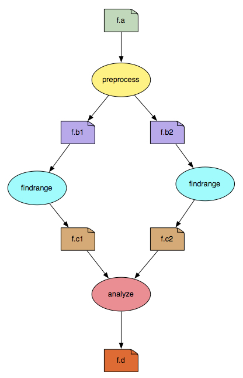

.. _example-workflows:

=================
Example Workflows
=================

These examples are included in the Pegasus distribution and can be found
under ``share/pegasus/examples`` in your Pegasus install
(``/usr/share/pegasus/examples`` for native packages)

   **Note**

   These examples are intended to be a starting point for when you want
   to create your own workflows and want to see how other workflows are
   set up. The example workflows will probably not work in your
   environment without modifications. Site and transformation catalogs
   contain site and user specifics such as paths to scratch directories
   and installed software, and at least minor modificiations are
   required to get the workflows to plan and run.

.. _grid-examples:

Grid Examples
=============

These examples assumes you have access to a cluster with Globus
installed. A pre-ws gatekeeper and gridftp server is required. You also
need Globus and Pegasus installed, both on the machine you are
submitting from, and the cluster.

.. _example-black-diamond:

Black Diamond
-------------

Pegasus is shipped with 3 different Black Diamond examples for the grid.
This is to highlight the available DAX APIs which are Java, Perl and
Python. The examples can be found under:

::

   share/pegasus/examples/grid-blackdiamond-java/
   share/pegasus/examples/grid-blackdiamond-perl/
   share/pegasus/examples/grid-blackdiamond-python/

The workflow has 4 nodes, layed out in a diamond shape, with files being
passed between them (f.*):

|image0|

The binary for the nodes is a simple "mock application" name ``keg``
("canonical example for the grid") which reads input files designated by
arguments, writes them back onto output files, and produces on STDOUT a
summary of where and when it was run. Keg ships with Pegasus in the bin
directory.

This example ships with a "submit" script which will build the replica
catalog, the transformation catalog, and the site catalog. When you
create your own workflows, such a submit script is not needed if you
want to maintain those catalogs manually.

   **Note**

   The use of ``./submit`` scripts in these examples are just to make it
   more easy to run the examples out of the box. For a production site,
   the catalogs (transformation, replica, site) may or may not be static
   or generated by other tooling.

To test the examples, edit the ``submit`` script and change the cluster
config to the setup and install locations for your cluster. Then run:

::

   $ ./submit

The workflow should now be submitted and in the output you should see a
work dir location for the instance. With that directory you can monitor
the workflow with:

::

   $ pegasus-status [workdir]

Once the workflow is done, you can make sure it was sucessful with:

::

   $ pegasus-analyzer -d [workdir]

NASA/IPAC Montage
-----------------

This example can be found under

::

   share/pegasus/examples/grid-montage/

The NASA IPAC Montage (http://montage.ipac.caltech.edu/) workflow
projects/montages a set of input images from telescopes like Hubble and
end up with images like http://montage.ipac.caltech.edu/images/m104.jpg
. The test workflow is for a 1 by 1 degrees tile. It has about 45 input
images which all have to be projected, background modeled and adjusted
to come out as one seamless image.

Just like the `Black Diamond <#example_black_diamond>`__ above, this
example uses a ``./submit`` script.

The Montage DAX is generated with a tool called ``mDAG`` shipped with
Montage which generates the workflow.

Rosetta
-------

This example can be found under

::

   share/pegasus/examples/grid-rosetta/

Rosetta (http://www.rosettacommons.org/) is a high resolution protein
prediction and design software. Highlights in this example are:

-  Using the Pegasus Java API to generate the DAX

-  The DAX generator loops over the input PDBs and creates a job for
   each input

-  The jobs all have a dependency on a flatfile database. For
   simplicity, each job depends on all the files in the database
   directory.

-  Job clustering is turned on to make each grid job run longer and
   better utilize the compute cluster

Just like the `Black Diamond <#example_black_diamond>`__ above, this
example uses a ``./submit`` script.

.. _condor-examples:

Condor Examples
===============

Black Diamond - condorio
------------------------

There are a set of Condor examples available, highlighting different
`data staging configurations <#data_staging_configuration>`__.The most
basic one is condorio, and the example can be found under:

::

   share/pegasus/examples/condor-blackdiamond-condorio/

This example is using the same abstract workflow as the `Black
Diamond <#example_black_diamond>`__ grid example above, and can be
executed either on the submit machine (universe="local") or on a local
Condor pool (universe="vanilla").

You can run this example with the ``./submit`` script. Example:

::

   $ ./submit

.. _container-examples:

Container Examples
==================

.. _example-containers-montage:

Montage Using Containers
------------------------

This section contains an example of a real workflow running inside
Singularity containers. The application is
`Montage <http://montage.ipac.caltech.edu/>`__ using the `montage-v2
workflow <https://github.com/pegasus-isi/montage-workflow-v2>`__. Be
aware that this workflow can be fairly data intensive, and when running
with containers in *condorio* or *nonsharedfs* data management modes,
the data staging of the application data and the container image to each
job can result in a non-trivial amount of network traffic.

The software dependencies consists of the *Montage* software stack, and
*AstroPy*. These are installed into the image (see the *Singularity*
file in the GitHub repository). The image has been made available in
`Singularity Hub <https://singularity-hub.org/>`__.

Now that we have an image, the next step is to check out the workflow
from GitHub, and use it to create an abstract workflow description, a
transformation catalog and a replica catalog. The *montage-workflow.py*
command create all this for us, but the command itself requires Montage
to look up input data for the specified location in the sky. The provide
the environment, run this command inside the same Singularity image. For
example:

::

   singularity exec \
               --bind $PWD:/srv --workdir /srv \
               shub://singularity-hub.org/pegasus-isi/montage-workflow-v2 \
               /srv/montage-workflow.py \
                   --tc-target container \
                   --center "56.7 24.00" \
                   --degrees 2.0 \
                   --band dss:DSS2B:blue \
                   --band dss:DSS2R:green \
                   --band dss:DSS2IR:red

The command executes a data find for the 3 specified bands, 2.0 degrees
around the location 56.7 24.00, and generates a workflow to combine the
images into a single image. One extra flag is provided to let the
command know we want to execute the workflow inside containers:
*--tc-target container*. The result is a transformation catalog in
*data/tc.txt*

, with starts with:
::

   cont montage {
      type "singularity"
      image "shub://singularity-hub.org/pegasus-isi/montage-workflow-v2"
      profile env "MONTAGE_HOME" "/opt/Montage"
   }

   tr mDiffFit {
     site condor_pool {
       type "INSTALLED"
       container "montage"
       pfn "file:///opt/Montage/bin/mDiffFit"
       profile pegasus "clusters.size" "5"
     }
   }
   ...

The first entry describes the container, where the image can be found
(Singularity Hub in this example), and a special environment variable we
want to be set for the jobs.

The second entry, of which there are many more similar ones in the file,
describes the application. Note how it refers back to the *"montage"*
container, specifying that we want the job to be wrapped in the
container.

In the *data/* directory. we can also find the abstract workflow
(*montage.dax*), and replica catalog (*rc.dax*). Note that this are the
same as if the workflow was running in a non-container environment. To
plan the workflow:

::

   pegasus-plan \
           --dir work \
           --relative-dir `date +'%s'` \
           --dax data/montage.dax \
           --sites condor_pool \
           --output-site local \
           --cluster horizontal

.. _local-shell-examples:

Local Shell Examples
====================

Black Diamond
-------------

To aid in workflow development and debugging, Pegasus can now map a
workflow to a local shell script. One advantage is that you do not need
a remote compute resource.

This example is using the same abstract workflow as the `Black
Diamond <#example_black_diamond>`__ grid example above. The difference
is that a property is set in pegasusrc to force shell execution:

::

   # tell pegasus to generate shell version of
   # the workflow
   pegasus.code.generator = Shell

You can run this example with the ``./submit`` script.

.. _notifications-example:

Notifications Example
=====================

A new feature in Pegasus 3.1. is notifications. While the workflow is
running, a monitoring tool is running side by side to the workflow, and
issues user defined notifications when certain events takes place, such
as job completion or failure. See `notifications
section <#notifications>`__ for detailed information. A workflow example
with notifications can be found under examples/notifications. This
workflow is based on the Black Diamond, with the changes being
notifications added to the DAX generator. For example, notifications are
added at the workflow level:

::

   # Create a abstract dag
   diamond = ADAG("diamond")
   # dax level notifications
   diamond.invoke('all', os.getcwd() + "/my-notify.sh")

The DAX generator also contains job level notifications:

::

   # job level notifications - in this case for at_end events
   frr.invoke('at_end', os.getcwd() + "/my-notify.sh")

These invoke lines specify that the ``my-notify.sh`` script will be
invoked for events generated (**all** in the first case, **at_end** in
the second). The ``my-notify.sh`` script contains callouts sample
notification tools shipped with Pegasus, one for email and for
Jabber/GTalk (commented out by default):

::

   #!/bin/bash

   # Pegasus ships with a couple of basic notification tools. Below
   # we show how to notify via email and gtalk.

   # all notifications will be sent to email
   # change $USER to your full email addess
   $PEGASUS_HOME/libexec/notification/email -t $USER

   # this sends notifications about failed jobs to gtalk.
   # note that you can also set which events to trigger on in your DAX.
   # set jabberid to your gmail address, and put in yout
   # password
   # uncomment to enable
   if [ "x$PEGASUS_STATUS" != "x" -a "$PEGASUS_STATUS" != "0" ]; then
       $PEGASUS_HOME/libexec/notification/jabber --jabberid FIXME@gmail.com \
                                                 --password FIXME \
                                                 --host talk.google.com
   fi

.. _workflow-of-workflows:

Workflow of Workflows
=====================

Galactic Plane
--------------

The `Galactic Plane <http://en.wikipedia.org/wiki/Galactic_plane>`__
workflow is a workflow of many Montage workflows. The output is a set of
tiles which can be used in software which takes the tiles and produces a
seamless image which can be scrolled and zoomed into. As this is more of
a production workflow than an example one, it can be a little bit harder
to get running in your environment.

Highlights of the example are:

-  The subworkflow DAXes are generated as jobs in the parent workflow -
   this is an example on how to make more dynamic workflows. For
   example, if you need a job in your workflow to determine the number
   of jobs in the next level, you can have the first job create a
   subworkflow with the right number of jobs.

-  DAGMan job categories are used to limit the number of concurrant jobs
   in certain places. This is used to limit the number of concurrant
   connections to the data find service, as well limit the number of
   concurrant subworkflows to manage disk usage on the compute cluster.

-  Job priorities are used to make sure we overlap staging and
   computation. Pegasus sets default priorities, which for most jobs are
   fine, but the priority of the data find job is set explicitly to a
   higher priority.

-  A specific output site is defined the the site catalog and specified
   with the --output option of subworkflows.

The DAX API has support for sub workflows:

::

       remote_tile_setup = Job(namespace="gp", name="remote_tile_setup", version="1.0")
       remote_tile_setup.addArguments("%05d" % (tile_id))
       remote_tile_setup.addProfile(Profile("dagman", "CATEGORY", "remote_tile_setup"))
       remote_tile_setup.uses(params, link=Link.INPUT, register=False)
       remote_tile_setup.uses(mdagtar, link=Link.OUTPUT, register=False, transfer=True)
       uberdax.addJob(remote_tile_setup)
   ...
       subwf = DAX("%05d.dax" % (tile_id), "ID%05d" % (tile_id))
       subwf.addArguments("-Dpegasus.schema.dax=%s/etc/dax-2.1.xsd" %(os.environ["PEGASUS_HOME"]),
                          "-Dpegasus.catalog.replica.file=%s/rc.data" % (tile_work_dir),
                          "-Dpegasus.catalog.site.file=%s/sites.xml" % (work_dir),
                          "-Dpegasus.transfer.links=true",
                          "--sites", cluster_name,
                          "--cluster", "horizontal",
                          "--basename", "tile-%05d" % (tile_id),
                          "--force",
                          "--output", output_name)
       subwf.addProfile(Profile("dagman", "CATEGORY", "subworkflow"))
       subwf.uses(subdax_file, link=Link.INPUT, register=False)
       uberdax.addDAX(subwf)

