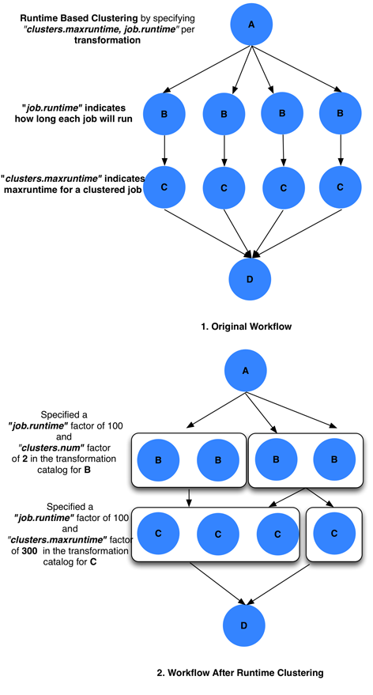
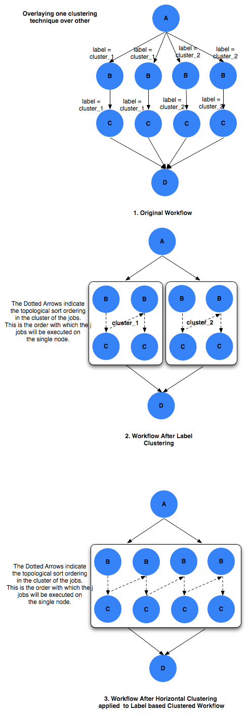
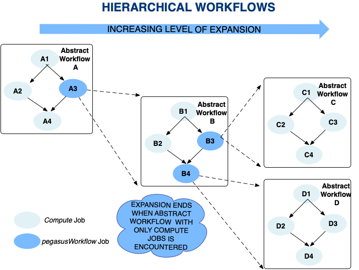
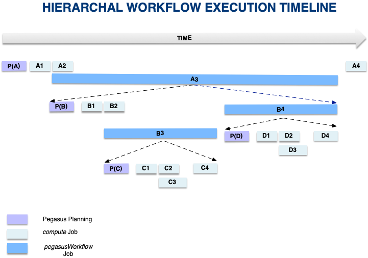

.. _optimization:

===================================================
Optimizing Workflows for Efficiency and Scalability
===================================================

By default, Pegasus generates workflows which targets the most common
usecases and execution environments. For more specialized environments
or workflows, the following sections can provide hints on how to
optimize your workflow to scale better, and run more efficient. Below
are some common issues and solutions.

.. _short-jobs:

Optimizing Short Jobs / Scheduling Delays
=========================================

*Issue:* Even though HTCondor is a high throughput system, there are
overheads when scheduling short jobs. Common overheads include
scheduling, data transfers, state notifications, and task book keeping.
These overheads can be very noticeable for short jobs, but not
noticeable at all for longer jobs as the ration between the computation
and the overhead is higher.

*Solution:* If you have many short tasks to run, the solution to
minimize the overheads is to use `task clustering <#job_clustering>`__.
This instructs Pegasus to take a set of tasks, selected
`horizontally <#horizontal_clustering>`__, by
`labels <#label_clustering>`__, or by `runtime <#runtime_clustering>`__,
and create jobs containing that whole set of tasks. The result is more
efficient jobs, for wich the overheads are less noticeable.

.. _job-clustering:

Job Clustering
==============

A large number of workflows executed through the Pegasus Workflow
Management System, are composed of several jobs that run for only a few
seconds or so. The overhead of running any job on the grid is usually 60
seconds or more. Hence, it makes sense to cluster small independent jobs
into a larger job. This is done while mapping an abstract workflow to an
executable workflow. Site specific or transformation specific criteria
are taken into consideration while clustering smaller jobs into a larger
job in the executable workflow. The user is allowed to control the
granularity of this clustering on a per transformation per site basis.

Overview
--------

The abstract workflow is mapped onto the various sites by the Site
Selector. This semi executable workflow is then passed to the clustering
module. The clustering of the workflow can be either be

-  level based horizontal clustering - where you can denote how many
   jobs get clustered into a single clustered job per level, or how many
   clustered jobs should be created per level of the workflow

-  level based runtime clustering - similar to horizontal clustering ,
   but while creating the clusters per level take into account the job
   runtimes.

-  label based (label clustering)

The clustering module clusters the jobs into larger/clustered jobs, that
can then be executed on the remote sites. The execution can either be
sequential on a single node or on multiple nodes using MPI. To specify
which clustering technique to use the user has to pass the **--cluster**
option to **pegasus-plan** .

Generating Clustered Executable Workflow
~~~~~~~~~~~~~~~~~~~~~~~~~~~~~~~~~~~~~~~~

The clustering of a workflow is activated by passing the
**--cluster|-C** option to **pegasus-plan**. The clustering granularity
of a particular logical transformation on a particular site is dependant
upon the clustering techniques being used. The executable that is used
for running the clustered job on a particular site is determined as
explained in section 7.

::

   #Running pegasus-plan to generate clustered workflows

   $ pegasus-plan --dax example.dax --dir ./dags -p siteX --output local
                  --cluster [comma separated list of clustering techniques]  -verbose

   Valid clustering techniques are horizontal and label.

The naming convention of submit files of the clustered jobs
is\ **merge_NAME_IDX.sub** . The NAME is derived from the logical
transformation name. The IDX is an integer number between 1 and the
total number of jobs in a cluster. Each of the submit files has a
corresponding input file, following the naming convention
**merge_NAME_IDX.in**. The input file contains the respective execution
targets and the arguments for each of the jobs that make up the
clustered job.

.. _horizontal-clustering:

Horizontal Clustering
^^^^^^^^^^^^^^^^^^^^^

In case of horizontal clustering, each job in the workflow is associated
with a level. The levels of the workflow are determined by doing a
modified Breadth First Traversal of the workflow starting from the root
nodes. The level associated with a node, is the furthest distance of it
from the root node instead of it being the shortest distance as in
normal BFS. For each level the jobs are grouped by the site on which
they have been scheduled by the Site Selector. Only jobs of same type
(txnamespace, txname, txversion) can be clustered into a larger job. To
use horizontal clustering the user needs to set the **--cluster** option
of **pegasus-plan to horizontal** .

Controlling Clustering Granularity
''''''''''''''''''''''''''''''''''

The number of jobs that have to be clustered into a single large job, is
determined by the value of two parameters associated with the smaller
jobs. Both these parameters are specified by the use of a PEGASUS
namespace profile keys. The keys can be specified at any of the
placeholders for the profiles (abstract transformation in the DAX, site
in the site catalog, transformation in the transformation catalog). The
normal overloading semantics apply i.e. profile in transformation
catalog overrides the one in the site catalog and that in turn overrides
the one in the DAX. The two parameters are described below.

-  **clusters.size factor**

   The clusters.size factor denotes how many jobs need to be merged into
   a single clustered job. It is specified via the use of a PEGASUS
   namespace profile key 'clusters.size'. for e.g. if at a particular
   level, say 4 jobs referring to logical transformation B have been
   scheduled to a siteX. The clusters.size factor associated with job B
   for siteX is say 3. This will result in 2 clustered jobs, one
   composed of 3 jobs and another of 2 jobs. The clusters.size factor
   can be specified in the transformation catalog as follows

   ::

      # multiple line text-based transformation catalog: 2014-09-30T16:05:01.731-07:00
      tr B {
              site siteX {
                      profile pegasus "clusters.size" "3"
                      pfn "/shared/PEGASUS/bin/jobB"
                      arch "x86"
                      os "LINUX"
                      type "INSTALLED"
              }
      }

      tr C {
              site siteX {
                      profile pegasus "clusters.size" "2"
                      pfn "/shared/PEGASUS/bin/jobC"
                      arch "x86"
                      os "LINUX"
                      type "INSTALLED"
              }
      }

   .. figure:: images/advanced-clustering-1.png
      :alt: Clustering by clusters.size

      Clustering by clusters.size

-  **clusters.num factor**

   The clusters.num factor denotes how many clustered jobs does the user
   want to see per level per site. It is specified via the use of a
   PEGASUS namespace profile key 'clusters.num'. for e.g. if at a
   particular level, say 4 jobs referring to logical transformation B
   have been scheduled to a siteX. The 'clusters.num' factor associated
   with job B for siteX is say 3. This will result in 3 clustered jobs,
   one composed of 2 jobs and others of a single job each. The
   clusters.num factor in the transformation catalog can be specified as
   follows

   ::

      # multiple line text-based transformation catalog: 2014-09-30T16:06:23.397-07:00
      tr B {
              site siteX {
                      profile pegasus "clusters.num" "3"
                      pfn "/shared/PEGASUS/bin/jobB"
                      arch "x86"
                      os "LINUX"
                      type "INSTALLED"
              }
      }

      tr C {
              site siteX {
                      profile pegasus "clusters.num" "2"
                      pfn "/shared/PEGASUS/bin/jobC"
                      arch "x86"
                      os "LINUX"
                      type "INSTALLED"
              }
      }

   In the case, where both the factors are associated with the job, the
   clusters.num value supersedes the clusters.size value.

   ::

      # multiple line text-based transformation catalog: 2014-09-30T16:08:01.537-07:00
      tr B {
              site siteX {
                      profile pegasus "clusters.num" "3"
                      profile pegasus "clusters.size" "3"
                      pfn "/shared/PEGASUS/bin/jobB"
                      arch "x86"
                      os "LINUX"
                      type "INSTALLED"
              }
      }

   In the above case the jobs referring to logical transformation B
   scheduled on siteX will be clustered on the basis of 'clusters.num'
   value. Hence, if there are 4 jobs referring to logical transformation
   B scheduled to siteX, then 3 clustered jobs will be created.

   .. figure:: images/advanced-clustering-2.png
      :alt: Clustering by clusters.num

      Clustering by clusters.num

.. _runtime-clustering:

Runtime Clustering
^^^^^^^^^^^^^^^^^^

Workflows often consist of jobs of same type, but have varying run
times. Two or more instances of the same job, with varying inputs can
differ significantly in their runtimes. A simple way to think about this
is running the same program on two distinct input sets, where one input
is smaller (1 MB) as compared to the other which is 10 GB in size. In
such a case the two jobs will having significantly differing run times.
When such jobs are clustered using horizontal clustering, the benefits
of job clustering may be lost if all smaller jobs get clustered
together, while the larger jobs are clustered together. In such
scenarios it would be beneficial to be able to cluster jobs together
such that all clustered jobs have similar runtimes.

In case of runtime clustering, jobs in the workflow are associated with
a level. The levels of the workflow are determined in the same manner as
in horizontal clustering. For each level the jobs are grouped by the
site on which they have been scheduled by the Site Selector. Only jobs
of same type (txnamespace, txname, txversion) can be clustered into a
larger job. To use runtime clustering the user needs to set the
**--cluster** option of **pegasus-plan to horizontal**, and set the
Pegasus property **pegasus.clusterer.preference** to **Runtime**.

Runtime clustering supports two modes of operation.

1. Clusters jobs together such that the clustered job's runtime does not
   exceed a user specified maxruntime.

   Basic Algorithm of grouping jobs into clusters is as follows

   ::

      // cluster.maxruntime - Is the maximum runtime for which the clustered job should run.
      // j.runtime - Is the runtime of the job j.
      1. Create a set of jobs of the same type (txnamespace, txname, txversion), and that run on the same site.
      2. Sort the jobs in decreasing order of their runtime.
      3. For each job j, repeat
        a. If j.runtime > cluster.maxruntime then
              ignore j.
        // Sum of runtime of jobs already in the bin + j.runtime <= cluster.maxruntime
        b. If j can be added to any existing bin (clustered job) then
              Add j to bin
           Else
              Add a new bin
              Add job j to newly added bin

   The runtime of a job, and the maximum runtime for which a clustered
   jobs should run is determined by the value of two parameters
   associated with the jobs.

   -  **runtime**

      expected runtime for a job

   -  **clusters.maxruntime**

      maxruntime for the clustered job i.e. Group as many jobs as
      possible into a cluster, as long as the clustered jobs' runtime
      does not exceed clusters.maxruntime.

2. Clusters all the into a fixed number of clusters (clusters.num), such
   that the runtimes of the clustered jobs are similar.

   Basic Algorithm of grouping jobs into clusters is as follows

   ::

      // cluster.num - Is the number of clustered jobs to create.
      // j.runtime - Is the runtime of the job j.
      1. Create a set of jobs of the same type (txnamespace, txname, txversion), and that run on the same site.
      2. Sort the jobs in decreasing order of their runtime.
      3. Create a heap containing clusters.num number of clustered jobs.
      4. For each job j, repeat
        a. Get cluster job cj, having the shortest runtime
        b. Add job j to clustered job cj

   The runtime of a job, and the number of clustered jobs to create is
   determined by the value of two parameters associated with the jobs.

   -  **runtime**

      expected runtime for a job

   -  **clusters.num**

      clusters.num factor denotes how many clustered jobs does the user
      want to see per level per site

..

   **Note**

   Users should either specify clusters.maxruntime or clusters.num. If
   both of them are specified, then clusters.num profile will be ignored
   by the clustering engine.

All of these parameters are specified by the use of a PEGASUS namespace
profile keys. The keys can be specified at any of the placeholders for
the profiles (abstract transformation in the DAX, site in the site
catalog, transformation in the transformation catalog). The normal
overloading semantics apply i.e. profile in transformation catalog
overrides the one in the site catalog and that in turn overrides the one
in the DAX. The two parameters are described below.

::

   # multiple line text-based transformation catalog: 2014-09-30T16:09:40.610-07:00
   #Cluster all jobs of type B at siteX, into 2 clusters such that the 2 clusters have similar runtimes
   tr B {
           site siteX {
                   profile pegasus "clusters.num" "2"
                   profile pegasus "runtime" "100"
                   pfn "/shared/PEGASUS/bin/jobB"
                   arch "x86"
                   os "LINUX"
                   type "INSTALLED"
           }
   }

   #Cluster all jobs of type C at siteX, such that the duration of the clustered job does not exceed 300.
   tr C {
           site siteX {
                   profile pegasus "clusters.maxruntime" "300"
                   profile pegasus "runtime" "100"
                   pfn "/shared/PEGASUS/bin/jobC"
                   arch "x86"
                   os "LINUX"
                   type "INSTALLED"
           }
   }

   Clustering by runtime

In the above case the jobs referring to logical transformation B
scheduled on siteX will be clustered such that all clustered jobs will
run approximately for the same duration specified by the
clusters.maxruntime property. In the above case we assume all jobs
referring to transformation B run for 100 seconds. For jobs with
significantly differing runtime, the runtime property will be associated
with the jobs in the DAX.

In addition to the above two profiles, we need to inform pegasus-plan to
use runtime clustering. This is done by setting the following property .

::

    pegasus.clusterer.preference          Runtime

.. _label-clustering:

Label Clustering
^^^^^^^^^^^^^^^^

In label based clustering, the user labels the workflow. All jobs having
the same label value are clustered into a single clustered job. This
allows the user to create clusters or use a clustering technique that is
specific to his workflows. If there is no label associated with the job,
the job is not clustered and is executed as is

Since, the jobs in a cluster in this case are not independent, it is
important the jobs are executed in the correct order. This is done by
doing a topological sort on the jobs in each cluster. To use label based
clustering the user needs to set the **--cluster** option of
**pegasus-plan** to label.

Labelling the Workflow
''''''''''''''''''''''

The labels for the jobs in the workflow are specified by associated
**pegasus** profile keys with the jobs during the DAX generation
process. The user can choose which profile key to use for labeling the
workflow. By default, it is assumed that the user is using the PEGASUS
profile key label to associate the labels. To use another key, in the
**pegasus** namespace the user needs to set the following property

-  pegasus.clusterer.label.key

For example if the user sets **pegasus.clusterer.label.key**\ to
**user_label** then the job description in the DAX looks as follows

::

   <adag >
   ...
     <job id="ID000004" namespace="app" name="analyze" version="1.0" level="1" >
       <argument>-a bottom -T60  -i <filename file="user.f.c1"/>  -o <filename file="user.f.d"/></argument>
       <profile namespace="pegasus" key="user_label">p1</profile>
       <uses file="user.f.c1" link="input" register="true" transfer="true"/>
       <uses file="user.f.c2" link="input" register="true" transfer="true"/>
       <uses file="user.f.d" link="output" register="true" transfer="true"/>
     </job>
   ...
   </adag>

-  The above states that the **pegasus** profiles with key as
   **user_label** are to be used for designating clusters.

-  Each job with the same value for **pegasus** profile key
   **user_label**\ appears in the same cluster.

Recursive Clustering
^^^^^^^^^^^^^^^^^^^^

In some cases, a user may want to use a combination of clustering
techniques. For e.g. a user may want some jobs in the workflow to be
horizontally clustered and some to be label clustered. This can be
achieved by specifying a comma separated list of clustering techniques
to the\ **--cluster** option of **pegasus-plan**. In this case the
clustering techniques are applied one after the other on the workflow in
the order specified on the command line.

For example

::

   $ pegasus-plan --dax example.dax --dir ./dags --cluster label,horizontal -s siteX --output local --verbose

   Recursive clustering

Execution of the Clustered Job
~~~~~~~~~~~~~~~~~~~~~~~~~~~~~~

The execution of the clustered job on the remote site, involves the
execution of the smaller constituent jobs either

-  **sequentially on a single node of the remote site**

   The clustered job is executed using **pegasus-cluster**, a wrapper
   tool written in C that is distributed as part of the PEGASUS. It
   takes in the jobs passed to it, and ends up executing them
   sequentially on a single node. To use pegasus-cluster for executing
   any clustered job on a siteX, there needs to be an entry in the
   transformation catalog for an executable with the logical name
   seqexec and namespace as pegasus.

   ::

      #site  transformation   pfn            type                 architecture    profiles

      siteX    pegasus::seqexec     /usr/pegasus/bin/pegasus-cluster INSTALLED       INTEL32::LINUX NULL

   If the entry is not specified, Pegasus will attempt create a default
   path on the basis of the environment profile PEGASUS_HOME specified
   in the site catalog for the remote site.

-  **On multiple nodes of the remote site using MPI based task
   management tool called Pegasus MPI Cluster (PMC)**

   The clustered job is executed using **pegasus-mpi-cluster**, a
   wrapper MPI program written in C that is distributed as part of the
   PEGASUS. A PMC job consists of a single master process (this process
   is rank 0 in MPI parlance) and several worker processes. These
   processes follow the standard master-worker architecture. The master
   process manages the workflow and assigns workflow tasks to workers
   for execution. The workers execute the tasks and return the results
   to the master. Communication between the master and the workers is
   accomplished using a simple text-based protocol implemented using
   MPI_Send and MPI_Recv. PMC relies on a shared filesystem on the
   remote site to manage the individual tasks stdout and stderr and
   stage it back to the submit host as part of it's own stdout/stderr.

   The input format for PMC is a DAG based format similar to Condor
   DAGMan's. PMC follows the dependencies specified in the DAG to
   release the jobs in the right order and executes parallel jobs via
   the workers when possible. The input file for PMC is automatically
   generated by the Pegasus Planner when generating the executable
   workflow. PMC allows for a finer grained control on how each task is
   executed. This can be enabled by associating the following pegasus
   profiles with the jobs in the DAX

   .. table:: Pegasus Profiles that can be associated with jobs in the
   DAX for PMC

      ================== =====================================================================================================================================================================================================================================================================================================
      **Key**            **Description**
      pmc_request_memory This key is used to set the -m option for pegasus-mpi-cluster. It specifies the amount of memory in MB that a job requires. This profile is usually set in the DAX for each job.
      pmc_request_cpus   This key is used to set the -c option for pegasus-mpi-cluster. It specifies the number of cpu's that a job requires. This profile is usually set in the DAX for each job.
      pmc_priority       This key is used to set the -p option for pegasus-mpi-cluster. It specifies the priority for a job . This profile is usually set in the DAX for each job. Negative values are allowed for priorities.
      pmc_task_arguments The key is used to pass any extra arguments to the PMC task during the planning time. They are added to the very end of the argument string constructed for the task in the PMC file. Hence, allows for overriding of any argument constructed by the planner for any particular task in the PMC job.
      ================== =====================================================================================================================================================================================================================================================================================================

   Refer to the pegasus-mpi-cluster man page in the `command line tools
   chapter <#cli>`__ to know more about PMC and how it schedules
   individual tasks.

   It is recommended to have a pegasus::mpiexec entry in the
   transformation catalog to specify the path to PMC on the remote and
   specify the relevant globus profiles such as xcount, host_xcount and
   maxwalltime to control size of the MPI job.

   ::

      # multiple line text-based transformation catalog: 2014-09-30T16:11:11.947-07:00
      tr pegasus::mpiexec {
              site siteX {
                      profile globus "host_xcount" "1"
                      profile globus "xcount" "32"
                      pfn "/usr/pegasus/bin/pegasus-mpi-cluster"
                      arch "x86"
                      os "LINUX"
                      type "INSTALLED"
              }
      }

   the entry is not specified, Pegasus will attempt create a default
   path on the basis of the environment profile PEGASUS_HOME specified
   in the site catalog for the remote site.

      **Tip**

      Users are encouraged to use label based clustering in conjunction
      with PMC

Specification of Method of Execution for Clustered Jobs
^^^^^^^^^^^^^^^^^^^^^^^^^^^^^^^^^^^^^^^^^^^^^^^^^^^^^^^

The method execution of the clustered job(whether to launch via mpiexec
or seqexec) can be specified

1. **globally in the properties file**

   The user can set a property in the properties file that results in
   all the clustered jobs of the workflow being executed by the same
   type of executable.

   ::

      #PEGASUS PROPERTIES FILE
      pegasus.clusterer.job.aggregator seqexec|mpiexec

   In the above example, all the clustered jobs on the remote sites are
   going to be launched via the property value, as long as the property
   value is not overridden in the site catalog.

2. **associating profile key job.aggregator with the site in the site
   catalog**

   ::

      <site handle="siteX" gridlaunch = "/shared/PEGASUS/bin/kickstart">
          <profile namespace="env" key="GLOBUS_LOCATION" >/home/shared/globus</profile>
          <profile namespace="env" key="LD_LIBRARY_PATH">/home/shared/globus/lib</profile>
          <profile namespace="pegasus" key="job.aggregator" >seqexec</profile>
          <lrc url="rls://siteX.edu" />
          <gridftp  url="gsiftp://siteX.edu/" storage="/home/shared/work" major="2" minor="4" patch="0" />
          <jobmanager universe="transfer" url="siteX.edu/jobmanager-fork" major="2" minor="4" patch="0" />
          <jobmanager universe="vanilla" url="siteX.edu/jobmanager-condor" major="2" minor="4" patch="0" />
          <workdirectory >/home/shared/storage</workdirectory>
        </site>

   In the above example, all the clustered jobs on a siteX are going to
   be executed via seqexec, as long as the value is not overridden in
   the transformation catalog.

3. **associating profile key job.aggregator with the transformation that
   is being clustered, in the transformation catalog**

   ::

      # multiple line text-based transformation catalog: 2014-09-30T16:11:52.230-07:00
      tr B {
              site siteX {
                      profile pegasus "clusters.size" "3"
                      profile pegasus "job.aggregator" "mpiexec"
                      pfn "/shared/PEGASUS/bin/jobB"
                      arch "x86"
                      os "LINUX"
                      type "INSTALLED"
              }
      }

   In the above example, all the clustered jobs that consist of
   transformation B on siteX will be executed via mpiexec.

      **Note**

      **The clustering of jobs on a site only happens only if**

      -  there exists an entry in the transformation catalog for the
         clustering executable that has been determined by the above 3
         rules

      -  the number of jobs being clustered on the site are more than 1

Outstanding Issues
~~~~~~~~~~~~~~~~~~

1. **Label Clustering**

   More rigorous checks are required to ensure that the labeling scheme
   applied by the user is valid.

.. _large-workflows:

How to Scale Large Workflows
============================

*Issue:* When planning and running large workflows, there are some
scalability issues to be aware of. During the planning stage, Pegasus
traverses the graphs multiple times, and some of the graph transforms
can be slow depending on if the graph is large in the number of tasks,
the number of files, or the number of dependencies. Once planned, large
workflows can also see scalability limits when interacting with the
operating system. A common problem is the number of files in a single
directory, such as thousands or millons input or output files.

*Solution:* The most common solution to these problems is to use
`hierarchical workflows <#hierarchial_workflows>`__, which works really
well if your workflow can be logically partitioned into smaller
workflows. A hierarchical workflow still runs like a single workflow,
with the difference being that some jobs in the workflow are actually
sub-workflows.

For workflows with a large number of files, you can control the number
of files in a single directory by reorganizing the files into a deep
directory structure.

.. _hierarchial-workflows:

Hierarchical Workflows
======================

Introduction
------------

The Abstract Workflow in addition to containing compute jobs, can also
contain jobs that refer to other workflows. This is useful for running
large workflows or ensembles of workflows.

Users can embed two types of workflow jobs in the DAX

1. daxjob - refers to a sub workflow represented as a DAX. During the
   planning of a workflow, the DAX jobs are mapped to condor dagman jobs
   that have pegasus plan invocation on the dax ( referred to in the DAX
   job ) as the prescript.

   .. figure:: ./images/daxjob-mapping.png
      :alt: Planning of a DAX Job
      :width: 100.0%

      Planning of a DAX Job

2. dagjob - refers to a sub workflow represented as a DAG. During the
   planning of a workflow, the DAG jobs are mapped to condor dagman and
   refer to the DAG file mentioned in the DAG job.

   .. figure:: ./images/dagjob-mapping.png
      :alt: Planning of a DAG Job
      :width: 100.0%

      Planning of a DAG Job

Specifying a DAX Job in the DAX
-------------------------------

Specifying a DAXJob in a DAX is pretty similar to how normal compute
jobs are specified. There are minor differences in terms of the xml
element name ( dax vs job ) and the attributes specified. DAXJob XML
specification is described in detail in the `chapter on DAX
API <#api>`__ . An example DAX Job in a DAX is shown below

::

     <dax id="ID000002" name="black.dax" node-label="bar" >
       <profile namespace="dagman" key="maxjobs">10</profile>
       <argument>-Xmx1024 -Xms512 -Dpegasus.dir.storage=storagedir  -Dpegasus.dir.exec=execdir -o local -vvvvv --force -s dax_site </argument>
     </dax>

DAX File Locations
~~~~~~~~~~~~~~~~~~

The name attribute in the dax element refers to the LFN ( Logical File
Name ) of the dax file. The location of the DAX file can be catalogued
either in the

1. Replica Catalog

2. Replica Catalog Section in the `DAX <#dax_replica_catalog>`__ .

      **Note**

      Currently, only file url's on the local site ( submit host ) can
      be specified as DAX file locations.

Arguments for a DAX Job
~~~~~~~~~~~~~~~~~~~~~~~

Users can specify specific arguments to the DAX Jobs. The arguments
specified for the DAX Jobs are passed to the pegasus-plan invocation in
the prescript for the corresponding condor dagman job in the executable
workflow.

The following options for pegasus-plan are inherited from the
pegasus-plan invocation of the parent workflow. If an option is
specified in the arguments section for the DAX Job then that overrides
what is inherited.

.. table:: Options inherited from parent workflow

   =========== ========================
   Option Name Description
   =========== ========================
   --sites     list of execution sites.
   =========== ========================

It is highly recommended that users **don't specify** directory related
options in the arguments section for the DAX Jobs. Pegasus assigns
values to these options for the sub workflows automatically.

1. --relative-dir

2. --dir

3. --relative-submit-dir

Profiles for DAX Job
~~~~~~~~~~~~~~~~~~~~

Users can choose to specify dagman profiles with the DAX Job to control
the behavior of the corresponding condor dagman instance in the
executable workflow. In the example `above <#dax_job_example>`__ maxjobs
is set to 10 for the sub workflow.

Execution of the PRE script and Condor DAGMan instance
~~~~~~~~~~~~~~~~~~~~~~~~~~~~~~~~~~~~~~~~~~~~~~~~~~~~~~

The pegasus plan that is invoked as part of the prescript to the condor
dagman job is executed on the submit host. The log from the output of
pegasus plan is redirected to a file ( ending with suffix pre.log ) in
the submit directory of the workflow that contains the DAX Job. The path
to pegasus-plan is automatically determined.

The DAX Job maps to a Condor DAGMan job. The path to condor dagman
binary is determined according to the following rules -

1. entry in the transformation catalog for condor::dagman for site
   local, else

2. pick up the value of CONDOR_HOME from the environment if specified
   and set path to condor dagman as $CONDOR_HOME/bin/condor_dagman ,
   else

3. pick up the value of CONDOR_LOCATION from the environment if
   specified and set path to condor dagman as
   $CONDOR_LOCATION/bin/condor_dagman , else

4. pick up the path to condor dagman from what is defined in the user's
   PATH

..

   **Tip**

   It is recommended that users specify dagman.maxpre in their
   properties file to control the maximum number of pegasus plan
   instances launched by each running dagman instance.

Specifying a DAG Job in the DAX
-------------------------------

Specifying a DAGJob in a DAX is pretty similar to how normal compute
jobs are specified. There are minor differences in terms of the xml
element name ( dag vs job ) and the attributes specified. For DAGJob XML
details,see the `API Reference <#api>`__ chapter . An example DAG Job in
a DAX is shown below

::

     <dag id="ID000003" name="black.dag" node-label="foo" >
       <profile namespace="dagman" key="maxjobs">10</profile>
       <profile namespace="dagman" key="DIR">/dag-dir/test</profile>
     </dag>

DAG File Locations
~~~~~~~~~~~~~~~~~~

The name attribute in the dag element refers to the LFN ( Logical File
Name ) of the dax file. The location of the DAX file can be catalogued
either in the

1. Replica Catalog

2. Replica Catalog Section in the DAX.

      **Note**

      Currently, only file url's on the local site ( submit host ) can
      be specified as DAG file locations.

Profiles for DAG Job
~~~~~~~~~~~~~~~~~~~~

Users can choose to specify dagman profiles with the DAX Job to control
the behavior of the corresponding condor dagman instance in the
executable workflow. In the example above, maxjobs is set to 10 for the
sub workflow.

The dagman profile DIR allows users to specify the directory in which
they want the condor dagman instance to execute. In the example
`above <#dag_job_example>`__ black.dag is set to be executed in
directory /dag-dir/test . The /dag-dir/test should be created
beforehand.

File Dependencies Across DAX Jobs
---------------------------------

In hierarchal workflows , if a sub workflow generates some output files
required by another sub workflow then there should be an edge connecting
the two dax jobs. Pegasus will ensure that the prescript for the child
sub-workflow, has the path to the cache file generated during the
planning of the parent sub workflow. The cache file in the submit
directory for a workflow is a textual replica catalog that lists the
locations of all the output files created in the remote workflow
execution directory when the workflow executes.

This automatic passing of the cache file to a child sub-workflow ensures
that the datasets from the same workflow run are used. However, the
passing the locations in a cache file also ensures that Pegasus will
prefer them over all other locations in the Replica Catalog. If you need
the Replica Selection to consider locations in the Replica Catalog also,
then set the following property.

::

   pegasus.catalog.replica.cache.asrc  true

The above is useful in the case, where you are staging out the output
files to a storage site, and you want the child sub workflow to stage
these files from the storage output site instead of the workflow
execution directory where the files were originally created.

Recursion in Hierarchal Workflows
---------------------------------

It is possible for a user to add a dax jobs to a dax that already
contain dax jobs in them. Pegasus does not place a limit on how many
levels of recursion a user can have in their workflows. From Pegasus
perspective recursion in hierarchal workflows ends when a DAX with only
compute jobs is encountered . However, the levels of recursion are
limited by the system resources consumed by the DAGMan processes that
are running (each level of nesting produces another DAGMan process) .

The figure below illustrates an example with recursion 2 levels deep.

   Recursion in Hierarchal Workflows

The execution time-line of the various jobs in the above figure is
illustrated below.

   Execution Time-line for Hierarchal Workflows

Example
-------

The Galactic Plane workflow is a Hierarchical workflow of many Montage
workflows. For details, see `Workflow of
Workflows <#example_workflows>`__.

.. _data-transfers:

Optimizing Data Transfers
=========================

*Issue:* When it comes to data transfers, Pegasus ships with a default
configuration which is trying to strike a balance between performance
and aggressiveness. We obviously want data transfers to be as quick as
possibly, but we also do not want our transfers to overwhelm data
services and systems.

*Solution:* Starting 4.8.0 release, the default configuration of Pegasus
now adds transfer jobs and cleanup jobs based on the number of jobs at a
particular level of the workflow. For example, for every 10 compute jobs
on a level of a workflow, one data transfer job( stage-in and stage-out)
is created. The default configuration also sets how many threads such a
pegasus-transfer job can spawn. Cleanup jobs are similarly constructed
with an internal ratio of 5.

Additionally, Pegasus makes use of DAGMan categories and associates the
following default values with the transfer and cleanup jobs.

See `Job Throttling <#job_throttling>`__ for details on how to set these
values.

Information on how to control manully the maxinum number of stagein and
stageout jobs can be found in the `Data Movement
Nodes <#data_movement_nodes>`__ section.

How to control the number of threads pegasus-transfer can use depends on
if you want to control standard transfer jobs, or PegasusLite. For the
former, see the `pegasus.transfer.threads <#transfer_props>`__ property,
and for the latter the
`pegasus.transfer.lite.threads <#transfer_props>`__ property.

.. _job-throttling:

Job Throttling
==============

*Issue:* For large workflows you may want to control the number of jobs
released by DAGMan in local condor queue, or number of remote jobs
submitted.

*Solution:* HTCondor DAGMan has knobs that can be tuned at a per
workflow level to control it's behavior. These knobs control how it
interacts with the local HTCondor Schedd to which it submits jobs that
are ready to run in a particular DAG. These knobs are exposed
as\ `DAGMan profiles <#dagman_profiles>`__ (maxidle, maxjobs, maxpre and
maxpost) that you can set in your properties files.

Within a single workflow, you can also control the number of jobs
submitted per type ( or category ) of jobs. To associate categories, you
needs to associate dagman profile key named category with the jobs and
specify the property dagman.[CATEGORY-NAME].\* in the properties file.
More information about HTCondor DAGMan categories can be found in the
`HTCondor
Documentation <http://research.cs.wisc.edu/htcondor/manual/v8.3.5/2_10DAGMan_Applications.html#SECTION003108400000000000000>`__.

By default, pegasus associates default category names to following types
of auxillary jobs

.. table:: Default Category names associated by Pegasus

   ======================== ============================= ================================================
   **DAGMan Category Name** **Auxillary Job applied to.** **Default Value Assigned in generated DAG file**
   stage-in                 data stage-in jobs            10
   stage-out                data stage-out jobs           10
   stage-inter              inter site data transfer jobs -
   cleanup                  data cleanup jobs             4
   registration             registration jobs             1 (for file based RC)
   ======================== ============================= ================================================

Below is a sample properties file that illustrates how categories can be
specified in the properties file

::

   # pegasus properties file snippet illustrating
   # how to specify dagman categories for different types of jobs

   dagman.stage-in.maxjobs 4
   dagman.stage-out.maxjobs 1
   dagman.cleanup.maxjobs 2

HTCondor also exposes useful configuration parameters that can be
specified in it's configuration file (condor_config_val -conf will list
the condor configuration files), to control job submission across
workflows. Some of the useful parameters that you may want to tune are

.. table:: Useful HTCondor Job Throttling Configuration Parameters

   ============================================================================================ ==========================================================================================================================================================================================================================================================================================================================================================================================================================================
   **HTCondor Configuration Parameter**                                                         **Description**
   **Parameter Name:**\ START_LOCAL_UNIVERSE\ **Sample Value :**\ TotalLocalJobsRunning < 20    Most of the pegauss added auxillary jobs ( createdir, cleanup, registration and data cleanup ) run in the local universe on the submit host. If you have a lot of workflows running, HTCondor may try to start too many local universe jobs, that may bring down your submit host. This global parameter is used to configure condor to not launch too many local universe jobs.
   **Parameter Name:**\ GRIDMANAGER_MAX_JOBMANAGERS_PER_RESOURCE\ **Sample Value :**\ Integer   For grid jobs of type gt2, limits the number of globus-job-manager processes that the condor_gridmanager lets run at a time on the remote head node. Allowing too many globus-job-managers to run causes severe load on the head note, possibly making it non-functional. Usually the default value in htcondor ( as of version 8.3.5) is 10.
                                                                                                This parameter is useful when you are doing remote job submissions using HTCondor-G.
   **Parameter Name:**\ GRIDMANAGER_MAX_SUBMITTED_JOBS_PER_RESOURCE\ **Sample Value :** Integer An integer value that limits the number of jobs that a condor_gridmanager daemon will submit to a resource. A comma-separated list of pairs that follows this integer limit will specify limits for specific remote resources. Each pair is a host name and the job limit for that host. Consider the example
                                                                                                ::

                                                                                                   GRIDMANAGER_MAX_SUBMITTED_JOBS_PER_RESOURCE =
                                                                                                                            200, foo.edu, 50, bar.com, 100.

                                                                                                In this example, all resources have a job limit of 200, except foo.edu, which has a limit of 50, and bar.com, which has a limit of 100. Limits specific to grid types can be set by appending the name of the grid type to the configuration variable name, as the example GRIDMANAGER_MAX_SUBMITTED_JOBS_PER_RESOURCE_CREAM = 300 In this example, the job limit for all CREAM resources is 300. Defaults to 1000 ( as of version 8.3.5).

                                                                                                This parameter is useful when you are doing remote job submissions using HTCondor-G.
   ============================================================================================ ==========================================================================================================================================================================================================================================================================================================================================================================================================================================

.. _job-throttling-across-workflows:

Job Throttling Across Workflows
-------------------------------

*Issue:* DAGMan throttling knobs are per workflow, and don't work across
workflows. Is there any way to control different types of jobs run at a
time across workflows?

*Solution:* While not possible in all cases, it is possible to throttle
different types of jobs across workflows if you configure the jobs to
run in vanilla universe by leverage `HTCondor concurrency
limits <http://research.cs.wisc.edu/htcondor/manual/v8.2/3_12Setting_Up.html#SECTION0041215000000000000000>`__.
Most of the Pegasus generated jobs ( data transfer jobs and auxillary
jobs such as create dir, cleanup and registration) execute in local
universe where concurrency limits don't work. To use this you need to do
the following

1. Get the local universe jobs to run locally in vanilla universe. You
   can do this by associating condor profiles universe and requirements
   in the site catalog for local site or individually in the
   transformation catalog for each pegasus executable. Here is an
   example local site catalog entry.

   ::

       <site handle="local" arch="x86_64" os="LINUX">
            <directory type="shared-scratch" path="/shared-scratch/local">
               <file-server operation="all" url="file:///shared-scratch/local"/>
            </directory>
            <directory type="local-storage" path="/storage/local">
               <file-server operation="all" url="file:///storage/local"/>
            </directory>

            <!-- keys to make jobs scheduled to local site run on local site in vanilla universe -->
            <profile namespace="condor" key="universe">vanilla</profile>
            <profile namespace="condor" key="requirements">(Machine=="submit.example.com")</profile>
         </site>

   Replace the Machine value in requirements with the hostname of your
   submit host.

2. Copy condor_config.pegasus file from share/pegasus/htcondor directory
   to your condor config.d directory.

Starting Pegasus 4.5.1 release, the following values for concurrency
limits can be associated with different types of jobs Pegasus creates.
To enable the generation of concurrency limits with the jobs set the
following property in your properties file.

::

   pegasus.condor.concurrency.limits   true

.. table:: Pegasus Job Types To Condor Concurrency Limits

   ============================ ================================================================================
   **Pegasus Job Type**         **HTCondor Concurrency Limit Compatible with distributed condor_config.pegasus**
   Data Stagein Job             pegasus_transfer.stagein
   Data Stageout Job            pegasus_transfer.stageout
   Inter Site Data Transfer Job pegasus_transfer.inter
   Worker Pacakge Staging Job   pegasus_transfer.worker
   Create Directory Job         pegasus_auxillary.createdir
   Data Cleanup Job             pegasus_auxillary.cleanup
   Replica Registration Job     pegasus_auxillary.registration
   Set XBit Job                 pegasus_auxillary.chmod
   User Compute Job             pegasus_compute
   ============================ ================================================================================

..

   **Note**

   It is not recommended to set limit for compute jobs unless you know
   what you are doing.

.. _job-memory-retries:

Increase Memory Requirements for Retries
========================================

*Issue:* Setting memory limits for codes with varying amounts of memory
requirments can be challenging. Some codes do not use much RAM most of
the time, but once in a while require more RAM due to for example
initial condition and hitting a particular spot in the algorithm.

*Solution:* A common approach is to provide a smaller limit for the
first try of a job, and if the job fails, increase the limit for
subsequent tries. This can be accomplished with an expression for the
**request_memory** attribute. For example, setting the attribute in the
site catalog, setting the limit to 1 GB for the first try, and then 4 GB
for remaining tries:

::

           <profile namespace="condor" key="request_memory"> ifthenelse(isundefined(DAGNodeRetry) || DAGNodeRetry == 0, 1024, 4096) </profile>

.. _portable-code:

Best Practices For Developing Portable Code
===========================================

This document lists out issues for the algorithm developers to keep in
mind while developing the respective codes. Keeping these in mind will
alleviate a lot of problems while trying to run the codes in a distributed computing environment.

Codes cannot specify the directory in which they should be run
--------------------------------------------------------------

Codes are installed in some standard location on the Grid Sites or
staged on demand. However, they are not invoked from directories where
they are installed. The codes should be able to be invoked from any
directory, as long as one can access the directory where the codes are
installed.

This is especially relevant, while writing scripts around the algorithm
codes. At that point specifying the relative paths do not work. This is
because the relative path is constructed from the directory where the
script is being invoked. A suggested workaround is to pick up the base
directory where the software is installed from the environment or by
using the ``dirname`` cmd or api. The workflow system can set
appropriate environment variables while launching jobs on the Grid.

No hard-coded paths
-------------------

The algorithms should not hard-code any directory paths in the code. All
directories paths should be picked up explicitly either from the
environment (specifying environment variables) or from command line
options passed to the algorithm code.

Propogating back the right exitcode
-----------------------------------

A job in the workflow is only released for execution if its parents have
executed successfully. Hence, it is very important that the algorithm
codes exit with the correct error code in case of success and failure.
The algorithms should exit with a status of 0 in case of success, and a
non zero status in case of error. Failure to do so will result in
erroneous workflow execution where jobs might be released for execution
even though their parents had exited with an error.

The algorithm codes should catch all errors and exit with a non zero
exitcode. The successful execution of the algorithm code can only be
determined by an exitcode of 0. The algorithm code should not rely upon
something being written to the stdout to designate success for e.g. if
the algorithm code writes out to the stdout SUCCESS and exits with a non
zero status the job would be marked as failed.

In \*nix, a quick way to see if a code is exiting with the correct code
is to execute the code and then execute echo $?.

::

   $ component-x input-file.lisp
   ... some output ...
   $ echo $?
   0

If the code is not exiting correctly, it is necessary to wrap the code
in a script that tests some final condition (such as the presence or
format of a result file) and uses exit to return correctly.

Static vs. Dynamically Linked Libraries
---------------------------------------

Since there is no way to know the profile of the machine that will be
executing the code, it is important that dynamically linked libraries
are avoided or that reliance on them is kept to a minimum. For example,
a component that requires libc 2.5 may or may not run on a machine that
uses libc 2.3. On \*nix, you can use the ``ldd`` command to see what
libraries a binary depends on.

If for some reason you install an algorithm specific library in a non
standard location make sure to set the LD_LIBRARY_PATH for the algorithm
in the transformation catalog for each site.

.. _cpu-affinity-condor:

Slot Partitioning and CPU Affinity in Condor
============================================

By default, Condor will evenly divide the resources in a machine (such
as RAM, swap space and disk space) among all the CPUs, and advertise
each CPU as its own slot with an even share of the system resources. If
you want to have your custom configuration, you can use the following
setting to define the maximum number of different slot types:

::

   MAX_SLOT_TYPES = 2

For each slot type, you can divide system resources unevenly among your
CPUs. The **N** in the name of the macro listed below must be an integer
from 1 to **MAX_SLOT_TYPES** (defined above).

::

   SLOT_TYPE_1 = cpus=2, ram=50%, swap=1/4, disk=1/4
   SLOT_TYPE_N = cpus=1, ram=20%, swap=1/4, disk=1/8

Slots can also be partitioned to accommodate actual needs by accepted
jobs. A partitionable slot is always unclaimed and dynamically splitted
when jobs are started. Slot partitioning can be enable as follows:

::

   SLOT_TYPE_1_PARTITIONABLE = True
   SLOT_TYPE_N_PARTITIONABLE = True

Condor can also bind cores to each slot through CPU affinity:

::

   ENFORCE_CPU_AFFINITY = True
   SLOT1_CPU_AFFINITY=0,2
   SLOT2_CPU_AFFINITY=1,3

Note that CPU numbers may vary from machines. Thus you need to verify
what is the association for your machine. One way to accomplish this is
by using the **lscpu** command line tool. For instance, the output
provided from this tool may look like:

::

   NUMA node0 CPU(s):     0,2,4,6,8,10
   NUMA node1 CPU(s):     1,3,5,7,9,11

The following example assumes a machine with 2 sockets and 6 cores per
socket, where even cores belong to socket 1 and odd cores to socket 2:

::

   NUM_SLOTS_TYPE_1 = 1
   NUM_SLOTS_TYPE_2 = 1
   SLOT_TYPE_1_PARTITIONABLE = True
   SLOT_TYPE_2_PARTITIONABLE = True

   SLOT_TYPE_1 = cpus=6
   SLOT_TYPE_2 = cpus=6

   ENFORCE_CPU_AFFINITY = True

   SLOT1_CPU_AFFINITY=0,2,4,6,8,10
   SLOT2_CPU_AFFINITY=1,3,5,7,9,11

Please read the section on "Configuring The Startd for SMP Machines" in
the Condor Administrator's Manual for full details.

