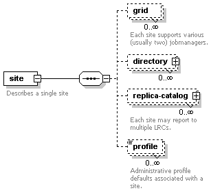

.. _ref-catalogs:

========
Catalogs
========

.. _replica:

Data Discovery (Replica Catalog)
================================

The Replica Catalog keeps mappings of logical file ids/names (LFN's) to
physical file ids/names (PFN's). A single LFN can map to several PFN's.
A PFN consists of a URL with protocol, host and port information and a
path to a file. Along with the PFN one can also store additional
key/value attributes to be associated with a PFN.

The Replica Catalog has two uses in Pegasus.

1. **Input Replica Catalog:** Discover the location of input files or
   previously generated datasets to use for planning purposes. To
   configure the input replica catalog use the properties prefix
   **pegasus.catalog.replica**.

2. **Output Replica Catalog:** Register the generated outputs if the
   outputs are marked for registration. Starting 5.0 release, by
   default Pegasus will registers outputs to a JDBC based Replica
   Catalog (*workflow-name.replicas.db*) in the workflow submit directory.
   For hierarchical workflows only one output replica catalog db is
   generated in the root workflow submit directory. To
   configure the output replica catalog use the properties prefix
   **pegasus.catalog.replica.output**.

The rest of this section shows how to configure input replica catalogs.
You can replace *pegasus.catalog.replica* with *pegasus.catalog.replica.output*
to configure output replica catalog.

.. note::

   Before 5.0 release, there was no differentiation between the input
   and the output replica catalog.

Pegasus supports the following implementations of the Replica Catalog.

1. **YAML** (Default)

2. **File**

3. **Regex**

4. **Directory**

5. **Database via JDBC**

6. **MRC**

.. _rc-YAML:

YAML
----

Starting 5.0 release, this is the default Replica Catalog backend in
Pegasus, replacing the old File format. In this format, you describe
the locations of your files in a YAML format that is described
using JSON schemas in `rc-5.0.yml <schemas/5.0/rc-5.0.yml>`__ .

The YAML mode is the Default mode, and by default Pegasus picks up a
file named **replicas.yml** in the current working directory ( from
where pegasus-plan is invoked) as the Replica Catalog for planning.
To override this you have to set the following properties

1. **pegasus.catalog.replica=YAML**

2. **pegasus.catalog.replica.file=<path to the replica catalog file>**

This backend is not transactionally safe for use as an output replica catalog.
Concurrent instances will conflict with each other especially in case
of hierarchical workflows.

We recommend that users use the Python Workflow API to generate their
Replica Catalog files. Below is a snippet of how you would do it

.. tabs::

    .. code-tab:: python generate_rc.py

        from Pegasus.api import *

        infile = File('input.txt')
        rc = ReplicaCatalog()\
              .add_replica('local', infile, "http://example.com/pegasus/input/" + infile.lfn,\
                            checksum = {'sha256':'66a42b4be204c824a7533d2c677ff7cc5c44526300ecd6b450602e06128063f9'})\
               .write()

        # the Replica Catalog will be written to the default path "./replicas.yml"

    .. code-tab:: yaml YAML RC

        pegasus: '5.0'
        replicas:
          - lfn: input.txt
            pfns:
              - {site: local, pfn: 'http://example.com/pegasus/input/input.txt'}
            checksum: {sha256: 66a42b4be204c824a7533d2c677ff7cc5c44526300ecd6b450602e06128063f9}

.. _rc-FILE:

.. tip::

    **Regular Expressions**
    This backend also supports for specification of regular expressions for
    file locations (similar to the Regex type backend), with the caveat that
    if regular expressions are used, then the Replica Catalog should be a
    separate file, and not embedded in the workflow description.

File
----

In this mode, Pegasus queries a file based replica catalog. The file
format is a simple multicolumn format. The site attribute
should be specified whenever possible. The attribute key for the site
attribute is **"site".**

::

   LFN PFN
   LFN PFN a=b [..]
   LFN PFN a="b" [..]
   "LFN w/LWS" "PFN w/LWS" [..]

The LFN may or may not be quoted. If it contains linear whitespace,
quotes, backslash or an equal sign, it must be quoted and escaped. The
same conditions apply for the PFN. The attribute key-value pairs are
separated by an equality sign without any whitespaces. The value may be
quoted. The LFN sentiments about quoting apply.

In order to use the File mode you
have to set the following properties

1. **pegasus.catalog.replica=File**

2. **pegasus.catalog.replica.file=<path to the replica catalog file>**

This backend is not transactionally safe for use as an output replica catalog.
Concurrent instances will conflict with each other especially in case
of hierarchical workflows.

.. _rc-regex:

Regex
-----

In this mode, Pegasus queries a file based replica catalog. The file
format is a simple multicolumn format. It is neither transactionally
safe purposes in any way. Multiple concurrent instances will conflict
with each other. The site attribute should be specified whenever
possible. The attribute key for the site attribute is **"site".**

In addition users can specifiy regular expression based LFN's. A regular
expression based entry should be qualified with an attribute named
'regex'. The attribute regex when set to true identifies the catalog
entry as a regular expression based entry. Regular expressions should
follow Java regular expression syntax.

For example, consider a replica catalog as shown below.

Entry 1 refers to an entry which does not use a regular expressions.
This entry would only match a file named 'f.a', and nothing else.

Entry 2 referes to an entry which uses a regular expression. In this
entry f.a referes to files having name as f<any-character>a i.e. faa,
f.a, f0a, etc.

::

   #1
   f.a file:///Volumes/data/input/f.a site="local"
   #2
   f.a file:///Volumes/data/input/f.a site="local" regex="true"

Regular expression based entries also support substitutions. For
example, consider the regular expression based entry shown below.

Entry 3 will match files with name alpha.csv, alpha.txt, alpha.xml. In
addition, values matched in the expression can be used to generate a
PFN.

For the entry below if the file being looked up is alpha.csv, the PFN
for the file would be generated as
file:///Volumes/data/input/csv/alpha.csv. Similary if the file being
lookedup was alpha.csv, the PFN for the file would be generated as
file:///Volumes/data/input/xml/alpha.xml i.e. The section [0], [1] will
be replaced. Section [0] refers to the entire string i.e. alpha.csv.
Section [1] refers to a partial match in the input i.e. csv, or txt, or
xml. Users can utilize as many sections as they wish.

::

   #3
   alpha\.(csv|txt|xml) file:///Volumes/data/input/[1]/[0] site="local" regex="true"

In case of a LFN name matching multiple entries in the file, the
implementation picks up the first matching regex as it appears in the
file. If you want to specify a default location for all LFN's that don't
match any regex expression, you can have this entry as the last entry in
your file.

::

   #4 all unmatched LFN's reside in the same input directory.

   .*     file:///Volumes/data/input/[0] site="local" regex="true"

.. _rc-directory:

Directory
---------

In this mode, Pegasus does a directory listing on an input directory to
create the LFN to PFN mappings. The directory listing is performed
recursively, resulting in deep LFN mappings. For example, if an input
directory $input is specified with the following structure

::

   $input
   $input/f.1
   $input/f.2
   $input/D1
   $input/D1/f.3

Pegasus will create the mappings the following LFN PFN mappings
internally

::

   f.1 file://$input/f.1  site="local"
   f.2 file://$input/f.2  site="local"
   D1/f.3 file://$input/D1/f.3 site="local"

Users can optionally specify additional properties to configure the
behavior of this implementation.

1. **pegasus.catalog.replica.directory** to specify the path to the
   directory where the files exist.

2. **pegasus.catalog.replica.directory.site** to specify a site
   attribute other than local to associate with the mappings.

3. **pegasus.catalog.replica.directory.flat.lfn** to specify whether you
   want deep LFN's to be constructed or not. If not specified, value
   defaults to false i.e. deep lfn's are constructed for the mappings.

4. **pegasus.catalog.replica.directory.url.prefix** to associate a URL
   prefix for the PFN's constructed. If not specified, the URL defaults
   to file://

.. tip::

   pegasus-plan has -**-input-dir** option that can be used to specify
   an input directory on the command line. This allows you to specify a
   separate replica catalog to catalog the locations of output files.

.. _rc-JDBCRC:

JDBCRC
------

In this mode, Pegasus queries a SQL based replica catalog that is
accessed via JDBC. To create the schema for JDBCRC use the
:ref:`pegasus-db-admin <cli-pegasus-db-admin>`  command line tool.

.. note::

   A site attribute was added to the SQL schema as a unique key for 4.4.
   To update an existing database schema, use pegasus-db-admin tool.

   .. figure:: ../images/jdbcrc-schema.png
      :alt: Schema Image of the JDBCRC.
      :width: 4in

      Schema Image of the JDBCRC.

To use JDBCRC, the user additionally needs to set the following
properties

1. **pegasus.catalog.replica JDBCRC**

2. **pegasus.catalog.replica.db.driver mysql \| postgres \|sqlite**

3. **pegasus.catalog.replica.db.url=<jdbc url to the database> e.g
   jdbc:mysql://database-host.isi.edu/database-name \|
   jdbc:sqlite:/shared/jdbcrc.db**

4. **pegasus.catalog.replica.db.user=<database user>**

5. **pegasus.catalog.replica.db.password=<database password>**

Users can use the command line client :ref:`pegasus-rc-client <rc-pegasus-rc-client>`
to interface to query, insert and remove entries from the JDBCRC backend.
Starting 4.5 release, there is also support for sqlite databases.
Specify the jdbc url to refer to a sqlite database.

.. _rc-MRC:

MRC
---

In this mode, Pegasus queries multiple replica catalogs to discover the
file locations on the grid.

To use it set

1. **pegasus.catalog.replica=MRC**

Each associated replica catalog can be configured via properties as
follows.

The user associates a variable name referred to as [value] for each of
the catalogs, where [value] is any legal identifier (concretely
[A-Za-z][_A-Za-z0-9]*) For each associated replica catalogs the user
specifies the following properties

-  **pegasus.catalog.replica.mrc.[value]**- specifies the type of
   replica catalog.

-  **pegasus.catalog.replica.mrc.[value].key**- specifies a property
   name key for a particular catalog

For example, to query a File catalog and JDBCRC at the same time specify
the following:

-  **pegasus.catalog.replica=MRC**

-  **pegasus.catalog.replica.mrc.jdbcrc=JDBCRC**

-  **pegasus.catalog.replica.mrc.jdbcrc.url=<jdbc url >**

-  **pegasus.catalog.replica.mrc.file1=File**

-  **pegasus.catalog.replica.mrc.file1.url=<path to file based replica
   catalog>**

In the above example,\ **jdbcrc** and **file1** are any valid identifier
names and **url** is the property key that needed to be specified.

Another example is to use MRC with multiple input directories. Sample
properties for that configuration are listed below

-  **pegasus.catalog.replica=MRC**

-  **pegasus.catalog.replica.mrc.directory1=Directory**

-  **pegasus.catalog.replica.mrc.directory1.directory=/path/to/dir1**

-  **pegasus.catalog.replica.mrc.directory1.directory.site=obelix**

-  **pegasus.catalog.replica.mrc.directory2=Directory**

-  **pegasus.catalog.replica.mrc.directory2.directory=/path/to/dir2**

-  **pegasus.catalog.replica.mrc.directory2.directory.site=corbusier**

.. _pegasus-rc-client:

Checksums in Replica Catalog
----------------------------

You can specify checksums for raw input files to your workflow in a Replica
Catalog. Pegasus will check against these checksums to ensure data integrity.
An example of this is shown below. More information in integrity checking
can be found in the section of this guide on
`Integrity Checking <#integrity-checking>`__.

Below is an example of how checksums are specified in YAML and File based
RC's. JDBC backend also supports specification of checksums. For that use
a File based rc as an input to the :ref:`pegasus-rc-client<rc-pegasus-rc-client>` .

.. tabs::

    .. code-tab:: yaml YAML

        pegasus: '5.0'
        replicas:
          - lfn: input.txt
            pfns:
              - {site: local, pfn: 'http://example.com/pegasus/input/input.txt'}
            checksum: {sha256: 66a42b4be204c824a7533d2c677ff7cc5c44526300ecd6b450602e06128063f9}

    .. code-tab:: text

       # file-based replica catalog: 2018-10-25T02:10:02.293-07:00
       f.a file:///lfs1/input-data/f.a checksum.type="sha256" checksum.value="ca8ed5988cb4ca0b67c45fd80fd17423aba2a066ca8a63a4e1c6adab067a3e92" site="condorpool"

.. _rc-pegasus-rc-client:

Replica Catalog Client pegasus-rc-client
----------------------------------------

The client used to interact with the Replica Catalogs is
pegasus-rc-client. The implementation that the client talks to is
configured using Pegasus properties.

Lets assume we create a file f.a in your home directory as shown below.

::

   $ date > $HOME/f.a

We now need to register this file in the **File** replica catalog
located in **$HOME/rc** using the pegasus-rc-client. Replace the
**gsiftp://url** with the appropriate parameters for your grid site.

::

   $ pegasus-rc-client -Dpegasus.catalog.replica=File -Dpegasus.catalog.replica.file=$HOME/rc insert \
    f.a gsiftp://somehost:port/path/to/file/f.a site=local

You may first want to verify that the file registeration is in the
replica catalog. Since we are using a File catalog we can look at the
file **$HOME/rc** to view entries.

::

   $ cat $HOME/rc

   # file-based replica catalog: 2010-11-10T17:52:53.405-07:00
   f.a gsiftp://somehost:port/path/to/file/f.a site=local

The above line shows that entry for file **f.a** was made correctly.

You can also use the **pegasus-rc-client** to look for entries.

::

   $ pegasus-rc-client -Dpegasus.catalog.replica=File -Dpegasus.catalog.replica.file=$HOME/rc lookup LFN f.a

   f.a gsiftp://somehost:port/path/to/file/f.a site=local

.. _site:

Resource Discovery (Site Catalog)
=================================

The Site Catalog describes the compute resources (which are often
clusters or a local HTCondor pool) that we intend to run the workflow
upon. A site is a homogeneous part of a cluster that has one or more
directories associated with it. Usually you associate directories
of type

* shared-scratch
* local-storage

Each directory in turn has a file server associated with it that tells
Pegasus how to stage-in and stage-out data to those directories on the
site.  A site can also be
a glidein pool such as when submitting workflows from a OSG submit
node.

Described below are some of the entries in the site catalog.

#. **site** - A site identifier.

#. **grid-gateway** - A site can optionally have a grid gateway
   associated with it that designates a GRAM gatekeeper
   (with a **jobmanager-fork** or **jobmanager-<scheduler>** interface)
   or a remote BOSCO endpoint to allow for remote job submissions to
   the site.

#. **Directory** - Info about filesystems Pegasus can use for storing
   temporary and long-term files. There are several configurations:

   -  **shared-scratch** - This describes the scratch file systems.
      Pegasus will use this to store intermediate data between jobs and
      other temporary files.

   -  **local-storage** - This describes the storage file systems (long
      term). This is the directory Pegasus will stage output files to.

   -  **local-scratch** - This describes the scratch file systems
      available locally on a compute node. This parameter is not
      commonly used and can be left unset in most cases.

   For each of the directories, you can specify access methods. Allowed
   methods are **put**, **get**, and **all** which means both put and
   get. For each mehod, specify a URL including the protocol. For
   example, if you want share data via http using the /var/www/staging
   directory, you can use scp://hostname/var/www for the put element and
   http://hostname/staging for the get element.

#. **arch,os,osrelease,osversion,** - The
   arch/os/osrelease/osversion/ of the site.

   ARCH can have one of the following values with the default value of
   **x86_64**.

    * x86
    * x86_64
    * ppc
    * ppc_64
    * ppc64le
    * ia64
    * sparcv7
    * sparcv9
    * amd64

   OS can have one of the following values

    * linux
    * sunos
    * macosx
    * aix
    * windows

#. **Profiles** - One or many profiles can be attached to a site.

   One example is the environments to be set on a remote site.

**Reserved Sites in Pegasus**

1. **local**

   In Pegasus local site is a reserved site that is used to designate
   the workflow submit node where Pegasus and HTCondor Schedd is
   installed. Pegasus usually does not execute any compute jobs specified
   by the user on this site. It is usually reserved for running Pegasus
   auxillary jobs in the HTCondor *local* universe.

   Pegasus will create an automatic entry for the local site if you don't
   specify one yourself in the site catalog.

2. **condorpool**

    Starting with the 5.0 release, Pegasus automatically also creates a
    *condorpool* site that can be used to run compute jobs. This site
    maps to the local HTCondor pool on your submit node and jobs scheduled
    to this site rely on HTCondor file transfers and are executed in
    HTCondor *vanilla* universe.

The rest of this section shows how to configure the site catalog.

Pegasus supports the following implementations of the Site Catalog.

1. **YAML** (Default) Corresponds to the schema described
   `here <schemas/5.0/sc-5.0.yml>`__.

2. **XML** Corresponds to the schema described
   `here <schemas/sc-4.0/sc-4.0.html>`__.

The above two formats are functionally equivalent

.. _sc-YAML:

YAML
----

The YAML mode is the Default mode, and by default Pegasus picks up a
file named **sites.yml** in the current working directory ( from
where pegasus-plan is invoked) as the Site Catalog for planning.
To override this you have to set the following properties

1.  **pegasus.catalog.site.file=<path to the site catalog file>**

We recommend that users use the Python API to generate the site catalog

The following illustrates how :py:class:`Pegasus.api.site_catalog.SiteCatalog`
can be used to generate a new Site Catalog programatically.

.. tabs::

    .. code-tab:: python generate_sc.py

        from Pegasus.api import *

        # create a SiteCatalog object
        sc = SiteCatalog()

        # create a "local" site
        local = Site("local", arch=Arch.X86_64, os_type=OS.LINUX)

        # create and add a shared scratch and local storage directories to the site "local"
        local_shared_scratch_dir = Directory(Directory.SHARED_SCRATCH, path="/tmp/workflows/scratch")\
                                    .add_file_servers(FileServer("file:///tmp/workflows/scratch", Operation.ALL))

        local_local_storage_dir = Directory(Directory.LOCAL_STORAGE, path="/tmp/workflows/outputs")\
                                    .add_file_servers(FileServer("file:///tmp/workflows/outputs", Operation.ALL))

        local.add_directories(local_shared_scratch_dir, local_local_storage_dir)

        # create a "condorpool" site
        condorpool = Site("condorpool", arch=Arch.X86_64, os_type=OS.LINUX)

        # create and add job managers to the site "condorpool"
        condorpool.add_grids(
            Grid(Grid.GT5, contact="smarty.isi.edu/jobmanager-pbs", scheduler_type=Scheduler.PBS, job_type=SupportedJobs.AUXILLARY),
            Grid(Grid.GT5, contact="smarty.isi.edu/jobmanager-pbs", scheduler_type=Scheduler.PBS, job_type=SupportedJobs.COMPUTE)
        )

        # create and add a shared scratch directory to the site "condorpool"
        condorpool_shared_scratch_dir = Directory(Directory.SHARED_SCRATCH, path="/lustre")\
                                            .add_file_servers(FileServer("gsiftp://smarty.isi.edu/lustre", Operation.ALL))
        condorpool.add_directories(condorpool_shared_scratch_dir)

        # create a "staging_site" site
        staging_site = Site("staging_site", arch=Arch.X86_64, os_type=OS.LINUX)

        # create and add a shared scratch directory to the site "staging_site"
        staging_site_shared_scratch_dir = Directory(Directory.SHARED_SCRATCH, path="/data")\
                                            .add_file_servers(
                                                FileServer("scp://obelix.isi.edu/data", Operation.PUT),
                                                FileServer("http://obelix.isi.edu/data", Operation.GET)
                                            )
        staging_site.add_directories(staging_site_shared_scratch_dir)

        # add all the sites to the site catalog object
        sc.add_sites(
            local,
            condorpool,
            staging_site
        )

        # write the site catalog to the default path "./sites.yml"
        sc.write()

    .. code-tab:: yaml YAML SC

        x-pegasus: {apiLang: python, createdBy: vahi, createdOn: '07-23-20T14:05:48Z'}
        pegasus: '5.0'
        sites:
        - name: local
          arch: x86_64
          os.type: linux
          directories:
          - type: sharedScratch
            path: /tmp/workflows/scratch
            fileServers:
            - {url: 'file:///tmp/workflows/scratch', operation: all}
          - type: localStorage
            path: /tmp/workflows/outputs
            fileServers:
            - {url: 'file:///tmp/workflows/outputs', operation: all}
        - name: condorpool
          arch: x86_64
          os.type: linux
          directories:
          - type: sharedScratch
            path: /lustre
            fileServers:
            - {url: 'gsiftp://smarty.isi.edu/lustre', operation: all}
          grids:
          - {type: gt5, contact: smarty.isi.edu/jobmanager-pbs, scheduler: pbs, jobtype: auxillary}
          - {type: gt5, contact: smarty.isi.edu/jobmanager-pbs, scheduler: pbs, jobtype: compute}
        - name: staging_site
          arch: x86_64
          os.type: linux
          directories:
          - type: sharedScratch
            path: /data
            fileServers:
            - {url: 'scp://obelix.isi.edu/data', operation: put}
            - {url: 'http://obelix.isi.edu/data', operation: get}

.. _sc-XML4:

XML
----

This format allows defining filesystem of shared as well as local type
on the head node of the remote cluster as well as on the backend nodes

   Schema Image of the Site Catalog XML4

Below is an example of the XML4 site catalog

.. code-block:: xml

   <?xml version="1.0" encoding="UTF-8"?>
   <sitecatalog xmlns="http://pegasus.isi.edu/schema/sitecatalog"
                xmlns:xsi="http://www.w3.org/2001/XMLSchema-instance"
                xsi:schemaLocation="http://pegasus.isi.edu/schema/sitecatalog http://pegasus.isi.edu/schema/sc-4.0.xsd"
                version="4.0">

       <site  handle="local" arch="x86_64" os="LINUX">
           <directory type="shared-scratch" path="/tmp/workflows/scratch">
               <file-server operation="all" url="file:///tmp/workflows/scratch"/>
           </directory>
           <directory type="local-storage" path="/tmp/workflows/outputs">
               <file-server operation="all" url="file:///tmp/workflows/outputs"/>
           </directory>
       </site>

       <site  handle="condor_pool" arch="x86_64" os="LINUX">
           <grid type="gt5" contact="smarty.isi.edu/jobmanager-pbs" scheduler="PBS" jobtype="auxillary"/>
           <grid type="gt5" contact="smarty.isi.edu/jobmanager-pbs" scheduler="PBS" jobtype="compute"/>
           <directory type="shared-scratch" path="/lustre">
               <file-server operation="all" url="gsiftp://smarty.isi.edu/lustre"/>
           </directory>
           <replica-catalog type="LRC" url="rlsn://smarty.isi.edu"/>
       </site>

       <site  handle="staging_site" arch="x86_64" os="LINUX">
           <directory type="shared-scratch" path="/data">
               <file-server operation="put" url="scp://obelix.isi.edu/data"/>
               <file-server operation="get" url="http://obelix.isi.edu/data"/>
           </directory>
       </site>

   </sitecatalog>

Site Catalog Converter pegasus-sc-converter
-------------------------------------------

The recommended and default format for Site Catalog is YAML now and
we recommend users to use :ref:`cli-pegasus-sc-converter` to convert
their existing catalogs to the yaml format.

For example, to convert a Site Catalog file, ``sites.xml``, to YAML,
use the following

command::

    pegasus-sc-converter -i sites.xml -o sites.yml

.. _transformation:

Executable Discovery (Transformation Catalog)
=============================================

The Transformation Catalog maps logical transformations to physical
executables on the system. It also provides additional information about
the transformation as to what system they are compiled for, what
profiles or environment variables need to be set when the transformation
is invoked etc.

Pegasus currently supports a Text formatted Transformation Catalog

1. **YAML:**\ A multi line text based Transformation Catalog (DEFAULT)

2. **Text:**\ A multi line text based Transformation Catalog

In this guide we will look at the format of the Multiline Text based TC.

.. _tc-YAML:

YAML TC (YAML)
------------------------------

The YAML mode is the Default mode, and by default Pegasus picks up a
file named **transformations.yml** in the current working directory ( from
where pegasus-plan is invoked) as the Site Catalog for planning.
To override this you have to set the following properties

1.  **pegasus.catalog.transformation.file=<path to the transformation catalog file>**

We recommend that users use the Python API to generate the site catalog

The following illustrates how
:py:class:`Pegasus.api.transformation_catalog.TransformationCatalog`
can be used to generate a new Transformation Catalog programmatically.

.. tabs::

    .. code-tab:: python generate_tc.py

        from Pegasus.api import *

        # create the TransformationCatalog object
        tc = TransformationCatalog()

        # create and add the transformation
        keg = Transformation(
                "keg",
                namespace="example",
                version="1.0",
                site="isi",
                pfn="/path/to/keg",
                is_stageable=False,

            ).add_profiles(Namespace.ENV, APP_HOME="/tmp/myscratch", JAVA_HOME="/opt/java/1.6")

        tc.add_transformations(keg)

        # write the transformation catalog to the default file path "./transformations.yml"
        tc.write()

    .. code-tab:: yaml YAML TC

        x-pegasus: {apiLang: python, createdBy: vahi, createdOn: '07-23-20T16:43:51Z'}
        pegasus: '5.0'
        transformations:
        - namespace: example
          name: keg
          version: '1.0'
          sites:
          - {name: isi, pfn: /path/to/keg, type: installed}
          profiles:
            env: {APP_HOME: /tmp/myscratch, JAVA_HOME: /opt/java/1.6}

The entries in this catalog have the following meaning

#. **transformations**  - This is the key to refer to an array of
   transformation catalog entries, with each entry defined by a
   namespace, name, version attributes with (namespace and version
   being optional)

#. **sites** - within each transformation array entry, sites is the
   key to refer to an array of sites with each site identified by a
   name attribute to designate the name of the site where the
   transformation is installed or available. For each site entry,
   you can specify the following keys

    * **pfn** - URL or file path for the location of the executable. The
      pfn is a file path if the transformation is of type INSTALLED and
      generally a url (file:/// or http:// or gridftp://) if of type
      STAGEABLE

    * **site** - The site identifier for the site where the transformation
      is available

    * **type** - The type of transformation. Whether it is installed
      ("INSTALLED") on the remote site or is available to stage
      ("STAGEABLE").

    * **container** - reference to a container in which this transformation
      is supposed to execute in. See :ref:`tc-container`

    * **arch, os, osrelease, osversion** - The arch/os/osrelease/osversion
      of the transformation. osrelease and osversion are optional.

      ARCH can have one of the following values with the default value of
      **x86_64**.

        * x86
        * x86_64
        * ppc
        * ppc_64
        * ppc64le
        * ia64
        * sparcv7
        * sparcv9
        * amd64

      OS can have one of the following values

        * linux
        * sunos
        * macosx
        * aix
        * windows

    * **checksum** - the sha256 checksum of the associated executable

#. **Profiles** - One or many profiles can be attached to a
   transformation for all sites or to a transformation on a particular
   site.

.. _tc-Text:

MultiLine Text based TC (Text)
------------------------------

The multile line text based TC is the new default TC in Pegasus. This
format allows you to define the transformations

The file is read and cached in memory. Any modifications, as adding or
deleting, causes an update of the memory and hence to the file
underneath. All queries are done against the memory representation. The
file sample.tc.text in the etc directory contains an example

::

   tr example::keg:1.0 {

   #specify profiles that apply for all the sites for the transformation
   #in each site entry the profile can be overridden

     profile env "APP_HOME" "/tmp/myscratch"
     profile env "JAVA_HOME" "/opt/java/1.6"

     site isi {
       profile env "HELLo" "WORLD"
       profile condor "FOO" "bar"
       profile env "JAVA_HOME" "/bin/java.1.6"
       pfn "/path/to/keg"
       arch "x86"
       os "linux"
       osrelease "fc"
       osversion "4"
       type "INSTALLED"
     }

     site wind {
       profile env "CPATH" "/usr/cpath"
       profile condor "universe" "condor"
       pfn "file:///path/to/keg"
       arch "x86"
       os "linux"
       osrelease "fc"
       osversion "4"
       type "STAGEABLE"
     }
   }

The entries in this catalog have the following meaning

1. **tr** tr - A transformation identifier. (Normally a
   Namespace::Name:Version.. The Namespace and Version are optional.)

2. **pfn** - URL or file path for the location of the executable. The
   pfn is a file path if the transformation is of type INSTALLED and
   generally a url (file:/// or http:// or gridftp://) if of type
   STAGEABLE

3. **site** - The site identifier for the site where the transformation
   is available

4. **type** - The type of transformation. Whether it is installed
   ("INSTALLED") on the remote site or is available to stage
   ("STAGEABLE").

5. **arch, os, osrelease, osversion** - The arch/os/osrelease/osversion
   of the transformation. osrelease and osversion are optional.

   ARCH can have one of the following values x86, x86_64, sparcv7,
   sparcv9, ppc, aix. The default value for arch is x86

   OS can have one of the following values linux,sunos,macosx. The
   default value for OS if none specified is linux

6. **Profiles** - One or many profiles can be attached to a
   transformation for all sites or to a transformation on a particular
   site.

To use this format of the Transformation Catalog you need to set the
following properties

1. **pegasus.catalog.transformation=Text**

2. **pegasus.catalog.transformation.file=<path to the transformation
   catalog file>**

.. _tc-container:

Containerized Applications in the Transformation Catalog
--------------------------------------------------------

Users can specify what container they want to use for running their
application in the Transformation Catalog using the multi line text
based format described in this section. Users can specify an optional
attribute named container that refers to the container to be used for
the application.

.. tabs::

    .. code-tab:: python generate_tc.py

        from Pegasus.api import *

        # create the TransformationCatalog object
        tc = TransformationCatalog()

        # create and add the centos-pegasus container
        centos_cont = Container(
                        "centos-pegasus",
                        Container.DOCKER,
                        "docker:///rynge/montage:latest",
                        mounts=["/Volumes/Workf/lfs1:/shared-data/:ro"],
                        checksum={"sha256": "dd78aaa88e1c6a8bf31c052eacfa03fba616ebfd903d7b2eb1b0ed6853b48713"}
                    ).add_profiles(Namespace.ENV, JAVA_HOME="/opt/java/1.6")

        tc.add_containers(centos_cont)

        # create and add the transformation
        keg = Transformation(
                "keg",
                namespace="example",
                version="1.0",
                site="isi",
                pfn="/path/to/keg",
                is_stageable=False,
                container=centos_cont
            ).add_profiles(Namespace.ENV, APP_HOME="/tmp/myscratch", JAVA_HOME="/opt/java/1.6")

        tc.add_transformations(keg)

        # write the transformation catalog to the default file path "./transformations.yml"
        tc.write()

    .. code-tab:: yaml YAML TC

        x-pegasus: {apiLang: python, createdBy: vahi, createdOn: '07-23-20T16:43:51Z'}
        pegasus: '5.0'
        transformations:
        - namespace: example
          name: keg
          version: '1.0'
          sites:
          - {name: isi,
             pfn: /path/to/keg,

             # installed means pfn refers to path in the container.
             # stageable means the executable can be staged into the container
             type: installed,

             # optional attribute to specify the container to use
             container: centos-pegasus}
          profiles:
            env: {APP_HOME: /tmp/myscratch, JAVA_HOME: /opt/java/1.6}
        containers:
        - name: centos-pegasus
          # can be either docker or singularity or shifter
          type: docker

          # URL to image in a docker|singularity hub|shitfer repo url OR
          # URL to an existing docker image exported as a tar file or singularity image
          image: docker:///rynge/montage:latest

          # optional site attribute to tell pegasus which site tar file
          # exists. useful for handling file URL's correctly
          image_site "optional site"

          # the checksum of the container when it is exported as a file
          checksum: {sha256: dd78aaa88e1c6a8bf31c052eacfa03fba616ebfd903d7b2eb1b0ed6853b48713}

          # mount information to mount host directories into container
          # format for each entry src-dir:dest-dir[:options]
          mounts: ['/Volumes/Workf/lfs1:/shared-data/:ro']

          # environment to be set when the job is run in the container
          # only env profiles and metadata are supported
          profiles:
            env: {JAVA_HOME: /opt/java/1.6}

The container itself is defined using the cont entry. Multiple
transformations can refer to the same container.

#. **cont** cont - A container identifier.

#. **image** - URL to image in a docker|singularity hub\| singularity
   library \| shifter repo URL or URL to an existing docker image
   exported as a tar file or singularity image. An example docker hub
   URL is docker:///rynge/montage:latest. An example Singularity hub URL
   is shub://singularity-hub.org/pegasus-isi/fedora-montage. Singularity
   library URLs are prefixed with "library" rather than "shub". Shifter
   images can only be referred to by shifter URL scheme that indicates
   that the image is available in the local shifter repository on the
   compute site. For example shifter:///papajim/namd_image:latest .

#. **image_site** - The site identifier for the site where the container
   is available

#. **mount** - mount information to mount host directories into container of
   format src-dir:dest-dir[:options] . Consult Docker and Singularity
   documentation for options supported for -v and -B options
   respectively.

#. * **checksum** - the sha256 checksum of the associated executable

#. **profiles** - One or many profiles can be attached to a
   transformation for all sites or to a transformation on a particular
   site. For containers, only env profiles are supported.

Transformation Catalog Converter pegasus-tc-converter
-----------------------------------------------------

The recommended and default format for Site Catalog is YAML now and
we recommend users to use :ref:`cli-pegasus-tc-converter` to convert
their existing catalogs to the yaml format.

For example, to convert a Site Catalog file, ``tc.txt``, to YAML,
use the following

command::

    pegasus-tc-converter -i tc.txt -I Text -O YAML -o transformations.yml

TC Converter Client pegasus-tc-converter
----------------------------------------

Pegasus 3.0 by default now parses a file based multi line textual format
of a Transformation Catalog. The new Text format is explained in detail
in the chapter on Catalogs.

Pegasus 3.0 comes with a pegasus-tc-converter that will convert users
old transformation catalog ( File ) to the Text format. Sample usage is
given below.

::

   $ pegasus-tc-converter -i sample.tc.data -I File -o sample.tc.text -O Text

   2010.11.22 12:53:16.661 PST:   Successfully converted Transformation Catalog from File to Text
   2010.11.22 12:53:16.666 PST:   The output transfomation catalog is in file  sample.tc.text

To use the converted transformation catalog, in the properties do the
following:

1. unset pegasus.catalog.transformation or set
   pegasus.catalog.transformation to Text

2. point pegasus.catalog.transformation.file to the converted
   transformation catalog
