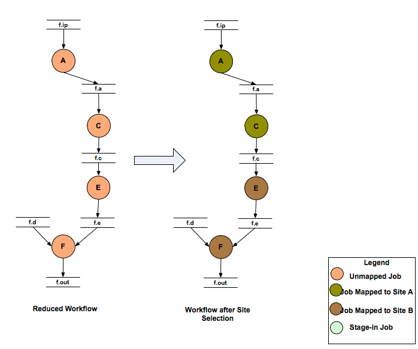
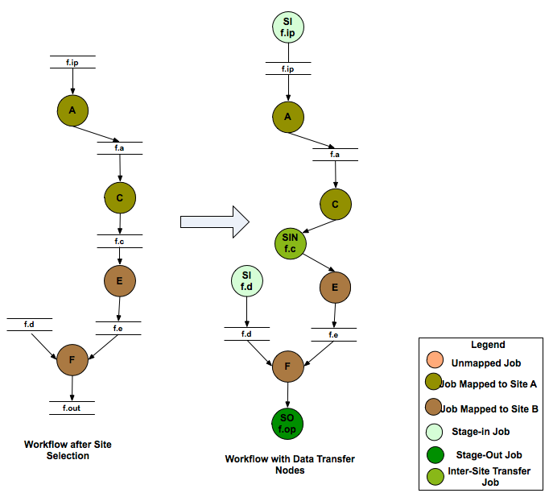
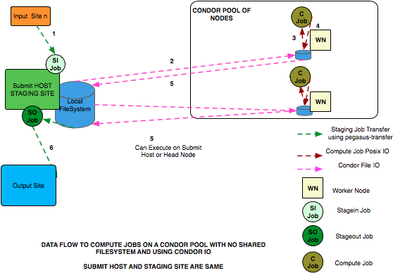
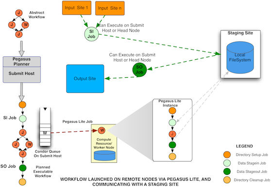
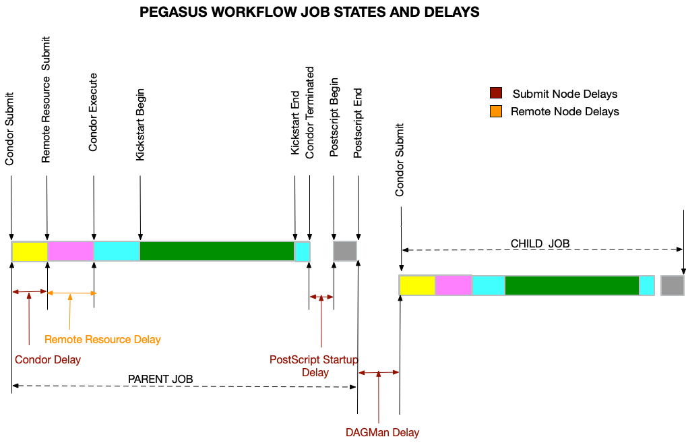

.. _running-workflows:

=================
Running Workflows
=================

.. _executable-workflows:

Executable Workflows (DAG)
==========================

The DAG is an executable (concrete) workflow that can be executed over a
variety of resources. When the workflow tasks are mapped to multiple
resources that do not share a file system, explicit nodes are added to
the workflow for orchestrating data. transfer between the tasks.

When you take the DAX workflow created in `Creating
Workflows <#creating_workflows>`__, and plan it for a single remote grid
execution, here a site with handle **hpcc**, and plan the workflow
without clean-up nodes, the following concrete workflow is built:

Planning augments the original abstract workflow with ancillary tasks to
facilitate the proper execution of the workflow. These tasks include:

-  the creation of remote working directories. These directories
   typically have name that seeks to avoid conflicts with other
   simultaneously running similar workflows. Such tasks use a job prefix
   of ``create_dir``.

-  the stage-in of input files before any task which requires these
   files. Any file consumed by a task needs to be staged to the task, if
   it does not already exist on that site. Such tasks use a job prefix
   of ``stage_in``.If multiple files from various sources need to be
   transferred, multiple stage-in jobs will be created. Additional
   advanced options permit to control the size and number of these jobs,
   and whether multiple compute tasks can share stage-in jobs.

-  the original DAX job is concretized into a compute task in the DAG.
   Compute jobs are a concatination of the job's **name** and **id**
   attribute from the DAX file.

-  the stage-out of data products to a collecting site. Data products
   with their **transfer** flag set to ``false`` will not be staged to
   the output site. However, they may still be eligible for staging to
   other, dependent tasks. Stage-out tasks use a job prefix of
   ``stage_out``.

-  If compute jobs run at different sites, an intermediary staging task
   with prefix ``stage_inter`` is inserted between the compute jobs in
   the workflow, ensuring that the data products of the parent are
   available to the child job.

-  the registration of data products in a replica catalog. Data products
   with their **register** flag set to ``false`` will not be registered.

-  the clean-up of transient files and working directories. These steps
   can be omitted with the ``--no-cleanup`` option to the planner.

The `Data Management <#data_management>`__ chapter details more about
when and how staging nodes are inserted into the workflow.

The DAG will be found in file ``diamond-0.dag``, constructed from the
**name** and **index** attributes found in the root element of the DAX
file.

::

   ######################################################################
   # PEGASUS WMS GENERATED DAG FILE
   # DAG diamond
   # Index = 0, Count = 1
   ######################################################################

   JOB create_dir_diamond_0_hpcc create_dir_diamond_0_hpcc.sub
   SCRIPT POST create_dir_diamond_0_hpcc /opt/pegasus/default/bin/pegasus-exitcode create_dir_diamond_0_hpcc.out

   JOB stage_in_local_hpcc_0 stage_in_local_hpcc_0.sub
   SCRIPT POST stage_in_local_hpcc_0 /opt/pegasus/default/bin/pegasus-exitcode stage_in_local_hpcc_0.out

   JOB preprocess_ID000001 preprocess_ID000001.sub
   SCRIPT POST preprocess_ID000001 /opt/pegasus/default/bin/pegasus-exitcode preprocess_ID000001.out

   JOB findrange_ID000002 findrange_ID000002.sub
   SCRIPT POST findrange_ID000002 /opt/pegasus/default/bin/pegasus-exitcode findrange_ID000002.out

   JOB findrange_ID000003 findrange_ID000003.sub
   SCRIPT POST findrange_ID000003 /opt/pegasus/default/bin/pegasus-exitcode findrange_ID000003.out

   JOB analyze_ID000004 analyze_ID000004.sub
   SCRIPT POST analyze_ID000004 /opt/pegasus/default/bin/pegasus-exitcode analyze_ID000004.out

   JOB stage_out_local_hpcc_2_0 stage_out_local_hpcc_2_0.sub
   SCRIPT POST stage_out_local_hpcc_2_0 /opt/pegasus/default/bin/pegasus-exitcode stage_out_local_hpcc_2_0.out

   PARENT findrange_ID000002 CHILD analyze_ID000004
   PARENT findrange_ID000003 CHILD analyze_ID000004
   PARENT preprocess_ID000001 CHILD findrange_ID000002
   PARENT preprocess_ID000001 CHILD findrange_ID000003
   PARENT analyze_ID000004 CHILD stage_out_local_hpcc_2_0
   PARENT stage_in_local_hpcc_0 CHILD preprocess_ID000001
   PARENT create_dir_diamond_0_hpcc CHILD findrange_ID000002
   PARENT create_dir_diamond_0_hpcc CHILD findrange_ID000003
   PARENT create_dir_diamond_0_hpcc CHILD preprocess_ID000001
   PARENT create_dir_diamond_0_hpcc CHILD analyze_ID000004
   PARENT create_dir_diamond_0_hpcc CHILD stage_in_local_hpcc_0
   ######################################################################
   # End of DAG
   ######################################################################

The DAG file declares all jobs and links them to a Condor submit file
that describes the planned, concrete job. In the same directory as the
DAG file are all Condor submit files for the jobs from the picture plus
a number of additional helper files.

The various instructions that can be put into a DAG file are described
in `Condor's DAGMAN
documentation <http://www.cs.wisc.edu/condor/manual/v7.5/2_10DAGMan_Applications.html>`__.The
constituents of the submit directory are described in the\ `"Submit
Directory Details" <#submit_directory>`__\ chapter

.. _mapping-refinement-steps:

Mapping Refinement Steps
========================

During the mapping process, the abstract workflow undergoes a series of
refinement steps that converts it to an executable form.

.. _planning-data-reuse:

Data Reuse
----------

The abstract workflow after parsing is optionally handed over to the
Data Reuse Module. The Data Reuse Algorithm in Pegasus attempts to prune
all the nodes in the abstract workflow for which the output files exist
in the Replica Catalog. It also attempts to cascade the deletion to the
parents of the deleted node for e.g if the output files for the leaf
nodes are specified, Pegasus will prune out all the workflow as the
output files in which a user is interested in already exist in the
Replica Catalog.

The Data Reuse Algorithm works in two passes

**First Pass** - Determine all the jobs whose output files exist in the
Replica Catalog. An output file with the transfer flag set to false is
treated equivalent to the file existing in the Replica Catalog , if the
output file is not an input to any of the children of the job X.

**Second Pass** - The algorithm removes the job whose output files exist
in the Replica Catalog and tries to cascade the deletion upwards to the
parent jobs. We start the breadth first traversal of the workflow bottom
up.

::

   ( It is already marked for deletion in Pass 1
        OR
         ( ALL of it's children have been marked for deletion
           AND
           ( Node's output files have transfer flags set to false
             OR
             Node's output files with transfer flag as true have locations recorded in the Replica Catalog
           )
          )
    )

..

.. tip::

   The Data Reuse Algorithm can be disabled by passing the **--force**
   option to pegasus-plan.

.. figure:: ./images/refinement-data-reuse.png
   :alt: Workflow Data Reuse
   :width: 100.0%

   Workflow Data Reuse

.. _planning-site-selection:

Site Selection
--------------

The abstract workflow is then handed over to the Site Selector module
where the abstract jobs in the pruned workflow are mapped to the various
sites passed by a user. The target sites for planning are specified on
the command line using the\ **--sites** option to pegasus-plan. If not
specified, then Pegasus picks up all the sites in the Site Catalog as
candidate sites. Pegasus will map a compute job to a site only if
Pegasus can

-  find an INSTALLED executable on the site

-  OR find a STAGEABLE executable that can be staged to the site as part
   of the workflow execution.

   Pegasus supports variety of site selectors with Random being the
   default

   -  **Random**

      The jobs will be randomly distributed among the sites that can
      execute them.

   -  **RoundRobin**

      The jobs will be assigned in a round robin manner amongst the
      sites that can execute them. Since each site cannot execute every
      type of job, the round robin scheduling is done per level on a
      sorted list. The sorting is on the basis of the number of jobs a
      particular site has been assigned in that level so far. If a job
      cannot be run on the first site in the queue (due to no matching
      entry in the transformation catalog for the transformation
      referred to by the job), it goes to the next one and so on. This
      implementation defaults to classic round robin in the case where
      all the jobs in the workflow can run on all the sites.

   -  **Group**

      Group of jobs will be assigned to the same site that can execute
      them. The use of the\ **PEGASUS profile key group** in the DAX,
      associates a job with a particular group. The jobs that do not
      have the profile key associated with them, will be put in the
      default group. The jobs in the default group are handed over to
      the "Random" Site Selector for scheduling.

   -  **Heft**

      A version of the HEFT processor scheduling algorithm is used to
      schedule jobs in the workflow to multiple grid sites. The
      implementation assumes default data communication costs when jobs
      are not scheduled on to the same site. Later on this may be made
      more configurable.

      The runtime for the jobs is specified in the transformation
      catalog by associating the **pegasus profile key runtime** with
      the entries.

      The number of processors in a site is picked up from the attribute
      **idle-nodes** associated with the vanilla jobmanager of the site
      in the site catalog.

   -  **NonJavaCallout**

      Pegasus will callout to an external site selector.In this mode a
      temporary file is prepared containing the job information that is
      passed to the site selector as an argument while invoking it. The
      path to the site selector is specified by setting the property
      pegasus.site.selector.path. The environment variables that need to
      be set to run the site selector can be specified using the
      properties with a pegasus.site.selector.env. prefix. The temporary
      file contains information about the job that needs to be
      scheduled. It contains key value pairs with each key value pair
      being on a new line and separated by a =.

      The following pairs are currently generated for the site selector
      temporary file that is generated in the NonJavaCallout.

      .. table:: Key Value Pairs that are currently generated for the site selector temporary file that is generated in the NonJavaCallout.

         ============== ==============================================================================================================================================================================================================================
         **Key**        **Value**
         version        is the version of the site selector api,currently 2.0.
         transformation is the fully-qualified definition identifier for the transformation (TR) namespace::name:version.
         derivation     is the fully qualified definition identifier for the derivation (DV), namespace::name:version.
         job.level      is the job's depth in the tree of the workflow DAG.
         job.id         is the job's ID, as used in the DAX file.
         resource.id    is a pool handle, followed by whitespace, followed by a gridftp server. Typically, each gridftp server is enumerated once, so you may have multiple occurances of the same site. There can be multiple occurances of this key.
         input.lfn      is an input LFN, optionally followed by a whitespace and file size. There can be multiple occurances of this key,one for each input LFN required by the job.
         wf.name        label of the dax, as found in the DAX's root element. wf.index is the DAX index, that is incremented for each partition in case of deferred planning.
         wf.time        is the mtime of the workflow.
         wf.manager     is the name of the workflow manager being used .e.g condor
         vo.name        is the name of the virtual organization that is running this workflow. It is currently set to NONE
         vo.group       unused at present and is set to NONE.
         ============== ==============================================================================================================================================================================================================================

..

.. tip::

   The site selector to use for site selection can be specified by
   setting the property **pegasus.selector.site**

   Workflow Site Selection

.. _mapping-job-clustering:

Job Clustering
--------------

After site selection, the workflow is optionally handed for to the job
clustering module, which clusters jobs that are scheduled to the same
site. Clustering is usually done on short running jobs in order to
reduce the remote execution overheads associated with a job. Clustering
is described in detail in the `optimization <#job_clustering>`__
chapter.

.. tip::

   The job clustering is turned on by passing the **--cluster** option
   to pegasus-plan.

Addition of Data Transfer and Registration Nodes
------------------------------------------------

After job clustering, the workflow is handed to the Data Transfer module
that adds data stage-in , inter site and stage-out nodes to the
workflow. Data Stage-in Nodes transfer input data required by the
workflow from the locations specified in the Replica Catalog to a
directory on the staging site associated with the job. The staging site
for a job is the execution site if running in a sharedfs mode, else it
is the one specified by **--staging-site** option to the planner. In
case, multiple locations are specified for the same input file, the
location from where to stage the data is selected using a **Replica
Selector** . Replica Selection is described in detail in the `Replica
Selection <#replica_selection>`__ section of the `Data
Management <#data_management>`__ chapter. More details about staging
site can be found in the `data staging
configuration <#data_staging_configuration>`__ chapter.

The process of adding the data stage-in and data stage-out nodes is
handled by Transfer Refiners. All data transfer jobs in Pegasus are
executed using **pegasus-transfer** . The pegasus-transfer client is a
python based wrapper around various transfer clients like
globus-url-copy, s3cmd, irods-transfer, scp, wget, cp, ln . It looks at
source and destination url and figures out automatically which
underlying client to use. pegasus-transfer is distributed with the
PEGASUS and can be found in the bin subdirectory . Pegasus Transfer
Refiners are are described in the detail in the Transfers section of the
`Data Management <#data_management>`__ chapter. The default transfer
refiner that is used in Pegasus is the **BalancedCluster** Transfer
Refiner, that clusters data stage-in nodes and data stage-out nodes per
level of the workflow, on the basis of certain pegasus profile keys
associated with the workflow.

   Addition of Data Transfer Nodes to the Workflow

Data Registration Nodes may also be added to the final executable
workflow to register the location of the output files on the final
output site back in the Replica Catalog . An output file is registered
in the Replica Catalog if the register flag for the file is set to true
in the DAX.

.. figure:: ./images/refinement-registration-jobs.png
   :alt: Addition of Data Registration Nodes to the Workflow
   :width: 100.0%

   Addition of Data Registration Nodes to the Workflow

The data staged-in and staged-out from a directory that is created on
the head node by a create dir job in the workflow. In the vanilla case,
the directory is visible to all the worker nodes and compute jobs are
launched in this directory on the shared filesystem. In the case where
there is no shared filesystem, users can turn on worker node execution,
where the data is staged from the head node directory to a directory on
the worker node filesystem. This feature will be refined further for
Pegasus 3.1. To use it with Pegasus 3.0 send email to **pegasus-support
at isi.edu**.

.. tip::

   The replica selector to use for replica selection can be specified by
   setting the property **pegasus.selector.replica**

.. _planning-createdir-cleanup:

Addition of Create Dir and Cleanup Jobs
---------------------------------------

After the data transfer nodes have been added to the workflow, Pegasus
adds a create dir jobs to the workflow. Pegasus usually , creates one
workflow specific directory per compute site , that is on the staging
site associated with the job. In the case of shared shared filesystem
setup, it is a directory on the shared filesystem of the compute site.
In case of shared filesystem setup, this directory is visible to all the
worker nodes and that is where the data is staged-in by the data
stage-in jobs.

The staging site for a job is the execution site if running in a
sharedfs mode, else it is the one specified by **--staging-site** option
to the planner. More details about staging site can be found in the
`data staging configuration <#data_staging_configuration>`__ chapter.

After addition of the create dir jobs, the workflow is optionally handed
to the cleanup module. The cleanup module adds cleanup nodes to the
workflow that remove data from the directory on the shared filesystem
when it is no longer required by the workflow. This is useful in
reducing the peak storage requirements of the workflow.

.. tip::

   The addition of the cleanup nodes to the workflow can be disabled by
   passing the **--nocleanup** option to pegasus-plan.

.. figure:: ./images/refinement-creadir-rm-jobs.png
   :alt: Addition of Directory Creation and File Removal Jobs
   :width: 100.0%

   Addition of Directory Creation and File Removal Jobs

..

.. tip::

   Users can specify the maximum number of cleanup jobs added per level
   by specifying the property **pegasus.file.cleanup.clusters.num** in
   the properties.

Code Generation
---------------

The last step of refinement process, is the code generation where
Pegasus writes out the executable workflow in a form understandable by
the underlying workflow executor. At present Pegasus supports the
following code generators

1. **Condor**

   This is the default code generator for Pegasus . This generator
   generates the executable workflow as a Condor DAG file and associated
   job submit files. The Condor DAG file is passed as input to Condor
   DAGMan for job execution.

2. **Shell**

   This Code Generator generates the executable workflow as a shell
   script that can be executed on the submit host. While using this code
   generator, all the jobs should be mapped to site local i.e specify
   **--sites local** to pegasus-plan.

   .. tip::

      To use the Shell code Generator set the property
      **pegasus.code.generator** Shell

3. **PMC**

   This Code Generator generates the executable workflow as a PMC task
   workflow. This is useful to run on platforms where it not feasible to
   run Condor such as the new XSEDE machines such as Blue Waters. In
   this mode, Pegasus will generate the executable workflow as a PMC
   task workflow and a sample PBS submit script that submits this
   workflow. Note that the generated PBS file needs to be manually
   updated before it can be submitted.

   .. tip::

      To use the Shell code Generator set the property
      **pegasus.code.generator** PMC

.. figure:: ./images/refinement-final-executable-wf.png
   :alt: Final Executable Workflow
   :width: 100.0%

   Final Executable Workflow

.. _data-staging-configuration:

Data Staging Configuration
==========================

Pegasus can be broadly setup to run workflows in the following
configurations

-  **Shared File System**

   This setup applies to where the head node and the worker nodes of a
   cluster share a filesystem. Compute jobs in the workflow run in a
   directory on the shared filesystem.

-  **NonShared FileSystem**

   This setup applies to where the head node and the worker nodes of a
   cluster don't share a filesystem. Compute jobs in the workflow run in
   a local directory on the worker node

-  **Condor Pool Without a shared filesystem**

   This setup applies to a condor pool where the worker nodes making up
   a condor pool don't share a filesystem. All data IO is achieved using
   Condor File IO. This is a special case of the non shared filesystem
   setup, where instead of using pegasus-transfer to transfer input and
   output data, Condor File IO is used.

For the purposes of data configuration various sites, and directories
are defined below.

1. **Submit Host**

   The host from where the workflows are submitted . This is where
   Pegasus and Condor DAGMan are installed. This is referred to as the
   **"local"** site in the site catalog .

2. **Compute Site**

   The site where the jobs mentioned in the DAX are executed. There
   needs to be an entry in the Site Catalog for every compute site. The
   compute site is passed to pegasus-plan using **--sites** option

3. **Staging Site**

   A site to which the separate transfer jobs in the executable workflow
   ( jobs with stage_in , stage_out and stage_inter prefixes that
   Pegasus adds using the transfer refiners) stage the input data to and
   the output data from to transfer to the final output site. Currently,
   the staging site is always the compute site where the jobs execute.

4. **Output Site**

   The output site is the final storage site where the users want the
   output data from jobs to go to. The output site is passed to
   pegasus-plan using the **--output** option. The stageout jobs in the
   workflow stage the data from the staging site to the final storage
   site.

5. **Input Site**

   The site where the input data is stored. The locations of the input
   data are catalogued in the Replica Catalog, and the pool attribute of
   the locations gives us the site handle for the input site.

6. **Workflow Execution Directory**

   This is the directory created by the create dir jobs in the
   executable workflow on the Staging Site. This is a directory per
   workflow per staging site. Currently, the Staging site is always the
   Compute Site.

7. **Worker Node Directory**

   This is the directory created on the worker nodes per job usually by
   the job wrapper that launches the job.

You can specifiy the data configuration to use either in

1. properties - Specify the global property
   `pegasus.data.configuration <#data_conf_props>`__ .

2. site catalog - Starting 4.5.0 release, you can specify pegasus
   profile key named data.configuration and associate that with your
   compute sites in the site catalog.

Shared File System
------------------

By default Pegasus is setup to run workflows in the shared file system
setup, where the worker nodes and the head node of a cluster share a
filesystem.

.. figure:: images/data-configuration-sharedfs.png
   :alt: Shared File System Setup
   :width: 100.0%

   Shared File System Setup

The data flow is as follows in this case

1. Stagein Job executes ( either on Submit Host or Head Node ) to stage
   in input data from Input Sites ( 1---n) to a workflow specific
   execution directory on the shared filesystem.

2. Compute Job starts on a worker node in the workflow execution
   directory. Accesses the input data using Posix IO

3. Compute Job executes on the worker node and writes out output data to
   workflow execution directory using Posix IO

4. Stageout Job executes ( either on Submit Host or Head Node ) to stage
   out output data from the workflow specific execution directory to a
   directory on the final output site.

..

.. tip::

   Set **pegasus.data.configuration** to **sharedfs** to run in this
   configuration.

.. _non-shared-fs:

Non Shared Filesystem
---------------------

In this setup , Pegasus runs workflows on local file-systems of worker
nodes with the the worker nodes not sharing a filesystem. The data
transfers happen between the worker node and a staging / data
coordination site. The staging site server can be a file server on the
head node of a cluster or can be on a separate machine.

**Setup**

-  compute and staging site are the different

-  head node and worker nodes of compute site don't share a filesystem

-  Input Data is staged from remote sites.

-  Remote Output Site i.e site other than compute site. Can be submit
   host.

.. figure:: images/data-configuration-nonsharedfs.png
   :alt: Non Shared Filesystem Setup
   :width: 100.0%

   Non Shared Filesystem Setup

The data flow is as follows in this case

1. Stagein Job executes ( either on Submit Host or on staging site ) to
   stage in input data from Input Sites ( 1---n) to a workflow specific
   execution directory on the staging site.

2. Compute Job starts on a worker node in a local execution directory.
   Accesses the input data using pegasus transfer to transfer the data
   from the staging site to a local directory on the worker node

3. The compute job executes in the worker node, and executes on the
   worker node.

4. The compute Job writes out output data to the local directory on the
   worker node using Posix IO

5. Output Data is pushed out to the staging site from the worker node
   using pegasus-transfer.

6. Stageout Job executes ( either on Submit Host or staging site ) to
   stage out output data from the workflow specific execution directory
   to a directory on the final output site.

In this case, the compute jobs are wrapped as
`PegasusLite <#pegasuslite>`__ instances.

This mode is especially useful for running in the cloud environments
where you don't want to setup a shared filesystem between the worker
nodes. Running in that mode is explained in detail
`here. <#amazon_aws>`__

.. tip::

   Set p\ **egasus.data.configuration** to **nonsharedfs** to run in
   this configuration. The staging site can be specified using the
   **--staging-site** option to pegasus-plan.

Condor Pool Without a Shared Filesystem
---------------------------------------

This setup applies to a condor pool where the worker nodes making up a
condor pool don't share a filesystem. All data IO is achieved using
Condor File IO. This is a special case of the non shared filesystem
setup, where instead of using pegasus-transfer to transfer input and
output data, Condor File IO is used.

**Setup**

-  Submit Host and staging site are same

-  head node and worker nodes of compute site don't share a filesystem

-  Input Data is staged from remote sites.

-  Remote Output Site i.e site other than compute site. Can be submit
   host.

   Condor Pool Without a Shared Filesystem

The data flow is as follows in this case

1. Stagein Job executes on the submit host to stage in input data from
   Input Sites ( 1---n) to a workflow specific execution directory on
   the submit host

2. Compute Job starts on a worker node in a local execution directory.
   Before the compute job starts, Condor transfers the input data for
   the job from the workflow execution directory on the submit host to
   the local execution directory on the worker node.

3. The compute job executes in the worker node, and executes on the
   worker node.

4. The compute Job writes out output data to the local directory on the
   worker node using Posix IO

5. When the compute job finishes, Condor transfers the output data for
   the job from the local execution directory on the worker node to the
   workflow execution directory on the submit host.

6. Stageout Job executes ( either on Submit Host or staging site ) to
   stage out output data from the workflow specific execution directory
   to a directory on the final output site.

In this case, the compute jobs are wrapped as
`PegasusLite <#pegasuslite>`__ instances.

This mode is especially useful for running in the cloud environments
where you don't want to setup a shared filesystem between the worker
nodes. Running in that mode is explained in detail
`here. <#amazon_aws>`__

.. tip::

   Set p\ **egasus.data.configuration** to **condorio** to run in this
   configuration. In this mode, the staging site is automatically set to
   site **local**

PegasusLite
===========

Starting Pegasus 4.0 , all compute jobs ( single or clustered jobs) that
are executed in a non shared filesystem setup, are executed using
lightweight job wrapper called PegasusLite.

   Workflow Running in NonShared Filesystem Setup with PegasusLite
   launching compute jobs

When PegasusLite starts on a remote worker node to run a compute job ,
it performs the following actions:

1. Discovers the best run-time directory based on space requirements and
   create the directory on the local filesystem of the worker node to
   execute the job.

2. Prepare the node for executing the unit of work. This involves
   discovering whether the pegasus worker tools are already installed on
   the node or need to be brought in.

3. Use pegasus-transfer to stage in the input data to the runtime
   directory (created in step 1) on the remote worker node.

4. Launch the compute job.

5. Use pegasus-transfer to stage out the output data to the data
   coordination site.

6. Remove the directory created in Step 1.

Pegasus-Plan
============

pegasus-plan is the main executable that takes in the abstract workflow
( DAX ) and generates an executable workflow ( usually a Condor DAG ) by
querying various catalogs and performing several refinement steps.
Before users can run pegasus plan the following needs to be done:

1. Populate the various catalogs

   1. **Replica Catalog**

      The Replica Catalog needs to be catalogued with the locations of
      the input files required by the workflows. This can be done by
      using pegasus-rc-client (See the Replica section of `Creating
      Workflows <#creating_workflows>`__).

   2. **Transformation Catalog**

      The Transformation Catalog needs to be catalogued with the
      locations of the executables that the workflows will use. This can
      be done by using pegasus-tc-client (See the Transformation section
      of `Creating Workflows <#creating_workflows>`__).

   3. **Site Catalog**

      The Site Catalog needs to be catalogued with the site layout of
      the various sites that the workflows can execute on. A site
      catalog can be generated for OSG by using the client
      pegasus-sc-client (See the Site section of the `Creating
      Workflows <#creating_workflows>`__).

2. Configure Properties

   After the catalogs have been configured, the user properties file
   need to be updated with the types and locations of the catalogs to
   use. These properties are described in the **basic.properties** files
   in the **etc** sub directory (see the Properties section of
   the\ `Configuration <#configuration>`__ chapter.

   The basic properties that need to be set usually are listed below:

   .. table:: Basic Properties that need to be set

      ========================================================== =
      pegasus.catalog.replica
      pegasus.catalog.replica.file / pegasus.catalog.replica.url
      pegasus.catalog.transformation
      pegasus.catalog.transformation.file
      pegasus.catalog.site.file
      ========================================================== =

To execute pegasus-plan user usually requires to specify the following
options:

1. **--dax** the path to the DAX file that needs to be mapped.

2. **--dir** the base directory where the executable workflow is
   generated

3. **--sites** comma separated list of execution sites.

4. **--output** the output site where to transfer the materialized
   output files.

5. **--submit** boolean value whether to submit the planned workflow for
   execution after planning is done.

.. _submit-directory:

Submit Directory Details
========================

This chapter describes the submit directory content after Pegasus has
planned a workflow. Pegasus takes in an abstract workflow ( DAX ) and
generates an executable workflow (DAG) in the submit directory.

This document also describes the various Replica Selection Strategies in
Pegasus.

.. _submit-directory-layout:

Layout
------

Each executable workflow is associated with a submit directory, and
includes the following:

1.  **<daxlabel-daxindex>.dag**

    This is the Condor DAGMman dag file corresponding to the executable
    workflow generated by Pegasus. The dag file describes the edges in
    the DAG and information about the jobs in the DAG. Pegasus generated
    .dag file usually contains the following information for each job

    1. The job submit file for each job in the DAG.

    2. The post script that is to be invoked when a job completes. This
       is usually located at **$PEGASUS_HOME/bin/exitpost** and parses
       the kickstart record in the job's\ **.out file** and determines
       the exitcode.

    3. JOB RETRY - the number of times the job is to be retried in case
       of failure. In Pegasus, the job postscript exits with a non zero
       exitcode if it determines a failure occurred.

2.  **<daxlabel-daxindex>.dag.dagman.out**

    When a DAG ( .dag file ) is executed by Condor DAGMan , the DAGMan
    writes out it's output to the **<daxlabel-daxindex>.dag.dagman.out
    file** . This file tells us the progress of the workflow, and can be
    used to determine the status of the workflow. Most of pegasus tools
    mine the **dagman.out** or **jobstate.log** to determine the
    progress of the workflows.

3.  **<daxlabel-daxindex>.static.bp**

    This file contains netlogger events that link jobs in the DAG with
    the jobs in the DAX. This file is parsed by pegasus-monitord when a
    workflow starts and populated to the stampede backend.

4.  **<daxlabel-daxindex>.notify**

    This file contains all the notifications that need to be set for the
    workflow and the jobs in the executable workflow. The format of
    notify file is described `here <#pegasus_notify_file>`__

5.  **<daxlabel-daxindex>.replica.store**

    This is a file based replica catalog, that only lists file locations
    are mentioned in the DAX.

6.  **<daxlabel-daxindex>.dot**

    Pegasus creates a dot file for the executable workflow in addition
    to the .dag file. This can be used to visualize the executable
    workflow using the dot program.

7.  **<job>.sub**

    Each job in the executable workflow is associated with it's own
    submit file. The submit file tells Condor how to execute the job.

8.  **<job>.out.00n**

    The stdout of the executable referred in the job submit file. In
    Pegasus, most jobs are launched via kickstart. Hence, this file
    contains the kickstart XML provenance record that captures runtime
    provenance on the remote node where the job was executed. n varies
    from 1-N where N is the JOB RETRY value in the .dag file. The
    exitpost executable is invoked on the <job>.out file and it moves
    the <job>.out to <job>.out.00n so that the the job's .out files are
    preserved across retries.

9.  **<job>.err.00n**

    The stderr of the executable referred in the job submit file. In
    case of Pegasus, mostly the jobs are launched via kickstart. Hence,
    this file contains stderr of kickstart. This is usually empty unless
    there in an error in kickstart e.g. kickstart segfaults , or
    kickstart location specified in the submit file is incorrect. The
    exitpost executable is invoked on the **<job>.out** file and it
    moves the **<job>.err to <job>.err.00n** so that the the job's
    **.out** files are preserved across retries.

10. **jobstate.log**

    The jobstate.log file is written out by the pegasus-monitord daemon
    that is launched when a workflow is submitted for execution by
    pegasus-run. The pegasus-monitord daemon parses the dagman.out file
    and writes out the jobstate.log that is easier to parse. The
    jobstate.log captures the various states through which a job goes
    during the workflow. There are other monitoring related files that
    are explained in the monitoring `chapter <#monitoring-files>`__.

11. **braindump.txt**

    Contains information about pegasus version, dax file, dag file, dax
    label.

.. _condor-dagman-file:

HTCondor DAGMan File
--------------------

The Condor DAGMan file ( .dag ) is the input to Condor DAGMan ( the
workflow executor used by Pegasus ) .

Pegasus generated .dag file usually contains the following information
for each job:

1. The job submit file for each job in the DAG.

2. The post script that is to be invoked when a job completes. This is
   usually found in **$PEGASUS_HOME/bin/exitpost** and parses the
   kickstart record in the job's .out file and determines the exitcode.

3. JOB RETRY - the number of times the job is to be retried in case of
   failure. In case of Pegasus, job postscript exits with a non zero
   exitcode if it determines a failure occurred.

4. The pre script to be invoked before running a job. This is usually
   for the dax jobs in the DAX. The pre script is pegasus-plan
   invocation for the subdax.

In the last section of the DAG file the relations between the jobs (
that identify the underlying DAG structure ) are highlighted.

Sample Condor DAG File
----------------------

::

   #####################################################################
   # PEGASUS WMS GENERATED DAG FILE
   # DAG blackdiamond
   # Index = 0, Count = 1
   ######################################################################

   JOB create_dir_blackdiamond_0_isi_viz create_dir_blackdiamond_0_isi_viz.sub
   SCRIPT POST create_dir_blackdiamond_0_isi_viz /pegasus/bin/pegasus-exitcode   \
                                      /submit-dir/create_dir_blackdiamond_0_isi_viz.out
   RETRY create_dir_blackdiamond_0_isi_viz 3

   JOB create_dir_blackdiamond_0_local create_dir_blackdiamond_0_local.sub
   SCRIPT POST create_dir_blackdiamond_0_local /pegasus/bin/pegasus-exitcode
                                      /submit-dir/create_dir_blackdiamond_0_local.out

   JOB pegasus_concat_blackdiamond_0 pegasus_concat_blackdiamond_0.sub

   JOB stage_in_local_isi_viz_0 stage_in_local_isi_viz_0.sub
   SCRIPT POST stage_in_local_isi_viz_0 /pegasus/bin/pegasus-exitcode   \
                                        /submit-dir/stage_in_local_isi_viz_0.out

   JOB chmod_preprocess_ID000001_0 chmod_preprocess_ID000001_0.sub
   SCRIPT POST chmod_preprocess_ID000001_0 /pegasus/bin/pegasus-exitcode \
                                           /submit-dir/chmod_preprocess_ID000001_0.out

   JOB preprocess_ID000001 preprocess_ID000001.sub
   SCRIPT POST preprocess_ID000001 /pegasus/bin/pegasus-exitcode   \
                                            /submit-dir/preprocess_ID000001.out

   JOB subdax_black_ID000002 subdax_black_ID000002.sub
   SCRIPT PRE subdax_black_ID000002 /pegasus/bin/pegasus-plan  \
         -Dpegasus.user.properties=/submit-dir/./dag_1/test_ID000002/pegasus.3862379342822189446.properties\
         -Dpegasus.log.*=/submit-dir/subdax_black_ID000002.pre.log \
         -Dpegasus.dir.exec=app_domain/app -Dpegasus.dir.storage=duncan -Xmx1024 -Xms512\
         --dir /pegasus-features/dax-3.2/dags \
         --relative-dir user/pegasus/blackdiamond/run0005/user/pegasus/blackdiamond/run0005/./dag_1 \
         --relative-submit-dir user/pegasus/blackdiamond/run0005/./dag_1/test_ID000002\
         --basename black --sites dax_site \
         --output local --force  --nocleanup  \
         --verbose  --verbose  --verbose  --verbose  --verbose  --verbose  --verbose \
         --verbose  --monitor  --deferred  --group pegasus --rescue 0 \
         --dax /submit-dir/./dag_1/test_ID000002/dax/blackdiamond_dax.xml

   JOB stage_out_local_isi_viz_0_0 stage_out_local_isi_viz_0_0.sub
   SCRIPT POST stage_out_local_isi_viz_0_0 /pegasus/bin/pegasus-exitcode   /submit-dir/stage_out_local_isi_viz_0_0.out

   SUBDAG EXTERNAL subdag_black_ID000003 /Users/user/Pegasus/work/dax-3.2/black.dag DIR /duncan/test

   JOB clean_up_stage_out_local_isi_viz_0_0 clean_up_stage_out_local_isi_viz_0_0.sub
   SCRIPT POST clean_up_stage_out_local_isi_viz_0_0 /lfs1/devel/Pegasus/pegasus/bin/pegasus-exitcode  \
                                             /submit-dir/clean_up_stage_out_local_isi_viz_0_0.out

   JOB clean_up_preprocess_ID000001 clean_up_preprocess_ID000001.sub
   SCRIPT POST clean_up_preprocess_ID000001 /lfs1/devel/Pegasus/pegasus/bin/pegasus-exitcode  \
                                        /submit-dir/clean_up_preprocess_ID000001.out

   PARENT create_dir_blackdiamond_0_isi_viz CHILD pegasus_concat_blackdiamond_0
   PARENT create_dir_blackdiamond_0_local CHILD pegasus_concat_blackdiamond_0
   PARENT stage_out_local_isi_viz_0_0 CHILD clean_up_stage_out_local_isi_viz_0_0
   PARENT stage_out_local_isi_viz_0_0 CHILD clean_up_preprocess_ID000001
   PARENT preprocess_ID000001 CHILD subdax_black_ID000002
   PARENT preprocess_ID000001 CHILD stage_out_local_isi_viz_0_0
   PARENT subdax_black_ID000002 CHILD subdag_black_ID000003
   PARENT stage_in_local_isi_viz_0 CHILD chmod_preprocess_ID000001_0
   PARENT stage_in_local_isi_viz_0 CHILD preprocess_ID000001
   PARENT chmod_preprocess_ID000001_0 CHILD preprocess_ID000001
   PARENT pegasus_concat_blackdiamond_0 CHILD stage_in_local_isi_viz_0
   ######################################################################
   # End of DAG
   ######################################################################

.. _kickstart-xml-record:

Kickstart XML Record
--------------------

Kickstart is a light weight C executable that is shipped with the
pegasus worker package. All jobs are launced via Kickstart on the remote
end, unless explicitly disabled at the time of running pegasus-plan.

Kickstart does not work with:

1. Condor Standard Universe Jobs

2. MPI Jobs

Pegasus automatically disables kickstart for the above jobs.

Kickstart captures useful runtime provenance information about the job
launched by it on the remote note, and puts in an XML record that it
writes to its own stdout. The stdout appears in the workflow submit
directory as <job>.out.00n . The following information is captured by
kickstart and logged:

1. The exitcode with which the job it launched exited.

2. The duration of the job

3. The start time for the job

4. The node on which the job ran

5. The stdout and stderr of the job

6. The arguments with which it launched the job

7. The environment that was set for the job before it was launched.

8. The machine information about the node that the job ran on

Amongst the above information, the dagman.out file gives a coarser
grained estimate of the job duration and start time.

Reading a Kickstart Output File
-------------------------------

The kickstart file below has the following fields highlighted:

1. The host on which the job executed and the ipaddress of that host

2. The duration and start time of the job. The time here is in reference
   to the clock on the remote node where the job is executed.

3. The exitcode with which the job executed

4. The arguments with which the job was launched.

5. The directory in which the job executed on the remote site

6. The stdout of the job

7. The stderr of the job

8. The environment of the job

::

   <?xml version="1.0" encoding="ISO-8859-1"?>

   <invocation xmlns="http://pegasus.isi.edu/schema/invocation" \
         xmlns:xsi="http://www.w3.org/2001/XMLSchema-instance" \
          xsi:schemaLocation="http://pegasus.isi.edu/schema/invocation http://pegasus.isi.edu/schema/iv-2.0.xsd" \
          version="2.0" start="2009-01-30T19:17:41.157-06:00" duration="0.321" transformation="pegasus::dirmanager"\
         derivation="pegasus::dirmanager:1.0" resource="cobalt" wf-label="scb" \
         wf-stamp="2009-01-30T17:12:55-08:00" hostaddr="141.142.30.219" hostname="co-login.ncsa.uiuc.edu"\
         pid="27714" uid="29548" user="vahi" gid="13872" group="bvr" umask="0022">

   <mainjob start="2009-01-30T19:17:41.426-06:00" duration="0.052" pid="27783">

   <usage utime="0.036" stime="0.004" minflt="739" majflt="0" nswap="0" nsignals="0" nvcsw="36" nivcsw="3"/>

   <status raw="0"><regular exitcode="0"/></status>

   <statcall error="0">
   <!-- deferred flag: 0 -->
   <file name="/u/ac/vahi/SOFTWARE/pegasus/default/bin/dirmanager">23212F7573722F62696E2F656E762070</file>
   <statinfo mode="0100755" size="8202" inode="85904615883" nlink="1" blksize="16384" \
       blocks="24" mtime="2008-09-22T18:52:37-05:00" atime="2009-01-30T14:54:18-06:00" \
       ctime="2009-01-13T19:09:47-06:00" uid="29548" user="vahi" gid="13872" group="bvr"/>
   </statcall>

   <argument-vector>
   <arg nr="1">--create</arg>
   <arg nr="2">--dir</arg>
   <arg nr="3">/u/ac/vahi/globus-test/EXEC/vahi/pegasus/scb/run0001</arg>
   </argument-vector>

   </mainjob>

   <cwd>/u/ac/vahi/globus-test/EXEC</cwd>

   <usage utime="0.012" stime="0.208" minflt="4232" majflt="0" nswap="0" nsignals="0" nvcsw="15" nivcsw="74"/>
   <machine page-size="16384" provider="LINUX">
   <stamp>2009-01-30T19:17:41.157-06:00</stamp>
   <uname system="linux" nodename="co-login" release="2.6.16.54-0.2.5-default" machine="ia64">#1 SMP Mon Jan 21\
            13:29:51 UTC 2008</uname>
   <ram total="148299268096" free="123371929600" shared="0" buffer="2801664"/>
   <swap total="1179656486912" free="1179656486912"/>
   <boot idle="1315786.920">2009-01-15T10:19:50.283-06:00</boot>
   <cpu count="32" speed="1600" vendor=""></cpu>
   <load min1="3.50" min5="3.50" min15="2.60"/>
   <proc total="841" running="5" sleeping="828" stopped="5" vmsize="10025418752" rss="2524299264"/>
   <task total="1125" running="6" sleeping="1114" stopped="5"/>
   </machine>
   <statcall error="0" id="stdin">
   <!-- deferred flag: 0 -->
   <file name="/dev/null"/>
   <statinfo mode="020666" size="0" inode="68697" nlink="1" blksize="16384" blocks="0" \
        mtime="2007-05-04T05:54:02-05:00" atime="2007-05-04T05:54:02-05:00" \
      ctime="2009-01-15T10:21:54-06:00" uid="0" user="root" gid="0" group="root"/>
   </statcall>

   <statcall error="0" id="stdout">
   <temporary name="/tmp/gs.out.s9rTJL" descriptor="3"/>
   <statinfo mode="0100600" size="29" inode="203420686" nlink="1" blksize="16384" blocks="128" \
    mtime="2009-01-30T19:17:41-06:00" atime="2009-01-30T19:17:41-06:00"\
    ctime="2009-01-30T19:17:41-06:00" uid="29548" user="vahi" gid="13872" group="bvr"/>
   <data>mkdir finished successfully.
   </data>
   </statcall>
   <statcall error="0" id="stderr">
   <temporary name="/tmp/gs.err.kobn3S" descriptor="5"/>
   <statinfo mode="0100600" size="0" inode="203420689" nlink="1" blksize="16384" blocks="0" \
    mtime="2009-01-30T19:17:41-06:00" atime="2009-01-30T19:17:41-06:00" \
   ctime="2009-01-30T19:17:41-06:00" uid="29548" user="vahi" gid="13872" group="bvr"/>
   </statcall>

   <statcall error="0" id="gridstart">
   <!-- deferred flag: 0 -->
   <file name="/u/ac/vahi/SOFTWARE/pegasus/default/bin/kickstart">7F454C46020101000000000000000000</file>
   <statinfo mode="0100755" size="255445" inode="85904615876" nlink="1" blksize="16384" blocks="504" \
     mtime="2009-01-30T18:06:28-06:00" atime="2009-01-30T19:17:41-06:00"\
    ctime="2009-01-30T18:06:28-06:00" uid="29548" user="vahi" gid="13872" group="bvr"/>
   </statcall>
   <statcall error="0" id="logfile">
   <descriptor number="1"/>
   <statinfo mode="0100600" size="0" inode="53040253" nlink="1" blksize="16384" blocks="0" \
    mtime="2009-01-30T19:17:39-06:00" atime="2009-01-30T19:17:39-06:00" \
   ctime="2009-01-30T19:17:39-06:00" uid="29548" user="vahi" gid="13872" group="bvr"/>
   </statcall>
   <statcall error="0" id="channel">
   <fifo name="/tmp/gs.app.Ien1m0" descriptor="7" count="0" rsize="0" wsize="0"/>
   <statinfo mode="010640" size="0" inode="203420696" nlink="1" blksize="16384" blocks="0" \
     mtime="2009-01-30T19:17:41-06:00" atime="2009-01-30T19:17:41-06:00" \
   ctime="2009-01-30T19:17:41-06:00" uid="29548" user="vahi" gid="13872" group="bvr"/>
   </statcall>

   <environment>
   <env key="GLOBUS_GRAM_JOB_CONTACT">https://co-login.ncsa.uiuc.edu:50001/27456/1233364659/</env>
   <env key="GLOBUS_GRAM_MYJOB_CONTACT">URLx-nexus://co-login.ncsa.uiuc.edu:50002/</env>
   <env key="GLOBUS_LOCATION">/usr/local/prews-gram-4.0.7-r1/</env>
   ....
   </environment>

   <resource>
   <soft id="RLIMIT_CPU">unlimited</soft>
   <hard id="RLIMIT_CPU">unlimited</hard>
   <soft id="RLIMIT_FSIZE">unlimited</soft>
   ....
   </resource>
   </invocation>

.. _jobstate-log-file:

Jobstate.Log File
-----------------

The jobstate.log file logs the various states that a job goes through
during workflow execution. It is created by the **pegasus-monitord**
daemon that is launched when a workflow is submitted to Condor DAGMan by
pegasus-run. **pegasus-monitord** parses the dagman.out file and writes
out the jobstate.log file, the format of which is more amenable to
parsing.

.. note::

   The jobstate.log file is not created if a user uses condor_submit_dag
   to submit a workflow to Condor DAGMan.

The jobstate.log file can be created after a workflow has finished
executing by running **pegasus-monitord** on the .dagman.out file in the
workflow submit directory.

Below is a snippet from the jobstate.log for a single job executed via
condorg:

::

   1239666049 create_dir_blackdiamond_0_isi_viz SUBMIT 3758.0 isi_viz - 1
   1239666059 create_dir_blackdiamond_0_isi_viz EXECUTE 3758.0 isi_viz - 1
   1239666059 create_dir_blackdiamond_0_isi_viz GLOBUS_SUBMIT 3758.0 isi_viz - 1
   1239666059 create_dir_blackdiamond_0_isi_viz GRID_SUBMIT 3758.0 isi_viz - 1
   1239666064 create_dir_blackdiamond_0_isi_viz JOB_TERMINATED 3758.0 isi_viz - 1
   1239666064 create_dir_blackdiamond_0_isi_viz JOB_SUCCESS 0 isi_viz - 1
   1239666064 create_dir_blackdiamond_0_isi_viz POST_SCRIPT_STARTED - isi_viz - 1
   1239666069 create_dir_blackdiamond_0_isi_viz POST_SCRIPT_TERMINATED 3758.0 isi_viz - 1
   1239666069 create_dir_blackdiamond_0_isi_viz POST_SCRIPT_SUCCESS - isi_viz - 1

Each entry in jobstate.log has the following:

1. The ISO timestamp for the time at which the particular event
   happened.

2. The name of the job.

3. The event recorded by DAGMan for the job.

4. The condor id of the job in the queue on the submit node.

5. The pegasus site to which the job is mapped.

6. The job time requirements from the submit file.

7. The job submit sequence for this workflow.

.. table:: The job lifecycle when executed as part of the workflow

   ========================================== ======================================================================================================
   **STATE/EVENT**                            **DESCRIPTION**
   SUBMIT                                     job is submitted by condor schedd for execution.
   EXECUTE                                    condor schedd detects that a job has started execution.
   GLOBUS_SUBMIT                              the job has been submitted to the remote resource. It's only written for GRAM jobs (i.e. gt2 and gt4).
   GRID_SUBMIT                                same as GLOBUS_SUBMIT event. The ULOG_GRID_SUBMIT event is written for all grid universe jobs./
   JOB_TERMINATED                             job terminated on the remote node.
   JOB_SUCCESS                                job succeeded on the remote host, condor id will be zero (successful exit code).
   JOB_FAILURE                                job failed on the remote host, condor id will be the job's exit code.
   POST_SCRIPT_STARTED                        post script started by DAGMan on the submit host, usually to parse the kickstart output
   POST_SCRIPT_TERMINATED                     post script finished on the submit node.
   POST_SCRIPT_SUCCESS \| POST_SCRIPT_FAILURE post script succeeded or failed.
   ========================================== ======================================================================================================

There are other monitoring related files that are explained in the
monitoring `chapter <#monitoring-files>`__.

.. _submit-directory-delays:

Pegasus Workflow Job States and Delays
--------------------------------------

The various job states that a job goes through ( as caputured in the
dagman.out and jobstate.log file) during it's lifecycle are illustrated
below. The figure below highlights the various local and remote delays
during job lifecycle.

|image0|

.. _braindump-file:

Braindump File
--------------

The braindump file is created per workflow in the submit file and
contains metadata about the workflow.

.. table:: Information Captured in Braindump File

   ================= ===================================================================================================
   **KEY**           **DESCRIPTION**
   user              the username of the user that ran pegasus-plan
   grid_dn           the Distinguished Name in the proxy
   submit_hostname   the hostname of the submit host
   root_wf_uuid      the workflow uuid of the root workflow
   wf_uuid           the workflow uuid of the current workflow i.e the one whose submit directory the braindump file is.
   dax               the path to the dax file
   dax_label         the label attribute in the adag element of the dax
   dax_index         the index in the dax.
   dax_version       the version of the DAX schema that DAX referred to.
   pegasus_wf_name   the workflow name constructed by pegasus when planning
   timestamp         the timestamp when planning occured
   basedir           the base submit directory
   submit_dir        the full path for the submit directory
   properties        the full path to the properties file in the submit directory
   planner           the planner used to construct the executable workflow. always pegasus
   planner_version   the versions of the planner
   pegasus_build     the build timestamp
   planner_arguments the arguments with which the planner is invoked.
   jsd               the path to the jobstate file
   rundir            the rundir in the numbering scheme for the submit directories
   pegasushome       the root directory of the pegasus installation
   vogroup           the vo group to which the user belongs to. Defaults to pegasus
   condor_log        the full path to condor common log in the submit directory
   notify            the notify file that contains any notifications that need to be sent for the workflow.
   dag               the basename of the dag file created
   type              the type of executable workflow. Can be dag \| shell
   ================= ===================================================================================================

A Sample Braindump File is displayed below:

::

   user vahi
   grid_dn null
   submit_hostname obelix
   root_wf_uuid a4045eb6-317a-4710-9a73-96a745cb1fe8
   wf_uuid a4045eb6-317a-4710-9a73-96a745cb1fe8
   dax /data/scratch/vahi/examples/synthetic-scec/Test.dax
   dax_label Stampede-Test
   dax_index 0
   dax_version 3.3
   pegasus_wf_name Stampede-Test-0
   timestamp 20110726T153746-0700
   basedir /data/scratch/vahi/examples/synthetic-scec/dags
   submit_dir /data/scratch/vahi/examples/synthetic-scec/dags/vahi/pegasus/Stampede-Test/run0005
   properties pegasus.6923599674234553065.properties
   planner /data/scratch/vahi/software/install/pegasus/default/bin/pegasus-plan
   planner_version 3.1.0cvs
   pegasus_build 20110726221240Z
   planner_arguments "--conf ./conf/properties --dax Test.dax --sites local --output local --dir dags --force --submit "
   jsd jobstate.log
   rundir run0005
   pegasushome /data/scratch/vahi/software/install/pegasus/default
   vogroup pegasus
   condor_log Stampede-Test-0.log
   notify Stampede-Test-0.notify
   dag Stampede-Test-0.dag
   type dag

.. _static-bp-file:

Pegasus static.bp File
----------------------

Pegasus creates a workflow.static.bp file that links jobs in the DAG
with the jobs in the DAX. The contents of the file are in netlogger
format. The purpose of this file is to be able to link an invocation
record of a task to the corresponding job in the DAX

The workflow is replaced by the name of the workflow i.e. same prefix as
the .dag file

In the file there are five types of events:

-  task.info

   This event is used to capture information about all the tasks in the
   DAX( abstract workflow)

-  task.edge

   This event is used to capture information about the edges between the
   tasks in the DAX ( abstract workflow )

-  job.info

   This event is used to capture information about the jobs in the DAG (
   executable workflow generated by Pegasus )

-  job.edge

   This event is used to capture information about edges between the
   jobs in the DAG ( executable workflow ).

-  wf.map.task_job

   This event is used to associate the tasks in the DAX with the
   corresponding jobs in the DAG.

.. include:: _basic-properties.rst
