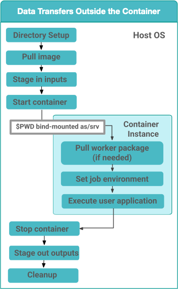
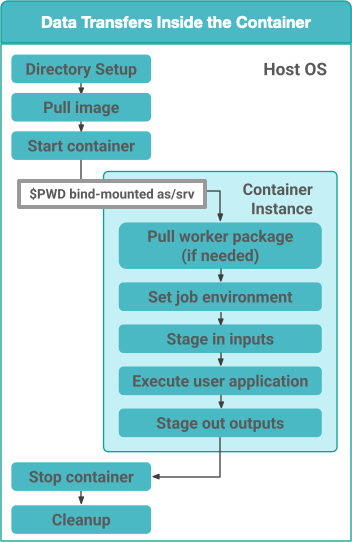

.. _containers:

==========
Containers
==========

.. _containers-overview:

Overview
========

Application containers provides a solution to package software with
complex dependencies to be used during workflow execution. Starting with
Pegasus 4.8.0, Pegasus has support for application containers in the
``nonsharedfs`` and ``condorio`` data configurations using PegasusLite.
Pegasus currently has support for the following container
technologies:

1. **Docker**
2. **Singularity/Apptainer**
3. **Shifter**

The **worker package is not required to be pre-installed in images**. If a
matching worker package is not installed, Pegasus will try to determine
which package is required and download it.

Singularity vs Apptainer
========================

Singularity project was moved into the Linux foundation in November 2021,
with an associated name change to **Apptainer**. To preserve backward
compatibility all `apptainer` releases, have a symlink named `singularity`
that points to the `apptainer` executable to preserve backward compatibility.

The above notwithstanding, Pegasus has been updated to prefer the `apptainer`
executable over the `singularity` executable. In the case, where a job runs
on a node where only an old singularity install exists, the Pegasus jobs will
fallback to using the singularity executable.

In the workflow APIs; when using Pegasus you should continue to tag containers
to type Singularity.

.. _containers-configuration:

Configuring Workflows To Use Containers
=======================================

Container support is provided by the :py:class:`Pegasus.api.transformation_catalog`
Python module. Use this to generate the transformation catalog for your workflow
when containers are used. 

For each container used by your workflow transformations, create a :py:class:`~Pegasus.api.transformation_catalog.Container` 
and add it to your :py:class:`~Pegasus.api.transformation_catalog.TransformationCatalog`. 

.. code-block:: python

   # Create and add containers to the TransformationCatalog.
   tc = TransformationCatalog()

   # A container that will be used to execute the following transformations.
   tools_container = Container(
                     "tools-container",
                     Container.DOCKER,
                     image="docker:///ryantanaka/preprocess:latest",
                     arguments="--shm-size=2g",
                     bypass_staging=True
                  )

   # Add the container to the TransformationCatalog
   tc.add_containers(tools_container)

When this container is run, anything specified in the ``arguments`` parameter is
added as a cli argument to the resulting ``docker container run`` command that
Pegasus generates. If ``bypass_staging`` is set to ``True``, the container will
be pulled directly onto the compute node where the job is run rather than to an
intermediate staging site first. 

Then, when creating :py:class:`~Pegasus.api.transformation_catalog.Transformation`\s, 
pass the appropriate container to the ``container`` parameter of the constructor. When ``is_stageable``
is set to ``False``, this means that the transformation is installed at the given
``pfn`` **inside of the container**. If ``is_stageable`` is set to ``True``, the executable will be staged into
the container and then executed there. Note that in this situation the transformation
should be hosted somewhere and made accessible via a protocol such as HTTP.

.. code-block:: python

   # Create and add our transformations to the TransformationCatalog.

   # An executable that is installed inside of "tools_container" to be run on site "condorpool"
   preprocess = Transformation(
                  "preprocess",
                  site="condorpool",
                  pfn="/usr/local/bin/preprocess.sh",
                  is_stageable=False,
                  container=tools_container
               )

   # A stageable python script that must be executed inside tools_container because
   # it contains packages that we have when we developed it locally, but may not be 
   # installed on a compute node. Note that "pfn" is not a file URL but rather an
   # http one because pegasus-transfer will need to fetch the file into the container.
   process_text_2nd_pass = Transformation(
                              "process_text_2nd_pass.py",
                              site="workflow-cloud",
                              pfn="http://www.isi.edu/~tanaka/process_text_2nd_pass.py",
                              is_stageable=True,
                              container=tools_container
                           )

   # Add the newly created transformations to the TransformationCatalog
   tc.add_transformations(preprocess, process_text_2nd_pass)

.. _containers-container-universe:

Configuring Workflows To Use HTCondor Container Universe
--------------------------------------------------------

Pegasus introduced support for containers in 4.8.0 in 2017. At that time, HTCondor
did not have first class support for containers. In addition, any support for
containers was tied to when running in pure HTCondor environments, and not available
for example when running in grid universe (used for submitting jobs to local HPC clusters).
Keeping this in mind, and also to have the most flexibility we decided to manage
the staging of the application container for the job in the PegasusLite job wrapper
that gets invoked when a job is launched in the worker node.
This allowed us to bring container support to all the environments Pegasus supports.

While these limitations still exist, HTCondor support for containers has greatly
improved in pure HTCondor environments such as Path and OSPool.
Keeping this in mind, Pegasus now has support for *container* universe in Pegasus
whereby we delegate the container management (invoking the container, launching the user job,
stopping the container) to HTCondor for those environments.
In order to enable this, you would need to add a condor profile with
key universe and value set to “container” for your execution site in the Site Catalog.

A sample YAML snippet is included below

.. code-block:: yaml

    - name: condorpool
      arch: x86_64
      os.type: linux
      directories: []
      profiles:
        condor: {universe: container}
        pegasus: {style: condor, clusters.num: 1}

.. note::

    We only support Apptainer/Singularity containers to be launched in the container universe.
    When enabled, Pegasus will stage-in the container as part of the data stage-in nodes in the
    executable workflow, and place them in the user submit directory. The container then gets
    transferred to the worker node where the user job is launched using in-built
    HTCondor file transfers.

**Symlinking of Data**

In case you are symlinking of data or using the shared filesystem for data staging and want
those directories to be mounted in the container, you need to update the EP (Execution Point)
condor configuration to specify the variable SINGULARITY_BIND_EXPR .
More details can be found in the HTCondor documentation
`here <https://htcondor.readthedocs.io/en/latest/admin-manual/ep-policy-configuration.html#apptainer-and-singularity-support>`__  .

.. _containers-osg:

Containers on OSG
=================

OSG has it's own way of handling container deployments for jobs that is
hidden from the user and hence Pegasus. They don't allow a user to run
an image directly by invoking ``docker run`` or ``singluarity exec``. Instead
the condor job wrappers deployed on OSG do it for you based on the
classads associated with the job. As a result, for a workflow to run on
OSG, one cannot specify or describe the container in the transformation
catalog. **Instead you catalog the executables without a container
reference, and the path to the executable is the path in the container
you want to use.** To specify the container, that needs to be setup you
instead specify the following Condor profiles:

* ``requirements``
* ``+SingularityImage``

For example you can specify the following in the :py:class:`~Pegasus.api.site_catalog.SiteCatalog` for OSG
the site:

.. code-block:: python

   osg = Site("OSG", arch=Arch.X86_64, os_type=OS.LINUX)\
         .add_profiles(Namespace.PEGASUS, style="condor")\
         .add_profiles(
                  Namespace.CONDOR,
                  universe="vanilla",
                  requirements="HAS_SINGULARITY == True",
                  request_cpus="1",
                  request_memory="1 GB",
                  request_disk="1 GB"
               )\
         .add_profiles(Namespace.CONDOR, key="+SingularityImage", value="/cvmfs/singularity.opensciencegrid.org/pegasus/osg-el7:latest")

.. _containers-exec-model:

Container Execution Model
=========================

Containerized applications in your workflow are launched as part of PegasusLite
jobs when starting on a remote worker node. The container execution model is as
follows:

1. Sets up a directory to run a user job in

2. Pulls the container image to that directory

3. Optionally, loads the container from the container image file and
   sets up the user to run as in the container (only applicable for
   Docker containers)

4. Mounts the job directory into the container as ``/scratch`` for Docker
   containers and as ``/srv`` for Apptainer/Singularity containers

5. If the data transfers for the job are set to happen on the
   host os (which is the default), pulls in all the relevant input
   data and executables required by the job in a directory on the
   HOST OS, that gets mounted in the container.

6. Container will run a job specific script created by
   PegasusLite that does the following:

   a. Figures the appropriate Pegasus worker to use in the container if
      not already installed.

   b. Sets up the job environment to use including transfer and setup of
      any credentials transferred as part of PegasusLite.

   c. If the data transfers for the job are set to happen inside the
      container; pulls in all the relevant input data and executables
      required by the job.

   d. Launches the user application using **pegasus-kickstart**.

   e. If the data transfers for the job are set to happen inside the
      container; stages out the output data to the staging site.

7. Optionally, shuts down the container (only applicable for Docker
   containers)

8. Ships out the output data to the staging site

9. Cleans up the directory on the worker node

..

.. note::

   Starting in Pegasus 5.1.0 release, the default for the  container data transfer
   model has been changed back to the default that was for 5.0.0 release. The data
   transfers for the job occurring outside the container in the PegasusLite wrapper,
   instead happening inside the container, when the user job starts in the container.
   However, this behavior can be controlled by setting the property
   **pegasus.transfer.container.onhost** in the properties file.

Data Transfers for Jobs when running in Container
=================================================

When a job is specified to run in an application container such as Docker or
Singularity, Pegasus has two options in PegasusLite on how data transfers
for the job occur. The transfers can happen either

* on the HOST OS before the container in which the job has to execute is
  invoked OR
* inside the application container, before the user code is invoked.

You can control the behavior by setting the Boolean property
**pegasus.transfer.container.onhost** in your properties file.

HOST OS Container Transfers
---------------------------
By default, Pegasus will set up the data transfers to happen on the HOST OS
in the PegasusLite wrapper before the application container is launched.
Benefits of this approach is that, it does not require Python3 to be
installed in the container. Python3 is required to run the pegasus
data transfer tools such as `pegasus-transfer`.

   Figure 1: Data Transfers setup to be on the HOST OS

Data Transfers inside the Container
-----------------------------------
If the property **pegasus.transfer.container.onhost** is set to false, then
the data transfers for the job happen inside the container before user code
is invoked. In this case, the container must have Python3 available.
This approach does have the benefit of you installing your own
data transfer tools in the container that are not available on the HostOS
and to use them for data transfers.

   Figure 1: Data Transfers setup to be inside the Container

Since in this case, the transfers are handled from within
the container, and thus container recipes require some extra attention.
A Dockerfile example that prepares a container for GridFTP transfers is
provided below.

In this example there are three sections.

-  Essential Packages

-  Install Globus Toolkit

-  Install CA Certs

From the ``Essential Packages``, **python** and either **curl** or
**wget** have to be present. ``Install Globus Toolkit``, sets up the
enviroment for GridFTP transfers. And ``Install CA Certs`` copies the grid
certificates in the container.

.. note::

   Globus Toolkit introduced some breaking changes in August 2018 to its
   authentication module, and some sites haven't upgraded their
   installations (eg. NERSC). GridFTP in order to authenticate
   successfully, requires the ``libglobus-gssapi-gsi4`` package to be pinned
   to the version 13.8-1. The code snipet below contains installation
   directives to handle this but they are commented out.

::

   ##########################################
   #### This Container Supports GridFTP  ####
   ##########################################

   FROM ubuntu:18.04

   #### Essential Packages ####
   RUN apt-get update &&\
   apt-get install -y software-properties-common curl wget python unzip &&\
   rm -rf /var/lib/apt/lists/*

   #### Install Globus Toolkit ####
   RUN wget -nv http://www.globus.org/ftppub/gt6/installers/repo/globus-toolkit-repo_latest_all.deb &&\
   dpkg -i globus-toolkit-repo_latest_all.deb &&\
   apt-get update &&\
   # apt-get install -y libglobus-gssapi-gsi4=13.8-1+gt6.bionic &&\
   # apt-mark hold libglobus-gssapi-gsi4 &&\
   apt-get install -y globus-data-management-client &&\
   rm -f globus-toolkit-repo_latest_all.deb &&\
   rm -rf /var/lib/apt/lists/*

   #### Install CA Certs ####
   RUN mkdir -p /etc/grid-security &&\
   cd /etc/grid-security &&\
   wget -nv https://download.pegasus.isi.edu/containers/certificates.tar.gz &&\
   tar xzf certificates.tar.gz &&\
   rm -f certificates.tar.gz

   ##########################################
   #### Your Container Specific Commands ####
   ##########################################

.. _containers-transfers:

Staging of Application Containers
=================================

Pegasus treats containers as other files in terms of data management.
A container to be used for a job is tracked as an input dependency that
needs to be staged if it is not already there. Similar to executables,
you specify the location for your container image in the Transformation
Catalog. You can specify the source URL's for containers as the
following.

1. URL to a container hosted on a central hub repository

   Example of a docker hub URL is ``docker:///rynge/montage:latest``, while
   for singularity ``shub://pegasus-isi/fedora-montage``

2. URL to a container image file on a file server

   -  **Docker -**\ Docker supports the loading of a container from a tar
      file. Hence, containers images can only be specified as tar files
      and the extension for the filename is not important.

   -  **Singularity -** Singularity supports container images in various
      forms and relies on the extension in the filename to determine
      what format the file is in. Pegasus supports the following
      extensions for singularity container images

      -  .img

      -  .tar

      -  .tar.gz

      -  .tar.bz2

      -  .cpio

      -  .cpio.gz

      -  .sif

      Singularity will fail to run the container if you don't specify
      the right extension when specifying the source URL for the image.

In both the cases, Pegasus will place the container image on the staging
site used for the workflow, as part of the data stage-in nodes, using
pegasus-transfer. When pulling in an image from a container hub
repository, pegasus-transfer will export the container as a ``tar`` file in
case of Docker, and as ``.img`` file in case of Singularity

.. _shifter_containers_staging:

Shifter Containers
------------------

Shifter containers are different from Docker and Singularity with
respect to the fact that the containers cannot be exported to a
container image file that can reside on a filesystem. Additionally, the
containers are expected to be available locally on the compute sites in
the local Shifter registry. Because of this, Pegasus does not do any
transfer of Shifter containers. You can specify a Shifter container
using the Shifter url scheme. For example, below is a transformation
catalog for a namd transformation that is executed in a Shifter
container.

.. code-block:: python

   tc = TransformationCatalog()

   namd_image = Container(
      "namd_image",
      Container.SHIFTER,
      image="shifter:///papajim/namd_image:latest"
   )

   tc.add_containers(namd_image)

   namd_tr = Transformation(
      "namd_tr",
      site="cori",
      pfn="/opt/NAMD_2.12_Linux-x86_64-multicore/namd2",
      is_stageable=False,
      container=namd_image
   )\
   .add_globus_profile(max_time=20)\
   .add_pegasus_profile(exitcode_success_msg="End of program")

   tc.add_transformations(namd_tr)

.. _containers-symlinking:

Symlinking and File Copy From Host OS
-------------------------------------

Since, Pegasus by default only mounts the job directory determined by
PegasusLite into the application container, symlinking of input data
sets works only if in the container definition in the transformation
catalog user defines the directories containing the input data to be
mounted in the container using the **mounts** key word. We recommend to
keep the source and destination directories to be the same i.e. the host
path is mounted in the same location in the container.

The above is also true for the case, where your input datasets are on the
shared filesystem on the compute site and you want a file copy to
happen, when PegasusLite job starts the container.

For example in the example below, we have input datasets accessible on
``/lizard`` on the compute nodes, and mounting them as **read-only** into the
container at ``/lizard``

.. code-block:: python

   centos_base = Container(
      "centos-base",
      Container.SINGULARITY,
      image="gsiftp://bamboo.isi.edu/lfs1/bamboo-tests/data/centos7.img",
      image_site="local",
      mounts=["/lizard:/lizard:ro"]
   ).add_env(JAVA_HOME="/opt/java/1.6")

To enable symlinking for containers set the following properties

.. code-block:: python

   props = Properties()
   # Tells Pegasus to try and create symlinks for input files
   props["pegasus.transfer.links"] = "true"

   # Tells Pegasus to by the staging site ( creation of stage-in jobs) as
   # data is available directly on compute nodes
   props["pegasus.transfer.bypass.input.staging"] = "true"
   props.write()

If you don't set ``pegasus.transfer.bypass.input.staging`` then you still can
have symlinking if:

1. your staging site is same as your compute site

2. the scratch directory specified in the site catalog is visible to the
   worker nodes

3. you mount the scratch directory in the container definition, NOT the
   original source directory.

Enabling symlinking of containers is useful when running large
workflows on a single cluster. Pegasus can pull the image from the
container repository once, and place it on the shared filesystem where
it can then be symlinked from when the PegasusLite jobs start on the
worker nodes of that cluster. In order to do this, you need to be
running the ``nonsharedfs`` data configuration mode with the staging site
set to be the same as the compute site.

