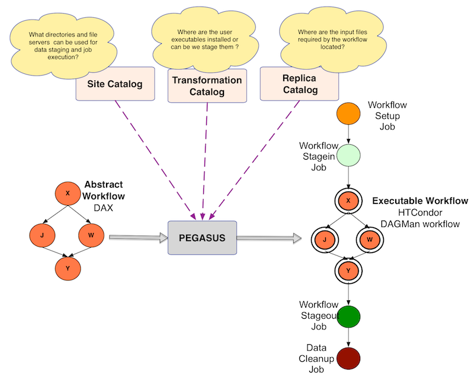

.. _creating-workflows:

==================
Creating Workflows
==================

.. _abstract-workflows:

Abstract Workflows
==================

The Abstract Workflow is a description of an user workflow, usually in
**YAML** format (before 5.0 release, it was a XML based format called the DAX)
that is used as the primary input into Pegasus. The workflow schema is
described using JSON schemas in
:download:`wf-5.0.yml <../../schemas/5.0/wf-5.0.yml>`.
We recommend that users  use the Workflow API to generate the abstract
workflows. The documentation of the API's can be found at
:ref:`api-reference` . The Workflow API is available for users to use in
Python, Java and R format.

The sample workflow below incorporates some of the elementary graph
structures used in all abstract workflows.

-  **fan-out**, **scatter**, and **diverge** all describe the fact that
   multiple siblings are dependent on fewer parents.

   The example shows how the **Job 2 and 3** nodes depend on **Job 1**
   node.

-  **fan-in**, **gather**, **join**, and **converge** describe how
   multiple siblings are merged into fewer dependent child nodes.

   The example shows how the **Job 4** node depends on both **Job 2 and
   Job 3** nodes.

-  **serial execution** implies that nodes are dependent on one another,
   like pearls on a string.

-  **parallel execution** implies that nodes can be executed in parallel

The example diamond workflow consists of four nodes representing jobs,
and are linked by six files.

-  Required input files must be registered with the Replica catalog in
   order for Pegasus to find it and integrate it into the workflow.

-  Leaf files are a product or output of a workflow. Output files can be
   collected at a location.

-  The remaining files all have lines leading to them and originating
   from them. These files are products of some job steps (lines leading
   to them), and consumed by other job steps (lines leading out of
   them). Often, these files represent intermediary results that can be
   cleaned.

The example workflow representation in form of an abstract requires external
catalogs, such as

* :ref:`replica catalog (RC) <replica>`  to resolve the input file ``f.a``.

* :ref:`transformation catalog (TC) <transformation>` to resolve the logical job
  names (such as diamond::preprocess:2.0) and

* :ref:`site catalog (SC) <site>` to resolve on what compute resources will
  the jobs execute on.

The  workflow below defines the four jobs just like the example picture,
and the files that flow between the jobs.The intermediary files are neither
registered nor staged out, and can be considered transient.
Only the final result file ``f.d`` is staged out.

There are two main ways of generating the abstract workfow
1. Using a Workflow generating API in

   * :ref:`Python <api-python>`, or
   * :ref:`Java <api-java>`.

   **Note:** We recommend this option.

2. Generating YAML directly from your script.

   **Note:** This option should only be considered by advanced users who
   can also read YAML schema definitions. This process can be error
   prone considering YAML's sensitivity towards indenting and whitespaces.

One example for the Abstract Workflow representing the example workflow
can look like the following:

 .. tabs::

    .. code-tab:: python Pegasus.api

      #! /usr/bin/env python3
      import logging

      from pathlib import Path

      from Pegasus.api import *

      logging.basicConfig(level=logging.DEBUG)

      # --- Raw input file -----------------------------------------------------------------

      fa = File("f.a").add_metadata(creator="ryan")

      # --- Workflow -----------------------------------------------------------------
      '''
                              [f.b1] - (findrange) - [f.c1]
                              /                             \
      [f.a] - (preprocess)                               (analyze) - [f.d]
                              \                             /
                              [f.b2] - (findrange) - [f.c2]

      '''
      wf = Workflow("diamond")

      wf.add_shell_hook(EventType.START, "/pegasus/libexec/notification/email -t notify@example.com")
      wf.add_shell_hook(EventType.END, "/pegasus/libexec/notification/email -t notify@example.com")

      fb1 = File("f.b1")
      fb2 = File("f.b2")
      job_preprocess = Job("preprocess")\
                              .add_args("-a", "preprocess", "-T", "3", "-i", fa, "-o", fb1, fb2)\
                              .add_inputs(fa)\
                              .add_outputs(fb1, fb2)\
                              .add_metadata(time=60)\
                              .add_shell_hook(EventType.START, "/pegasus/libexec/notification/email -t notify@example.com")\
                              .add_shell_hook(EventType.END, "/pegasus/libexec/notification/email -t notify@example.com")

      fc1 = File("f.c1")
      job_findrange_1 = Job("findrange")\
                              .add_args("-a", "findrange", "-T", "3", "-i", fb1, "-o", fc1)\
                              .add_inputs(fb1)\
                              .add_outputs(fc1)\
                              .add_metadata(time=60)\
                              .add_shell_hook(EventType.START, "/pegasus/libexec/notification/email -t notify@example.com")\
                              .add_shell_hook(EventType.END, "/pegasus/libexec/notification/email -t notify@example.com")

      fc2 = File("f.c2")
      job_findrange_2 = Job("findrange")\
                              .add_args("-a", "findrange", "-T", "3", "-i", fb2, "-o", fc2)\
                              .add_inputs(fb2)\
                              .add_outputs(fc2)\
                              .add_metadata(time=60)\
                              .add_shell_hook(EventType.START, "/pegasus/libexec/notification/email -t notify@example.com")\
                              .add_shell_hook(EventType.END, "/pegasus/libexec/notification/email -t notify@example.com")

      fd = File("f.d").add_metadata(final_output="true")
      job_analyze = Job("analyze")\
                     .add_args("-a", "analyze", "-T", "3", "-i", fc1, fc2, "-o", fd)\
                     .add_inputs(fc1, fc2)\
                     .add_outputs(fd)\
                     .add_metadata(time=60)\
                     .add_shell_hook(EventType.START, "/pegasus/libexec/notification/email -t notify@example.com")\
                     .add_shell_hook(EventType.END, "/pegasus/libexec/notification/email -t notify@example.com")

      wf.add_jobs(job_preprocess, job_findrange_1, job_findrange_2, job_analyze)
      wf.write()

    .. code-tab:: yaml YAML

      x-pegasus:
      apiLang: python
      createdBy: ryantanaka
      createdOn: 07-24-20T10:08:48Z
      pegasus: "5.0"
      name: diamond
      hooks:
      shell:
         - _on: start
            cmd: /pegasus/libexec/notification/email -t notify@example.com
         - _on: end
            cmd: /pegasus/libexec/notification/email -t notify@example.com
      jobs:
      - type: job
         name: preprocess
         id: ID0000001
         arguments: [-a, preprocess, -T, "3", -i, f.a, -o, f.b1, f.b2]
         uses:
            - lfn: f.a
            metadata:
               creator: ryan
            type: input
            - lfn: f.b1
              type: output
              stageOut: true
              registerReplica: true
            - lfn: f.b2
              type: output
              stageOut: true
              registerReplica: true
         metadata:
            time: "60"
         hooks:
            shell:
            - _on: start
               cmd: /pegasus/libexec/notification/email -t notify@example.com
            - _on: end
               cmd: /pegasus/libexec/notification/email -t notify@example.com
      - type: job
         name: findrange
         id: ID0000002
         arguments: [-a, findrange, -T, "3", -i, f.b1, -o, f.c1]
         uses:
            - lfn: f.b1
            type: input
            - lfn: f.c1
            type: output
            stageOut: true
            registerReplica: true
         metadata:
            time: "60"
         hooks:
            shell:
            - _on: start
               cmd: /pegasus/libexec/notification/email -t notify@example.com
            - _on: end
               cmd: /pegasus/libexec/notification/email -t notify@example.com
      - type: job
         name: findrange
         id: ID0000003
         arguments: [-a, findrange, -T, "3", -i, f.b2, -o, f.c2]
         uses:
            - lfn: f.c2
            type: output
            stageOut: true
            registerReplica: true
            - lfn: f.b2
            type: input
         metadata:
            time: "60"
         hooks:
            shell:
            - _on: start
               cmd: /pegasus/libexec/notification/email -t notify@example.com
            - _on: end
               cmd: /pegasus/libexec/notification/email -t notify@example.com
      - type: job
         name: analyze
         id: ID0000004
         arguments: [-a, analyze, -T, "3", -i, f.c1, f.c2, -o, f.d]
         uses:
            - lfn: f.d
            metadata:
               final_output: "true"
            type: output
            stageOut: true
            registerReplica: true
            - lfn: f.c2
            type: input
            - lfn: f.c1
            type: input
         metadata:
            time: "60"
         hooks:
            shell:
            - _on: start
               cmd: /pegasus/libexec/notification/email -t notify@example.com
            - _on: end
               cmd: /pegasus/libexec/notification/email -t notify@example.com
      jobDependencies:
      - id: ID0000001
         children:
            - ID0000002
            - ID0000003
      - id: ID0000002
         children:
            - ID0000004
      - id: ID0000003
         children:
            - ID0000004

.. _catalogs:

Catalogs
========

The Abstract Workflow description that you specify to Pegasus is portable,
and usually does not contain any locations to physical input files, executables
or cluster end points where jobs are executed. Pegasus uses three information
catalogs during the planning process.

   Information Catalogs used by Pegasus

1.  **Replica Catalog**

    To discover locations of files referred to in the workflow. At a minimum,
    you need to specify locations of all the raw input files of the workflow.
    These are the files that are not generated by any job in the workflow.
    In the example Abstract Worfklow above, that would be file *f.a*.

    You can use the Python Worklfow API to generate a replica catalog. By
    default, Pegasus will pick up a file named **replicas.yml** from the
    directory where the planner is invoked from.

    .. tabs::

        .. code-tab:: python generate_rc.py

            from Pegasus.api import *

            infile = File('f.a')
            rc = ReplicaCatalog()\
                  .add_replica('local', infile, "http://example.com/pegasus/input/" + infile.lfn,\
                                checksum = {'sha256':'66a42b4be204c824a7533d2c677ff7cc5c44526300ecd6b450602e06128063f9'})\
                   .write()

            # the Replica Catalog will be written to the default path "./replicas.yml"

        .. code-tab:: yaml YAML RC

            pegasus: '5.0'
            replicas:
              - lfn: input.txt
                pfns:
                  - {site: local, pfn: 'http://example.com/pegasus/input/f.a'}
                checksum: {sha256: 66a42b4be204c824a7533d2c677ff7cc5c44526300ecd6b450602e06128063f9}

    You can find more details about Replica Catalog in the reference guide
    :ref:`here<replica>`.

2.  **Transformation Catalog**

    To discover locations of executables that are invoked by the jobs in the
    workflow. The transformation catalog is used to map the logical job names
    to actual executables that can be invoked on the various sites where the
    jobs are launched. In the example Abstract Worfklow above, the transformation
    catalog will map the transformations *preprocess*, *findrange*, *analyze* to
    an executable available on a particular site.

    You can use the Python Worklfow API to generate a replica catalog. By
    default, Pegasus will pick up a file named **transformations.yml** from
    the directory where the planner is invoked from.

    The following illustrates how
    :py:class:`Pegasus.api.transformation_catalog.TransformationCatalog`
    can be used to generate a new Transformation Catalog programmatically.

    .. tabs::

        .. code-tab:: python generate_tc.py

            from Pegasus.api import *

            # create the TransformationCatalog object
            tc = TransformationCatalog()

            # create and add the transformation
            keg = Transformation(
                    "preprocess",
                    site="condorpool",
                    pfn="/usr/bin/pegasus-keg",
                    is_stageable=False,

                ).add_profiles(Namespace.ENV, APP_HOME="/tmp/myscratch", JAVA_HOME="/opt/java/1.6")

            tc.add_transformations(keg)

            # write the transformation catalog to the default file path "./transformations.yml"
            tc.write()

        .. code-tab:: yaml YAML TC

            x-pegasus: {apiLang: python, createdBy: vahi, createdOn: '07-23-20T16:43:51Z'}
            pegasus: '5.0'
            transformations:
            - name: keg
              sites:
              - {name: condorpool, pfn: /usr/bin/pegasus-keg, type: installed}
              profiles:
                env: {APP_HOME: /tmp/myscratch, JAVA_HOME: /opt/java/1.6}

    You can find more details about Transformation Catalog in the reference guide
    :ref:`here<transformation>`.

3.  **Site Catalog**

    To discover what directories and file servers to use for staging in data and
    placing outputs. Pegasus by default constructs two sites automatically for a
    a user

    * **local**

      The *local* site is used by Pegasus to learn about the submit host where
      Pegasus is installed and executed from.

    * **condorpool**

      The *condorpool* site is the Condor pool configured on your submit machine.

    You can use the Python Worklfow API to generate a site catalog. By
    default, Pegasus will pick up a file named **sites.yml** from
    the directory where the planner is invoked from. If you want to override
    the default sites created or use other sites representing HPC clusters
    or so forth, refer to the Site Catalog in the reference guide
    :ref:`here<site>`.

.. _best-practices-code:

Best Practices For Developing Portable Code
===========================================

This section lists out issues for application developers to keep in mind while
developing code that will be run by Pegasus in a distributed computing environment.

Applications cannot specify the directory in which they should be run
---------------------------------------------------------------------

Application codes are either installed in some standard location at the compute
sites or staged on demand. When they are invoked, they are not invoked from the
directories where they are installed. Therefore, they should work when invoked
from any directory.

No hard-coded paths
-------------------

The applications should not hard-code directory paths as these hard coded paths
may become unusable when the application runs on different sites. Rather, these
paths should be passed via command line arguments to the job or picked up from
environment variables to increase portability.

Propogating back the right exitcode
-----------------------------------

A job in the workflow is only released for execution if its parents have
executed successfully. Hence, **it is very important that the applications
exit with the correct error code in case of success and failure**.
The application should exit with a status of 0 indicating a successful execution,
or a non zero status indicating an error has occurred. Failure to do so will result in
erroneous workflow execution where jobs might be released for execution
even though their parents had exited with an error.

Successful execution of the application code can only be
determined by an exitcode of 0. The application code should not rely upon
something being written to ``stdout`` to designate success. For example, if
the application writes to ``stdout``: ``SUCCESS``, and exits with a non
zero status the job will still be marked as ``FAILED``.

In \*nix, a quick way to see if a code is exiting with the correct code
is to execute the code and then execute echo $?.

::

   $ component-x input-file.lisp
   ... some output ...
   $ echo $?
   0

If the code is not exiting correctly, it is necessary to wrap the code
in a script that tests some final condition (such as the presence or
format of a result file) and uses exit to return correctly.

Static vs. Dynamically Linked Libraries
---------------------------------------

Since there is no way to know the profile of the machine that will be
executing the code, it is important that **dynamically linked libraries
are avoided or that reliance on them is kept to a minimum**. For example,
a component that requires ``libc 2.5`` may or may not run on a machine that
uses ``libc 2.3``. On \*nix, you can use the ``ldd`` command to see what
libraries a binary depends on.

If for some reason you install an application specific library in a non
standard location, make sure to set the ``LD_LIBRARY_PATH`` for the application
in the transformation catalog for each site.

Setting the Job Environment
----------------------------

Pegasus allows users to associate env profiles with the jobs, that allow them
to specify the environment variables that need to be set when the job executes.
Sometimes this maybe insufficient, as you may need to run a script at runtime
on the compute node to determine the environment in which your job can execute
in.

If your job runs with PegasusLite (i.e. your data configuration is either
*condorio* or *nonsharedfs*), Pegasus allows you to specify an
environment setup script file that is sourced in the PegasusLite wrapper
before your job is invoked. This setup script can be used to set up the environment
for your job. Details on how to configure this can be found in the
:ref:`PegasusLite chapter<source-env-in-pegasuslite>`.

