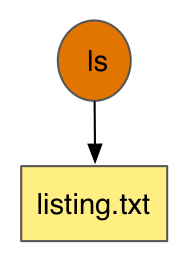
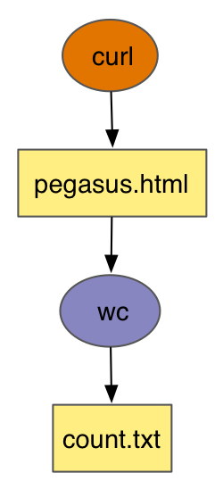
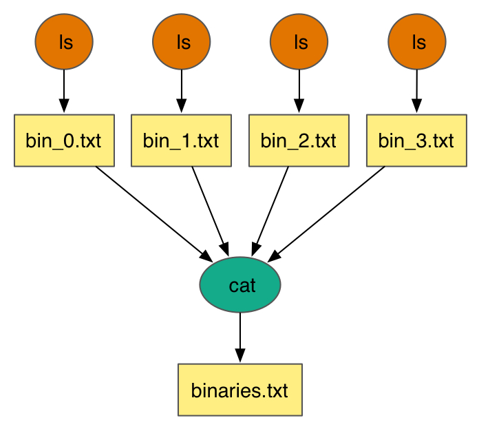
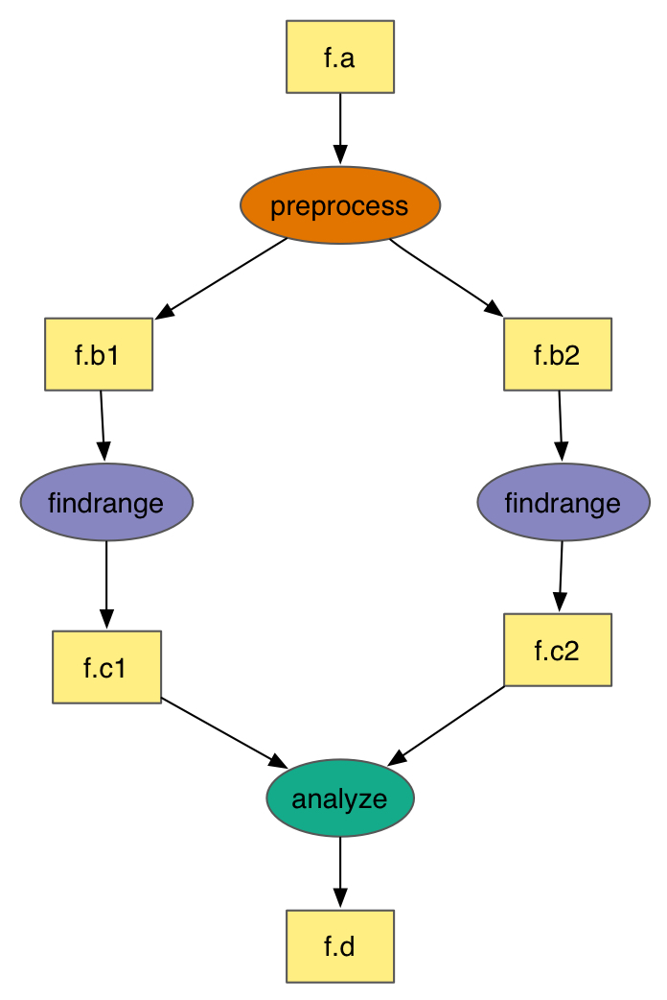

.. _example-workflows:

=================
Example Workflows
=================

PegasusHub is a gallery of Pegasus workflows created and published by
Pegasus' user community. PegasusHub is located at
``https://pegasushub.github.io/`` and contains workflows ranging from
simple examples that are suitable for beginners (e.g., Diamond Workflow)
to more complicated examples showcasing more advanced Pegasus capabilities
(e.g., Montage Workflow). All of the workflows available on PegasusHub
reside in individual GitHub repositories and can be cloned using Git.

From the available workflows on PegasusHub we have cherry picked
some of the examples and through a cli tool called ``pegasus-init`` we
enable users to fetch them in a ready to execute state on some of the
most common execution environments Pegasus supports.

.. note::

  These examples are intended to be a starting point for when you want
  to create your own workflows and want to see how other workflows are
  set up. The example workflows might not work in your
  environment without modifications. Site and transformation catalogs
  may contain site and user specifics such as paths to scratch directories
  and installed software, and minor modificiations might be
  required to get the workflows to plan and run.

.. _pegasushub:

PegasusHub
==========

Contributing Workflows
----------------------

Any user can contribute its Pegasus workflow to PegasusHub! In order to add
your own Pegasus-enabled workflow GitHub repository, you will need to
submit a pull request to PegasusHub's development repository
(``https://github.com/pegasushub/pegasushub.github.io``) and suggest an
edit to the ``_data/workflows.yml`` file with your workflow repository
details.

::

  -organization: your-github-organization
   repo_name: your-workflow-repository

Process Workflow
----------------

The process workflow (``https://github.com/pegasus-isi/process-workflow``) has one node, which does not
consume any inputs, and produces one output file ``listing.txt`` containing the output of the ``ls`` command.

Pipeline Workflow
-----------------

The pipeline workflow (``https://github.com/pegasus-isi/pipeline-workflow``) has two nodes in a sequence
as shown in the figure below. The first node fetches a webpage using the ``curl`` command, followed by a
node which computes the no. of lines in the fetched webpage, which is saved in an output file called ``count.txt``.

Split Workflow
--------------

The split workflow (``https://github.com/pegasus-isi/split-workflow``) has five nodes as shown in the figure below.
The first node consumes and input file ``pegasus.html`` and splits it to produce 4 parts. Each part is then processed
by a node which computes the no. of lines in each part using ``wc`` command.

.. figure:: ../images/tutorial-split-wf.jpg
   :alt: Split Workflow Example
   :align: center
   :width: 378

Merge Workflow
--------------

The merge workflow (``https://github.com/pegasus-isi/merge-workflow``) is as shown in the figure below.
The first set of nodes execute the ``ls`` command on different locations and stores the output in files
names ``bin_*.txt``. The output of the above nodes is merged using the ``cat`` command and it's output
stored in a single file ``binaries.txt``.

Diamond Workflow
----------------

The diamond workflow (``https://github.com/pegasus-isi/diamond-workflow``) has 4 nodes, layed out in
a diamond shape, with files being passed between them (f.*): First node represents a computation to
preprocess an input ``f.a`` and produce two output files ``f.b*``. Each of the output file is then analyzed
by a ``findrange`` job, which produces one output ``f.c*``. The outputs are then processed by a single node
called ``analyze`` which produces an output file ``f.d``.

.. _pegasus-init:

Pegasus Init
============

Pegasus Init (``pegasus-init``) is designed to be an interactive cli tool that generates example
workflows, ready to be executed on common execution environments. The
example workflows provided are a subset of the workflows availabe at
PegasusHub (``https://pegasushub.github.io``).

.. note::

  Some of the example workflows might overwrite the configuration ``pegasus-init``
  generates. Be cautious when executing commands that may alter the
  workflow and catalogs generated by ``pegasus-init``.

Being an interactive cli tool, ``pegasus-init`` prompts the user for input,
asking questions that will customize the selected execution environment.

Example usage:

::

  pegasus-init example-workflow

``pegasus-init`` first asks you to select one of the execution environments.

::

  ###########################################################
  ###########   Available Execution Environments   ##########
  ###########################################################
  1) Local Machine Condor Pool
  2) Local SLURM Cluster
  3) Local LSF Cluster
  4) OLCF Summit from OLCF Headnode
  5) OLCF Summit from OLCF Hosted Kubernetes Pod

  select an execution environment [1]:

Afterwards, it asks you to select one of the available workflow examples
offered for the selected execution environment

::

  ###########################################################
  ###########     Available Workflow Examples      ##########
  ###########################################################
  1) pegasus-isi/diamond-workflow
  2) pegasus-isi/merge-workflow
  3) pegasus-isi/pipeline-workflow
  4) pegasus-isi/process-workflow
  5) pegasus-isi/split-workflow

  Select an example workflow [1]:

Based on your answers ``pegasus-init`` might ask more questions
in order to customize the execution environment's configuration
such as your project allocation, the scheduler's queue etc.

.. _pegasus-init-exec-envs:

Pegasus Init Execution Environments
===================================

The execution environemnts supported by ``pegasus-init`` are updated dynamically
and their source code can be found at the GitHub repository
``https://github.com/pegasushub/pegasus-site-catalogs``. The python script
``Sites.py`` is used by ``pegasus-init`` to generate the appropriate site
catalog for a supported execution environment, but it's also standalone and
it can be used to scaffold a Pegasus site catalog.

::

  python3 Sites.py \
    --execution-site CONDORPOOL \
    --project-name "" \
    --queue-name "" \
    --pegasus-home "" \
    --scratch-parent-dir ~/scratch \
    --storage-parent-dir ~/storage

.. note::

  Use ``-h|--help`` to discover more iformation about the input arguments.
