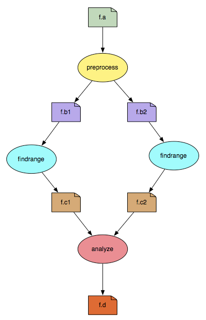

.. _introduction:

============
Introduction
============

`Pegasus WMS <http://pegasus.isi.edu>`__ is a configurable system for
mapping and executing **scientific workflows** over a wide range
of execution environments including a laptop, a campus cluster, a Grid,
or a commercial or academic cloud. Today, Pegasus runs workflows on
Amazon EC2, Nimbus, Open Science Grid, and many campus
clusters. One workflow can run on a single system or across a
heterogeneous set of resources. Pegasus can run workflows ranging from
just a few computational tasks up to 1 million.

Pegasus WMS bridges the scientific domain and the execution environment
by automatically mapping high-level workflow descriptions onto
distributed resources. It automatically locates the necessary input data
and computational resources necessary for workflow execution. Pegasus
enables scientists to construct workflows in abstract terms without
worrying about the details of the underlying execution environment or
the particulars of the low-level specifications required by the
middleware (Condor, Globus, or Amazon EC2). Pegasus WMS also bridges the
current cyberinfrastructure by effectively coordinating multiple
distributed resources. The input to Pegasus is a description of the
abstract workflow in a YAML format.

Pegasus allows researchers to translate complex computational tasks into
workflows that link and manage ensembles of dependent tasks and related
data files. Pegasus automatically chains dependent tasks together, so
that a single scientist can complete complex computations that once
required many different people. New users are encouraged to explore the
:ref:`tutorial` to become familiar with how to operate
Pegasus for their own workflows in which users create and run a sample project
to demonstrate Pegasus capabilities.

Pegasus has a number of features that contribute to its useability and
effectiveness.

-  **Portability / Reuse**

   User created workflows can easily be run in different environments
   without alteration. Pegasus currently runs workflows on top of
   Condor, Grid infrastructures such as Open Science Grid,
   Amazon EC2, Nimbus, and many campus clusters. The same workflow can
   run on a single system or across a heterogeneous set of resources.

-  **Performance**

   The Pegasus mapper can reorder, group, and prioritize tasks in order
   to increase the overall workflow performance.

-  **Scalability**

   Pegasus can easily scale both the size of the workflow, and the
   resources that the workflow is distributed over. Pegasus runs
   workflows ranging from just a few computational tasks up to 1
   million. The number of resources involved in executing a workflow can
   scale as needed without any impediments to performance.

-  **Provenance**

   By default, all jobs in Pegasus are launched via the **kickstart**
   process that captures runtime provenance of the job and helps in
   debugging. The provenance data is collected in a database, and the
   data can be summarized with tools such as **pegasus-statistics**,
   **pegasus-plots**, or directly with SQL queries.

-  **Data Management**

   Pegasus handles replica selection, data transfers and output
   registrations in data catalogs. These tasks are added to a workflow
   as auxiliary jobs by the Pegasus planner.

-  **Reliability**

   Jobs and data transfers are automatically retried in case of
   failures. Debugging tools such as **pegasus-analyzer** helps the user
   to debug the workflow in case of non-recoverable failures.

-  **Error Recovery**

   When errors occur, Pegasus tries to recover when possible by retrying
   tasks, retrying the entire workflow, providing workflow-level
   checkpointing, re-mapping portions of the workflow, trying
   alternative data sources for staging data, and, when all else fails,
   by providing a rescue workflow containing a description of only the
   work that remains to be done. It cleans up storage as the workflow is
   executed so that data-intensive workflows have enough space to
   execute on a storage-constrained resource. Pegasus keeps track of what
   has been done (provenance) including the locations of data used and
   produced, and which software was used with which parameters.

-  **Operating Environments**

   Pegasus workflows can be deployed across a variety of environments:

   -  *Local Execution*

      Pegasus can run a workflow on a single computer with Internet
      access. Running in a local environment is quicker to deploy as the
      user does not need to gain access to multiple resources in order to
      execute a workflow.

   -  *Condor Pools and Glideins*

      Condor is a specialized workload management system for
      compute-intensive jobs. Condor queues workflows, schedules, and
      monitors the execution of each workflow. Condor Pools and Glideins
      are tools for submitting and executing the Condor daemons on a
      Globus resource. As long as the daemons continue to run, the
      remote machine running them appears as part of your Condor pool.
      For a more complete description of Condor, see the `Condor Project
      Pages <http://www.cs.wisc.edu/condor/description.html>`__

   -  *Grids*

      Pegasus WMS is entirely compatible with Grid computing. Grid
      computing relies on the concept of distributed computations.
      Pegasus apportions pieces of a workflow to run on distributed
      resources.

   -  *Clouds*

      Cloud computing uses a network as a means to connect a Pegasus end
      user to distributed resources that are based in the cloud.

What are scientific workflows?
==============================

A scientific workflow, or just workflow, is an abstraction used by scientists to
express an ensemble of complex, computational operations. In this context, 
an operation refers to a computational act such as retrieving data from remote 
storage services, executing applications, and transferring data products to 
designated storage sites. 

Here we define key terminology within the context of Pegasus workflows which will 
be used throughout this chapter. 

- **job**
   A job (also referred to as a task) is the core entity in Pegasus in terms of 
   execution. It encapsulates the executable that will be run (e.g. a Python 
   script, an MPI application, a Java executable, a bash shell script, etc.), 
   command line arguments that can be passed to the executable at runtime, 
   required input files, and output files that will be produced.

- **file**
   A file is the core entity in Pegasus in terms of data. Jobs (more specifically, 
   the executable encapsulated by the job) will use as input zero or more files 
   and will produce zero or more files. 

- **dependency**
   A dependency is a directed link between two jobs denoting a temporal or data 
   dependency. A temporal dependency between two jobs means that the source job 
   must complete before the destination job may run. A data dependency means that 
   one or more of the output file(s) produced by the source job will be used as 
   input in the destination job. For example, if “Job 1” writes a file which is 
   then read by “Job 2”, then you have a data dependency from “Job 1” to “Job 2”. 

- **workflow**
   A workflow is the collected organization of jobs, files, and dependencies. 

   
   Figure 1: example workflow

To represent the computations imagined by scientists, workflows use a formal 
framework based on `graph theory <https://en.wikipedia.org/wiki/Graph_(discrete_mathematics)>`_. 
A workflow is represented as a directed acyclic 
graph (DAG) whose nodes represent the jobs of the workflow (e.g., the tasks that 
need to be done) and the edges between those jobs represent dependencies (e.g., 
which jobs depend on which jobs). :ref:`Figure 1<diamond-example>` illustrates a simple workflow where 
ovals represent jobs and boxes represent files. An arrow from a file to a job is 
interpreted as “this job uses that file as input”. An arrow from a job to a file 
is interpreted as “this job produces that file”. For example, 
“preprocess -> f.b1 -> findrange” can be interpreted as “the job, preprocess, 
produces f.b1 as output, which is then used by findrange as input, and therefore 
a data dependency exists between preprocess and findrange”. 

The execution of workflows, represented as DAGs, follows two main rules:

1. A job is considered finished when **all its output files have been written**.
2. A job cannot start before **all its predecessors have finished** their executions.

A workflow management system (WMS), such as Pegasus, is responsible for managing 
the execution of such workflows. It provides guarantees that jobs comprising the 
workflow will be executed in a sequence that is a valid 
`topological ordering <https://en.wikipedia.org/wiki/Topological_sorting>`_ of 
the workflow. Furthermore, Pegasus provides a number of additional functionalities 
such as the handling the movement of data products used/produced during the workflow 
execution, fault tolerance, and monitoring.

How to Convert Existing Applications Into a Workflow
====================================================

The scientific community has long developed large applications, experiments, and
analysis pipelines as workflows rather than monolithic entities because they are
easier to manage and maintain. Furthermore, the DAG structure of the workflow exposes
parallel regions within the application that can be taken advantage of using 
distributed and high performance computing resources. If you find that the 
codes you've developed need increasingly more resources to run, it can be advantageous
to start adopting this "workflow" model. Then, a workflow management system like 
Pegasus can handle the execution of your codes at scale. 

Converting an existing monolithic application/computational experiment into a 
workflow is fairly straightforward as most applications have an inherent DAG 
structure. Simply speaking, an application is just a set of functions executed 
in sequence, one after another. Consider the following Python script as a toy 
example of a monolithic application.

.. code-block:: python
   :name: monolithic-script 

   def preprocess(data):
      # process the data
      return data_processed1, data_processed2
   
   def findrange(data):
      # perform some computations
      return data_range

   def analyze(data1, data2):
      # process (analyze) data1 and data2
      return final_result

   if __name__=="__main__":
      data = [1,2,3,4,5,6]
      data_processed1, data_processed2 = preprocess(data)
      data_range1 = findrange(data_processed1)
      data_range2 = findrange(data_processed2)
      result = analyze(data_range1, data_range2)

      print(result)

In this example, a Python function is similar to a job in Pegasus. Each function 
serves its own purpose and does some units of computation. Functions typically 
require some input and produce some output. That output is then consumed by 
another function, and so on and so forth. The major difference between a program 
and a job is that within the program, data objects may be passed between functions 
(shared address space) while in Pegasus, jobs are separate entities and cannot 
communicate between each other directly and thus must communicate using files. 

:ref:`Figure 1<diamond-example>` illustrates what the above monolithic application 
would look like if it were to be translated into a workflow. The following steps 
outline what must be done to accomplish this translation:

1. Identify the functions or part of codes that are independent (i.e., functions 
   that do not depend on any other functions);
2. Break the code into multiple scripts, each of them embedding one of the 
   independent functions found in the previous step. In our example, we will have 
   three scripts, one with the function “preprocess”, one with the function 
   “findrange” and one with the function “analyze”;
3. If the function which was into a script has arguments, the script must be 
   modified to read those arguments from a file(s).
4. If the function which was converted into a script returns data, the script 
   must be modified to write that data to a file(s).
5. Use the Pegasus API, described in the following chapters, to link these 
   independent scripts together and produce a Pegasus workflow.

Using Pegasus to Create the Workflow
------------------------------------

Say that we've now broken apart the :ref:`monolithic script<monolithic-script>`
from above into individual components. We would end up with a project directory 
that looks something like this:

.. code-block::

   project/
   ├── bin
   │   ├── analyze.py
   │   ├── findrange.py
   │   └── preprocess.py
   └── input_data
      └── data.csv

Using the Python API provided by Pegasus, we can build and execute these codes
as a workflow. The following snippet illustrates this:

.. code-block:: python

   #!/usr/bin/env python3
   import logging
   from pathlib import Path

   from Pegasus.api import *

   logging.basicConfig(level=logging.DEBUG)

   # --- Specify Input Files ------------------------------------------------------
   input_data = File("data.csv")
   rc = ReplicaCatalog().add_replica(
      site="local", lfn=input_data, pfn=Path(".").resolve() / "input_data/data.csv"
   )

   # --- Specify Executables ------------------------------------------------------
   preprocess = Transformation(
      name="preproces.py",
      site="local",
      pfn=Path(".").resolve() / "bin/preprocess.py",
      is_stageable=True,
   )

   findrange = Transformation(
      name="findrange.py",
      site="local",
      pfn=Path(".").resolve() / "bin/findrange.py",
      is_stageable=True,
   )

   analyze = Transformation(
      name="analyze.py",
      site="local",
      pfn=Path(".").resolve() / "bin/analyze.py",
      is_stageable=True,
   )

   tc = TransformationCatalog().add_transformations(preprocess, findrange, analyze)

   # --- Build Workflow -----------------------------------------------------------
   wf = Workflow("analysis-workflow")

   fb1 = File("f.b1")
   fb2 = File("f.b2")
   preprocess_job = (
      Job(preprocess)
      .add_args("arg1", "arg2")
      .add_inputs(input_data)
      .add_outputs(fb1, fb2)
   )

   fc1 = File("f.c1")
   findrange_job1 = Job(findrange).add_inputs(fb1).add_outputs(fc1)

   fc2 = File("f.c2")
   findrange_job2 = Job(findrange).add_inputs(fb2).add_outputs(fc2)

   result = File("result.csv")
   analyze_job = Job(analyze).add_inputs(fc1, fc2).add_outputs(result)

   wf.add_replica_catalog(rc)
   wf.add_transformation_catalog(tc)
   wf.add_jobs(preprocess_job, findrange_job1, findrange_job2, analyze_job)

From this script, we can see that all components in the 
:ref:`monolithic script<monolithic-script>` have been accounted for. Using the 
reference to the Workflow which was just created, it can then be executed with
``wf.plan(submit=True)``. Continue to the :ref:`tutorial` for a hands on 
lesson in developing and running Pegasus workflows. 

.. note::

   We recommend visiting the 
   `Pegasus Workflow Repository <https://pegasushub.github.io>`_ or the
   `Pegasus Application Showcase <https://pegasus.isi.edu/application-showcase/>`_  
   for examples of real-world workflows from a diverse set of scientific domains. 

