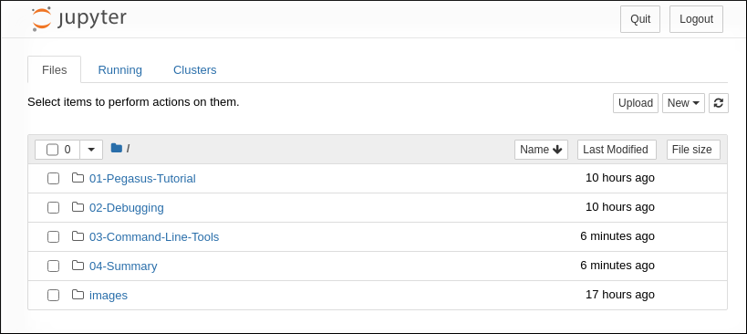

.. _tutorial:

========
Tutorial
========

The Pegasus WMS tutorial is now based on a Docker container running interactive Jupyter notebooks. The lessons include creating abstract workflows with the Python API, planning and executing workflows as well as debugging and command line tools. Jupyter is a great environment for learning how Pegasus works, but please note that production use is commonly done on the command line. There are no Jupyter dependencies in Pegasus.

If you do not already have Docker installed, please find instructions in the `Docker documentation <https://docs.docker.com/get-docker/>`_.

Once you have Docker running, download and start the tutorial container. Decide on an unused port on your computer for Jupyter to run on. In the example below, we pick **9999**. Leave the second port specification (8888) alone, as it specifies what the inside port number is. For example, if you want to run Jupyter on port 5000 on your machine, use 5000:8888.

.. parsed-literal::

    docker run --privileged --rm -p 9999:8888 pegasus/tutorial:|release|

Once the container has started, use your favorite web browser and go to http://localhost:9999. The password is: **scitech**

Once logged in, you should see a listing similar to:

Please access the notebooks in order. Start with *01-Pegasus-Tutorial*, and once that is complete, run *02-Debugging* and so on.

It is important that each step in a workbook is `Run` in order. The best way to do ensure this is to start at the top and hit the `Run` button to advance to the next step.

